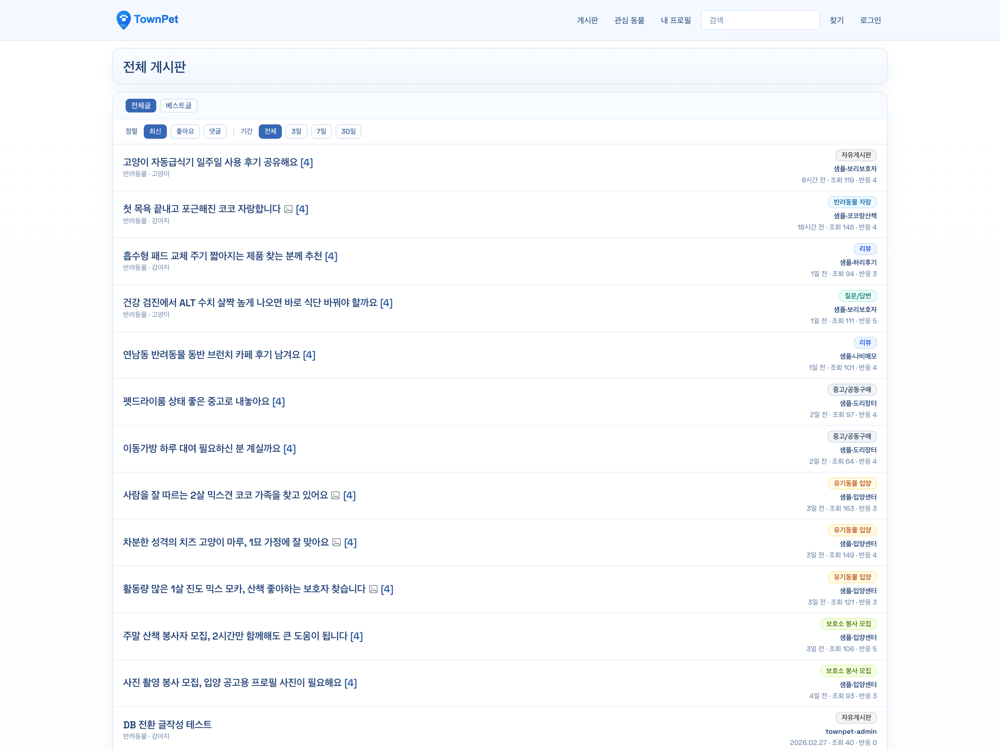
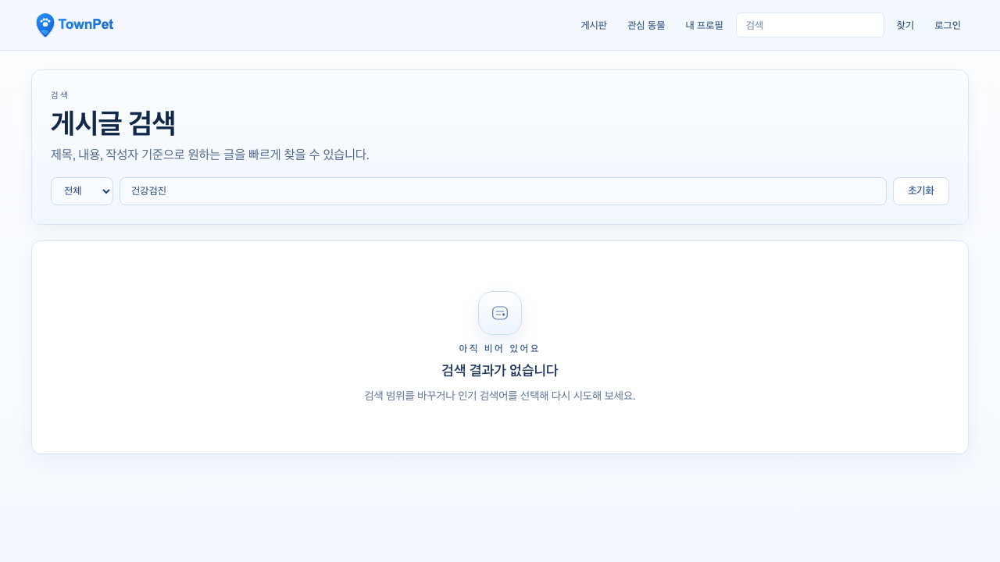
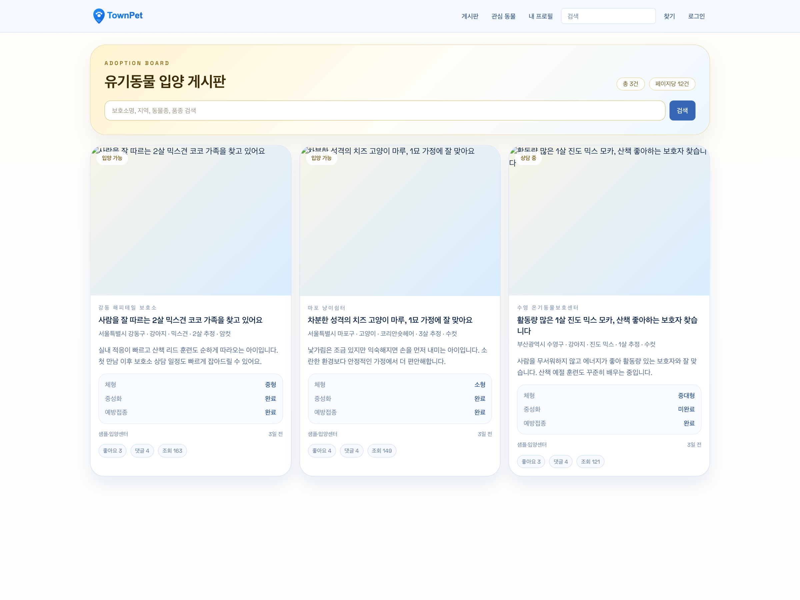
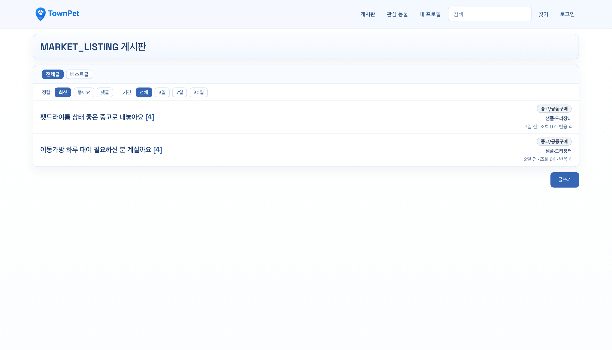
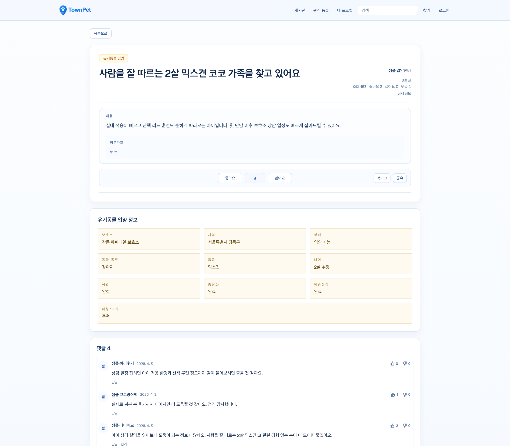
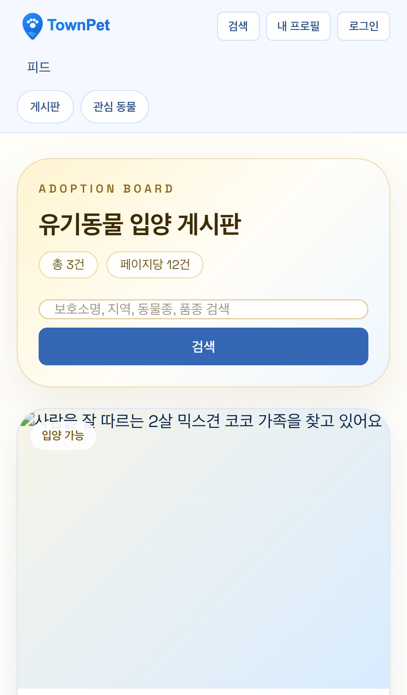

# TownPet

> AI 에이전트 기반으로 설계, 구현, 검증, 운영까지 밀어붙인 반려동물 커뮤니티 프로젝트

[데모 사이트 링크](https://townpet.vercel.app)
---
[개발 계획](./PLAN.md) · [실행 로그](./PROGRESS.md) · [완료 이력](./COMPLETED.md)

## 개발자 구조

- 실행 코드와 명령의 소스 오브 트루스는 `app/`입니다.
- 저장소 진입점은 [`AGENTS.md`](/Users/alex/project/townpet/AGENTS.md)입니다.
- 제품/정책 기준은 [`docs/제품_기술_개요.md`](/Users/alex/project/townpet/docs/제품_기술_개요.md), `docs/policies/*`, `docs/security/*`를 우선합니다.
- `PLAN.md`, `PROGRESS.md`는 현재 맡은 작업만 남기는 active 상태 문서입니다.
- 완료된 작업 상세와 과거 검증 로그는 `COMPLETED.md`에 보관합니다.

## 빠른 구조 파악

- 먼저 [`AGENTS.md`](/Users/alex/project/townpet/AGENTS.md), [`docs/제품_기술_개요.md`](/Users/alex/project/townpet/docs/제품_기술_개요.md), [`app/package.json`](/Users/alex/project/townpet/app/package.json)을 읽습니다.
- 그다음 코드는 `app/prisma -> app/src/lib/validations -> app/src/server -> app/src/app -> app/src/components` 순서로 보는 편이 빠릅니다.
- 특정 기능을 볼 때는 route/page보다 service/query와 validation을 먼저 읽는 편이 구조를 더 빨리 이해하게 해줍니다.

## 저장소 지도

- `app/src/app`
  - App Router 페이지와 API route
- `app/src/components`
  - 화면 컴포넌트
- `app/src/lib`
  - validation, presenter, policy, helper
- `app/src/server`
  - service, query, auth, rate-limit, ops
- `app/prisma`
  - schema와 migrations
- `docs`
  - 제품/운영/보안 기준 문서

## 대표 도메인 묶음

- `posts/feed`
  - `app/src/lib/validations/posts/post.ts`
  - `app/src/server/services/posts/post.service.ts`
  - `app/src/server/queries/posts/post.queries.ts`
  - `app/src/app/feed`
  - `app/src/components/posts`
- `auth/session`
  - `app/src/lib/validations/auth/index.ts`
  - `app/src/server/services/auth/auth.service.ts`
  - `app/src/server/auth.ts`
  - `app/src/server/admin-page-access.ts`
  - `app/src/lib/auth.ts`
  - `app/src/lib/social-auth.ts`
  - `app/src/app/login`, `app/src/app/register`, `app/src/app/onboarding`
- `notifications`
  - `app/src/lib/notifications/notification-unread-sync.ts`
  - `app/src/server/services/notifications/notification.service.ts`
  - `app/src/server/queries/notifications/notification.queries.ts`
  - `app/src/server/actions/notifications/notification.ts`
  - `app/src/components/notifications`
  - `app/src/app/notifications`
- `moderation/ops`
  - `app/src/server/services/moderation/report.service.ts`
  - `app/src/server/services/moderation/sanction.service.ts`
  - `app/src/server/services/moderation/policy.service.ts`
  - `app/src/server/queries/moderation/report.queries.ts`
  - `app/src/server/queries/ops-overview.queries.ts`
  - `app/src/app/admin`

## 공용 개발 루틴

- 기본 루틴은 `corepack pnpm -C app dev`, `lint`, `typecheck`, `test`, `test:e2e`, `quality:check`만 공용으로 봅니다.
- 시드, 복구, 백필, 운영 점검 명령은 필요할 때만 쓰는 유지보수 루틴입니다.
- 세부 작업 규칙과 계층 경계는 [`AGENTS.md`](/Users/alex/project/townpet/AGENTS.md)를 기준으로 봅니다.

## 최소 운영 루틴

- solo 운영에서 매일 기억할 명령은 `corepack pnpm -C app quality:check`, `corepack pnpm -C app ops:check:health`, `corepack pnpm -C app db:restore:local` 세 개면 충분합니다.
- CI/배포 mental model도 [`quality-gate.yml`](/Users/alex/project/townpet/.github/workflows/quality-gate.yml) 과 [`ops-smoke-checks.yml`](/Users/alex/project/townpet/.github/workflows/ops-smoke-checks.yml) 두 개만 먼저 보면 됩니다.
- 브라우저 smoke는 hot path에서 뺐고, 필요할 때 [`browser-smoke.yml`](/Users/alex/project/townpet/.github/workflows/browser-smoke.yml)이나 로컬 `test:e2e:smoke`로만 확인합니다.
- 나머지 `db:*`, `ops:*`, `test:e2e:*`, cleanup/backfill 스크립트는 평소 루틴이 아니라 필요할 때 찾는 유지보수 도구입니다.

TownPet은 단순 커뮤니티가 아니라, 반려인이 `병원 · 입양 · 산책 · 거래 · 분실` 같은 상황별 정보를 더 빨리 찾고 더 신뢰할 수 있게 만드는 로컬 반려 플랫폼을 목표로 한 프로젝트입니다.
AI Agent를 **문제 분해 → 구현 → 테스트 → 배포 → 운영 개선**까지 연결하는 개발 시스템으로 활용했습니다.

## 문제 정의

- 반려 정보는 병원 후기, 입양 공고, 산책 코스, 중고 거래처럼 맥락이 강한데, 대부분 한 채널 안에서 뒤섞여 있어 탐색 비용이 큽니다.
- TownPet은 이 문제를 `지역 + 상황` 단위로 다시 쪼개서, 범용 게시판이 아니라 **행동으로 이어지는 정보 화면**을 만드는 방향으로 접근했습니다.
- 그래서 자유글보다 `구조화 게시판`, 조회수보다 `신뢰 장치`, 단순 피드보다 `운영 가능한 커뮤니티 구조`를 먼저 설계했습니다.

## 비즈니스 아이디어

- `지역 커뮤니티`와 `상황별 정보 탐색`을 한 제품 안에서 연결할 수 있습니다.
- 한국의 유명 커뮤니티들 처럼 비로그인 회원도 정보를 열람하고 글작성, 댓글작성 기능을 사용할 수 있습니다.
- 입양, 병원, 산책, 거래처럼 intent가 분명한 카테고리는 이후 추천, 광고, 제휴, 거래 상태 머신으로 확장하기 좋습니다.
- 단순 콘텐츠 모음이 아니라, 구조화된 UGC와 운영 로그가 계속 쌓이는 형태라 서비스와 데이터가 함께 커집니다.

## 대표 화면

<table>
  <tr>
    <td width="50%" valign="top">
      
      <p><strong>전체 피드</strong><br />게시판 태그, 정렬, 기간 필터가 한 화면에 보이는 커뮤니티 기본 화면</p>
    </td>
    <td width="50%" valign="top">
      
      <p><strong>게시글 검색</strong><br />검색 결과, 자동완성, zero-result 운영 개선이 연결되는 검색 화면</p>
    </td>
  </tr>
  <tr>
    <td width="50%" valign="top">
      
      <p><strong>유기동물 입양 게시판</strong><br />보호소, 지역, 품종 같은 구조화 정보를 카드 중심으로 보여주는 전용 게시판</p>
    </td>
    <td width="50%" valign="top">
      
      <p><strong>중고 · 공동구매 게시판</strong><br />장터/공동구매 타입이 피드 필터와 함께 동작하는 거래형 게시판 화면</p>
    </td>
  </tr>
  <tr>
    <td width="50%" valign="top">
      
      <p><strong>글 상세와 댓글/반응</strong><br />글 본문, 구조화 메타 정보, 댓글, 반응까지 한 흐름으로 보여주는 상세 화면</p>
    </td>
    <td width="50%" valign="top" align="center">
      
      <p><strong>모바일 사용성</strong><br />모바일에서도 검색과 게시판 탐색이 바로 가능하도록 헤더 밀도와 진입성을 정리한 화면</p>
    </td>
  </tr>
</table>

## 제품 설계 포인트

### 1. 커뮤니티를 정보 탐색 제품으로 바꾼 구조
- `LOCAL / GLOBAL` 피드와 검색을 나눠 지역 커뮤니티 감각과 확장성을 같이 가져가도록 설계했습니다.
- 병원 후기, 입양, 산책, 거래, 봉사처럼 서로 다른 맥락을 게시판과 구조화 필드로 분리했습니다.

### 2. 신뢰를 기본값으로 둔 운영형 구조
- Kakao / Naver / Credentials 인증, 신고/차단/제재, 직접 모더레이션, 관리자 감사 로그를 제품 기본값으로 넣었습니다.
- `/admin/ops`, health check, cleanup workflow까지 포함해 배포 후에도 운영 가능한 상태를 목표로 했습니다.

### 3. AI를 실제 개발 방식으로 내재화한 프로젝트
- 작업을 작은 사이클로 분해하고, `PLAN.md`/`PROGRESS.md`에는 active 상태를, `COMPLETED.md`에는 완료 이력을 남겼습니다.
- 기능 추가뿐 아니라 보안, migration chain, 운영 가드, 모바일 사용성까지 AI 에이전트와 함께 반복적으로 닫았습니다.

## 기술적으로 한 일

- `LOCAL / GLOBAL` 정책이 분리된 커뮤니티 피드와 검색
- Kakao / Naver / Credentials 인증, 온보딩, 세션/권한 제어
- 신고, 차단, 제재, 직접 모더레이션, 관리자 감사 로그
- 검색 자동완성, 구조화 검색, zero-result 분석, `/admin/ops` 운영 대시보드
- Prisma migration, health check, retention cleanup, CI quality gate까지 포함한 운영형 구조

## 기술 스택

- Next.js App Router
- React 19
- TypeScript
- Prisma + PostgreSQL
- Zod
- NextAuth v5
- Upstash Redis
- Vitest + Playwright
- Vercel

## AI-native 개발 방식

- 문제를 기능 단위가 아니라 `정합성`, `모더레이션`, `검색 품질`, `운영 가시성` 같은 축으로 나눴습니다.
- AI 에이전트에게 구현을 맡길 때도 바로 머지하지 않고, 테스트/문서/운영 영향까지 같이 확인했습니다.
- 결과물 뒤에는 바로 확인 가능한 운영/문서 자산을 함께 남겼습니다.
  - 제품/운영 문서: [docs](./docs)
  - 계획/실행 로그: [PLAN.md](./PLAN.md), [PROGRESS.md](./PROGRESS.md), [COMPLETED.md](./COMPLETED.md)
  - 보안 트랙: [보안 계획](./docs/security/%EB%B3%B4%EC%95%88_%EA%B3%84%ED%9A%8D.md), [보안 진행상황](./docs/security/%EB%B3%B4%EC%95%88_%EC%A7%84%ED%96%89%EC%83%81%ED%99%A9.md)

## 빠른 실행

```bash
docker compose up -d
cp app/.env.local app/.env
corepack pnpm -C app install
corepack pnpm -C app db:migrate
corepack pnpm -C app db:seed
corepack pnpm -C app dev
```

## 한 줄 정리

> TownPet은 “AI로 빨리 만든 프로젝트”가 아니라, **AI를 활용해 제품·운영·보안·품질까지 끝까지 밀어붙인 프로젝트**입니다.
