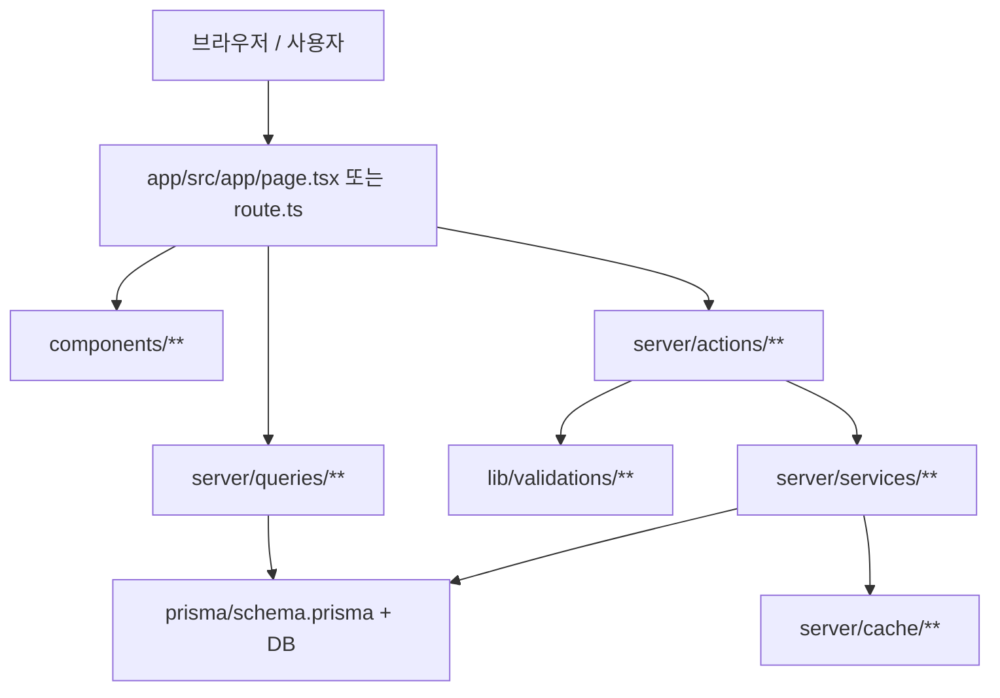

# 02. TownPet 전체 구조 한 장으로 보기

## 이번 글에서 풀 문제

TownPet는 파일 수가 많고, Next.js App Router와 React Server Component가 섞여 있어서 처음 보면 어디서부터 읽어야 할지 감이 잘 오지 않습니다.

이 글은 TownPet 전체 구조를 한 장의 지도처럼 정리합니다.

- `이 프로젝트는 어떤 폴더가 어떤 역할을 맡고 있는가`

이 질문에 답하면, 이후 글에서 `피드`, `검색`, `인증`, `모더레이션` 같은 세부 기능도 훨씬 쉽게 읽힙니다.

## 왜 이 글을 먼저 읽어야 하는가

Python/Java 백엔드 개발자가 TownPet를 처음 열면 보통 이런 지점에서 막힙니다.

- `app/src/app` 아래 파일이 왜 곧 라우트인지 모르겠다
- `page.tsx`, `route.ts`, `layout.tsx`가 어떻게 다른지 모르겠다
- `lib`, `server`, `components`가 어디까지 책임지는지 헷갈린다
- Prisma/Zod/Service/Query가 어떤 순서로 연결되는지 감이 없다

그래서 이 글에서는 먼저 **프로젝트 지도**를 잡습니다.

## 먼저 알아둘 개념

- TownPet는 **Next.js App Router** 기반 프로젝트입니다.
- UI와 라우트 진입점은 주로 [`app/src/app`](../app/src/app)에 있습니다.
- 비즈니스 로직은 주로 [`app/src/server`](../app/src/server)에 있습니다.
- 검증과 순수 헬퍼는 주로 [`app/src/lib`](../app/src/lib)에 있습니다.
- DB 스키마와 migration은 [`app/prisma`](../app/prisma)에 있습니다.

## 가장 먼저 볼 폴더

### 1. [`app/src/app`](../app/src/app)

이 폴더는 **라우트 진입점**입니다.

- `page.tsx`: 화면
- `layout.tsx`: 공통 레이아웃
- `route.ts`: API 엔드포인트
- `loading.tsx`: 로딩 UI
- `error.tsx`: 에러 UI
- `not-found.tsx`: 404 UI

예시:

- [`app/src/app/page.tsx`](../app/src/app/page.tsx)
  - `/` 요청을 받으면 `/feed`로 리다이렉트합니다.
- [`app/src/app/layout.tsx`](../app/src/app/layout.tsx)
  - 앱 전체의 헤더, 푸터, 글로벌 메타데이터를 정의합니다.
- [`app/src/app/feed/page.tsx`](../app/src/app/feed/page.tsx)
  - 실제 피드 화면을 렌더링합니다.
- [`app/src/app/api/posts/route.ts`](../app/src/app/api/posts/route.ts)
  - 게시글 목록 조회와 게시글 생성 API를 담당합니다.

### 2. [`app/src/components`](../app/src/components)

이 폴더는 **UI 조립 블록**입니다.

- 페이지에서 재사용하는 화면 조각
- 상태를 가진 클라이언트 컴포넌트
- 입력 폼, 카드, 버튼, 리스트

예시:

- [`app/src/components/posts/feed-infinite-list.tsx`](../app/src/components/posts/feed-infinite-list.tsx)
- [`app/src/components/posts/post-create-form.tsx`](../app/src/components/posts/post-create-form.tsx)
- [`app/src/components/navigation/app-shell-header.tsx`](../app/src/components/navigation/app-shell-header.tsx)

### 3. [`app/src/lib`](../app/src/lib)

이 폴더는 **순수 함수, 공용 유틸, validation**이 모이는 곳입니다.

대표적으로:

- 검증
  - [`app/src/lib/validations`](../app/src/lib/validations)
- 입력 정규화
  - [`app/src/lib/structured-field-normalization.ts`](../app/src/lib/structured-field-normalization.ts)
- 검색 문서 생성
  - [`app/src/lib/search-document.ts`](../app/src/lib/search-document.ts)
- 인증/보안 관련 순수 헬퍼
  - [`app/src/lib/auth.ts`](../app/src/lib/auth.ts)
  - [`app/src/lib/security-headers.ts`](../app/src/lib/security-headers.ts)

### 4. [`app/src/server`](../app/src/server)

이 폴더는 TownPet의 **실질적인 백엔드 계층**입니다.

하위 폴더를 보면 의도가 더 명확합니다.

- [`app/src/server/actions`](../app/src/server/actions)
  - Server Action
  - React/Next 폼이나 버튼에서 바로 호출하는 서버 함수
- [`app/src/server/services`](../app/src/server/services)
  - 쓰기 중심 비즈니스 로직
  - 정책 검사, validation 연결, 트랜잭션, cache bump
- [`app/src/server/queries`](../app/src/server/queries)
  - 읽기 전용 조회 로직
  - 목록, 상세, 통계, 관리자 화면 데이터
- [`app/src/server/cache`](../app/src/server/cache)
  - query cache, 버전 bump, 운영 cache 상태
- 그 외
  - auth, rate limit, request context, error monitor, retention job

### 5. [`app/prisma`](../app/prisma)

DB 구조의 기준입니다.

- [`app/prisma/schema.prisma`](../app/prisma/schema.prisma)
  - 모델, enum, index
- [`app/prisma/migrations`](../app/prisma/migrations)
  - 변경 이력

TownPet는 기능이 커질수록 `schema.prisma`를 먼저 읽는 편이 이해가 빠릅니다.

### 6. [`docs`](../docs), [`business`](../business) 와 [`blog`](./)

셋의 역할은 다릅니다.

- `docs/`
  - `PLAN.md`, `PROGRESS.md`, `COMPLETED.md` 같은 상태 문서
- `business/`
  - 제품, 운영, 보안, 정책, 배포 문서
  - 실제 기준 문서 SSOT
- `blog/`
  - 이 프로젝트를 설명하는 학습/포트폴리오 시리즈
  - 독자가 코드를 이해하기 위한 재현형 문서

## 구조를 그림으로 보면

이 그림에서 중요한 건 두 가지입니다.

- **화면 진입점은 `app/src/app`**
- **실제 규칙과 데이터 처리는 `server` + `lib` + `prisma`**

## TownPet를 읽는 추천 순서

### 1단계. 루트 진입점 보기

- [`app/src/app/page.tsx`](../app/src/app/page.tsx)
- [`app/src/app/layout.tsx`](../app/src/app/layout.tsx)

여기서 앱이 어디로 시작하고, 공통 레이아웃이 어떻게 붙는지 봅니다.

### 2단계. 가장 대표적인 페이지 하나 보기

- [`app/src/app/feed/page.tsx`](../app/src/app/feed/page.tsx)

이 파일은 TownPet의 성격을 가장 잘 보여줍니다.

- 인증 여부를 확인합니다.
- 커뮤니티 내비게이션을 읽습니다.
- 쿼리 파라미터를 해석합니다.
- feed query를 호출합니다.
- 결과를 UI 컴포넌트에 전달합니다.

즉, “페이지 진입점은 어떤 역할까지 하는가”를 보여줍니다.

### 3단계. 같은 도메인의 API 보기

- [`app/src/app/api/posts/route.ts`](../app/src/app/api/posts/route.ts)

이 파일은 같은 게시글 도메인에서:

- GET으로 목록을 조회하고
- POST로 게시글을 생성하며
- rate limit, auth, query parsing, error normalization을 처리합니다.

### 4단계. 실제 쓰기 로직 보기

- [`app/src/server/services/post.service.ts`](../app/src/server/services/post.service.ts)

이 파일이 사실상 게시글 도메인의 핵심입니다.

- `createPost`
- `updatePost`
- `deletePost`
- reaction/bookmark 처리
- moderation/contact/forbidden keyword 정책
- upload attach/release
- cache invalidation

이 정도가 모두 여기 들어 있습니다.

### 5단계. 읽기 전용 query 보기

- [`app/src/server/queries/post.queries.ts`](../app/src/server/queries/post.queries.ts)

이 파일은 목록/상세/검색/랭킹/베스트피드 같은 조회를 담당합니다.

중요한 포인트:

- TownPet는 `service`와 `query`를 분리합니다.
- 쓰기는 `services`
- 읽기는 `queries`

즉 CQRS를 아주 엄격하게 구현한 것은 아니지만, **읽기/쓰기 관심사를 꽤 강하게 분리**한 구조입니다.

### 6단계. validation 보기

- [`app/src/lib/validations/post.ts`](../app/src/lib/validations/post.ts)

여기서:

- 제목/본문 최대 길이
- 카테고리별 필수 조건
- 업로드 URL 검증
- 구조화 필드 정규화

를 먼저 고정합니다.

즉 “DTO + validator” 역할을 합니다.

### 7단계. DB 스키마 보기

- [`app/prisma/schema.prisma`](../app/prisma/schema.prisma)

최소한 아래 모델은 초반에 꼭 보면 좋습니다.

- `User`
- `Post`
- `Comment`
- `Report`
- `Notification`
- `SearchTermStat`
- `ModerationActionLog`

## Java/Spring으로 치환하면

TownPet를 Java/Spring 경험으로 번역하면 대략 이렇게 읽을 수 있습니다.

- `app/src/app/api/**/route.ts`
  - `@RestController`
- `app/src/server/actions/*.ts`
  - 서버에서 직접 호출하는 form handler
  - `Controller`와 `Application Service`의 중간쯤
- `app/src/server/services/*.ts`
  - `Service`
- `app/src/server/queries/*.ts`
  - 조회 전용 `Repository + Query Service`
- `app/src/lib/validations/*.ts`
  - DTO + Bean Validation
- `app/prisma/schema.prisma`
  - Entity/DDL의 기준

Spring과 가장 다른 점은:

- 라우트가 클래스/어노테이션이 아니라 **파일 위치**로 결정됩니다.
- UI가 서버와 더 가까이 붙어 있습니다.
- `Server Component`와 `Server Action` 때문에 “백엔드 코드처럼 보이지만 UI 폴더 안에 있는” 코드가 있습니다.

## TownPet의 실제 읽기 루트 예시

### 예시 1. 피드가 어떻게 보이는지 이해하고 싶다

1. [`app/src/app/feed/page.tsx`](../app/src/app/feed/page.tsx)
2. [`app/src/server/queries/post.queries.ts`](../app/src/server/queries/post.queries.ts)
3. [`app/src/components/posts/feed-infinite-list.tsx`](../app/src/components/posts/feed-infinite-list.tsx)

### 예시 2. 게시글 생성이 어떻게 되는지 이해하고 싶다

1. [`app/src/components/posts/post-create-form.tsx`](../app/src/components/posts/post-create-form.tsx)
2. [`app/src/server/actions/post.ts`](../app/src/server/actions/post.ts)
3. [`app/src/server/services/post.service.ts`](../app/src/server/services/post.service.ts)
4. [`app/src/lib/validations/post.ts`](../app/src/lib/validations/post.ts)
5. [`app/prisma/schema.prisma`](../app/prisma/schema.prisma)

### 예시 3. 검색이 어떻게 되는지 이해하고 싶다

1. [`app/src/app/search/page.tsx`](../app/src/app/search/page.tsx)
2. [`app/src/server/queries/post.queries.ts`](../app/src/server/queries/post.queries.ts)
3. [`app/src/server/queries/search.queries.ts`](../app/src/server/queries/search.queries.ts)
4. [`app/src/lib/search-document.ts`](../app/src/lib/search-document.ts)

## 테스트는 어디를 보면 되는가

TownPet는 코드 가까이에 테스트를 두는 편입니다.

예시:

- [`app/src/server/services/post.service.test.ts`](../app/src/server/services/post.service.test.ts)
- [`app/src/server/queries/post.queries.test.ts`](../app/src/server/queries/post.queries.test.ts)
- [`app/src/server/actions/post.test.ts`](../app/src/server/actions/post.test.ts)

즉 어떤 기능을 읽을 때는:

- 본문 코드
- 같은 이름의 `*.test.ts`

를 같이 열면 이해 속도가 훨씬 빨라집니다.

## 현재 구조의 장점

- 라우트 진입점과 실제 비즈니스 로직이 어느 정도 분리돼 있습니다.
- validation, query, service, cache 관심사가 나뉘어 있습니다.
- 운영 기능과 제품 기능이 같은 레포 안에서 일관된 방식으로 관리됩니다.
- 보안/운영 코드도 `server` 계층에서 눈에 보이는 형태로 유지됩니다.

## 현재 구조의 한계

- Next.js 프로젝트라서 UI와 서버 코드가 물리적으로 가까워, 처음엔 계층 경계가 흐려 보일 수 있습니다.
- App Router 특성상 “어느 파일이 실제 HTTP entry인지”를 익숙해질 때까지 찾기 어렵습니다.
- `actions`, `route`, `service`, `query`가 동시에 존재하므로 처음에는 과해 보일 수 있습니다.

하지만 이 구조는 기능이 커질수록 오히려 장점이 큽니다.

## Python/Java 개발자용 요약

- `app/src/app`부터 보면 전체 흐름이 잡힙니다.
- 실제 비즈니스 로직은 `app/src/server`에 있다고 생각하면 됩니다.
- `lib/validations`는 DTO 검증 계층으로 보면 됩니다.
- `queries`는 조회 전용, `services`는 쓰기 전용에 가깝습니다.
- TownPet를 읽는 가장 안정적인 순서는:

1. `schema.prisma`
2. `validation`
3. `service/query`
4. `route/page`
5. `component`

## 면접에서 이렇게 설명할 수 있다

> TownPet는 Next.js App Router 기반이지만, 내부 계층은 꽤 백엔드 친화적으로 나눴습니다. `app/src/app`는 라우트 진입점이고, 실제 비즈니스 로직은 `app/src/server/services`, 조회는 `app/src/server/queries`, 입력 검증은 `app/src/lib/validations`, 데이터 모델은 `prisma/schema.prisma`에 둡니다. 그래서 Python/Java 백그라운드에서도 `Controller -> Service -> Query/Validation -> ORM` 관점으로 읽을 수 있습니다.
