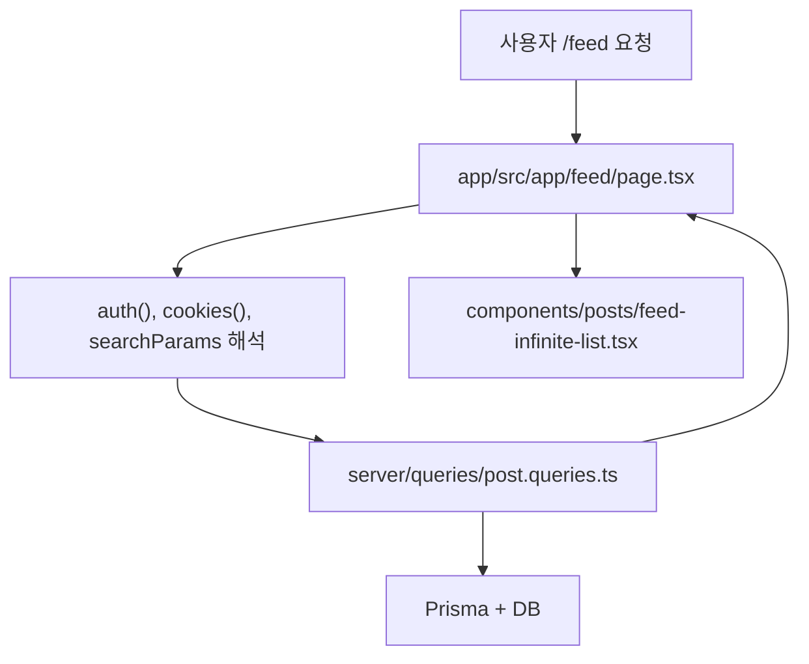
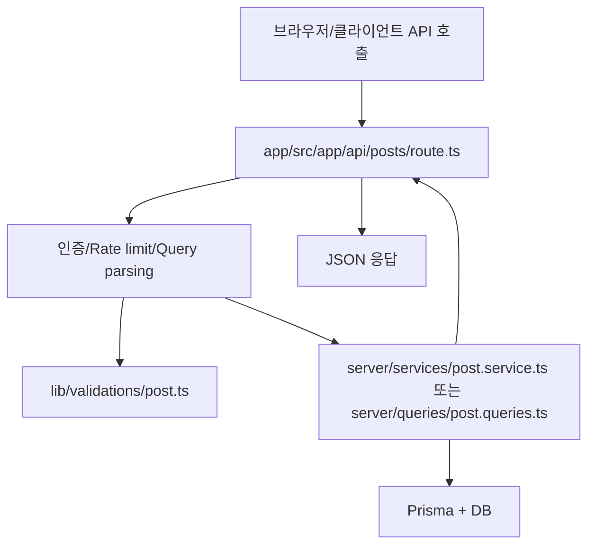
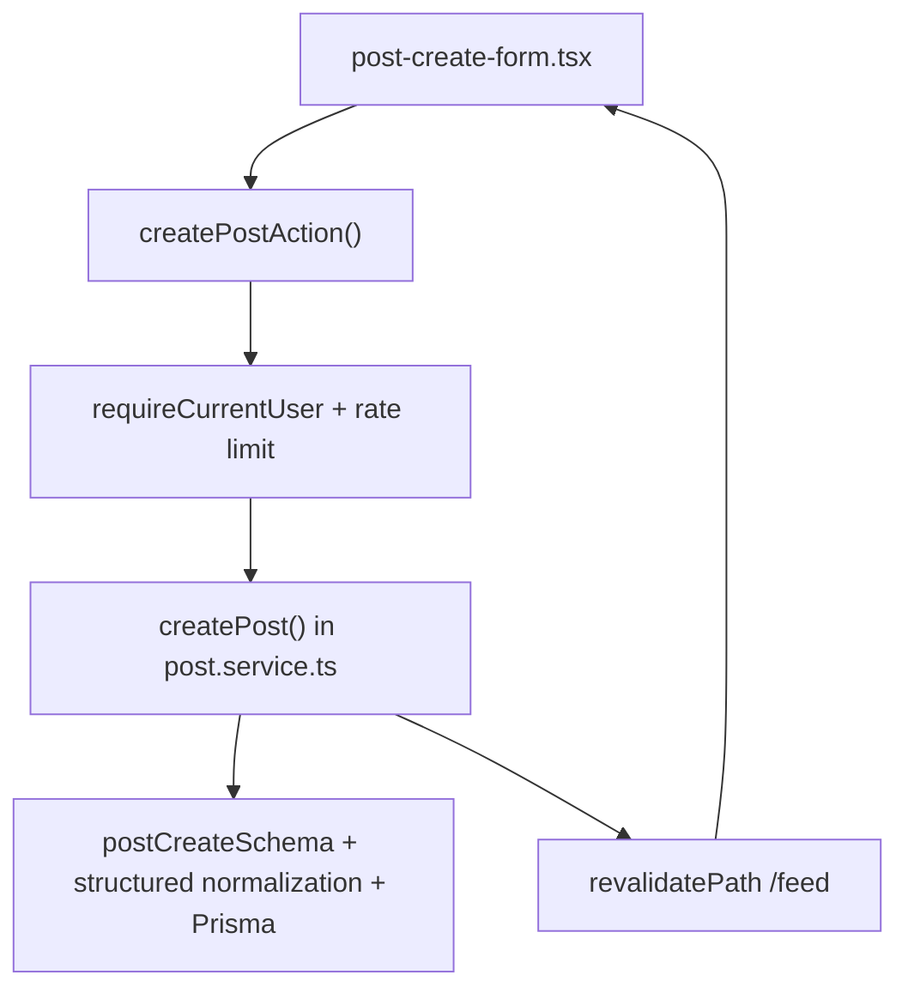

# 03. Next.js App Router를 백엔드 관점에서 이해하기

## 이번 글에서 풀 문제

Python/Java 개발자가 Next.js 프로젝트를 읽을 때 가장 먼저 부딪히는 문제는 이것입니다.

- `왜 파일이 라우트가 되지?`
- `page.tsx`와 `route.ts`는 뭐가 다르지?`
- `layout.tsx`, `loading.tsx`, `error.tsx`는 언제 쓰지?`
- `Server Action`은 API와 뭐가 다른가?`

TownPet를 읽으려면 이 질문부터 정리해야 합니다.

## 왜 지금 이 글이 필요한가

TownPet는 기능이 많은 프로젝트입니다.

- 피드
- 검색
- 알림
- 댓글
- 신고/모더레이션
- 관리자 대시보드

그런데 이 모든 기능이 결국 **App Router 파일 구조** 위에 올라갑니다. 즉 App Router를 모르면 기능별 코드도 제대로 읽기 어렵습니다.

## 핵심 요약

App Router에서 가장 중요한 규칙은 이것입니다.

- 폴더가 URL 구조를 만든다
- 파일명이 역할을 결정한다

예를 들어:

- [`app/src/app/page.tsx`](/Users/alex/project/townpet/app/src/app/page.tsx)
  - `/`
- [`app/src/app/feed/page.tsx`](/Users/alex/project/townpet/app/src/app/feed/page.tsx)
  - `/feed`
- [`app/src/app/search/page.tsx`](/Users/alex/project/townpet/app/src/app/search/page.tsx)
  - `/search`
- [`app/src/app/api/posts/route.ts`](/Users/alex/project/townpet/app/src/app/api/posts/route.ts)
  - `/api/posts`

## 파일별 역할

### `page.tsx`

화면을 렌더링하는 파일입니다.

Spring MVC로 치환하면:

- `Controller + View model assembly`

하지만 App Router에서는 이 파일이 **서버에서 직접 데이터 조회를 하면서 화면을 만들 수 있다**는 점이 다릅니다.

예시:

- [`app/src/app/feed/page.tsx`](/Users/alex/project/townpet/app/src/app/feed/page.tsx)

이 파일은:

- 세션을 읽고
- 쿠키를 읽고
- query string을 해석하고
- `listPosts`, `countPosts` 같은 query를 호출한 뒤
- 결과를 컴포넌트에 내려줍니다.

즉 “화면 렌더링용 서버 엔트리”로 이해하면 됩니다.

### `route.ts`

HTTP API 엔드포인트입니다.

Spring MVC로 치환하면:

- `@RestController`

예시:

- [`app/src/app/api/posts/route.ts`](/Users/alex/project/townpet/app/src/app/api/posts/route.ts)

이 파일은:

- `GET`
- `POST`

함수를 export해서 메서드별 API를 만듭니다.

즉:

- `export async function GET(...)`
- `export async function POST(...)`

형태가 그대로 엔드포인트입니다.

### `layout.tsx`

하위 페이지들이 공유하는 레이아웃입니다.

예시:

- [`app/src/app/layout.tsx`](/Users/alex/project/townpet/app/src/app/layout.tsx)

이 파일은:

- 사이트 메타데이터
- 전역 폰트
- 헤더
- 푸터

를 한 번에 감쌉니다.

Spring/Thymeleaf 경험으로 비유하면:

- 공통 layout template

에 가깝습니다.

### `loading.tsx`

해당 세그먼트가 로딩 중일 때 보여주는 화면입니다.

예:

- [`app/src/app/feed/loading.tsx`](/Users/alex/project/townpet/app/src/app/feed/loading.tsx)

### `error.tsx`

해당 세그먼트에서 예외가 발생했을 때 보여주는 에러 화면입니다.

예:

- [`app/src/app/feed/error.tsx`](/Users/alex/project/townpet/app/src/app/feed/error.tsx)
- [`app/src/app/admin/error.tsx`](/Users/alex/project/townpet/app/src/app/admin/error.tsx)

### `not-found.tsx`

404 화면입니다.

예:

- [`app/src/app/not-found.tsx`](/Users/alex/project/townpet/app/src/app/not-found.tsx)

## TownPet에서 라우트가 실제로 어떻게 생기는가

### `/`

- 파일: [`app/src/app/page.tsx`](/Users/alex/project/townpet/app/src/app/page.tsx)
- 역할: `/feed`로 즉시 리다이렉트

이 프로젝트는 랜딩보다 피드가 중심이기 때문에 홈이 사실상 feed 입구입니다.

### `/feed`

- 파일: [`app/src/app/feed/page.tsx`](/Users/alex/project/townpet/app/src/app/feed/page.tsx)
- 역할: 핵심 커뮤니티 목록 화면

여기서:

- 로그인 여부를 확인하고
- 로컬/글로벌 조건을 판단하고
- 검색/정렬 파라미터를 해석하고
- 쿼리 계층을 호출합니다.

### `/api/posts`

- 파일: [`app/src/app/api/posts/route.ts`](/Users/alex/project/townpet/app/src/app/api/posts/route.ts)
- 역할:
  - GET: 게시글 목록 조회
  - POST: 게시글 생성

### `/admin`

- 파일: [`app/src/app/admin/page.tsx`](/Users/alex/project/townpet/app/src/app/admin/page.tsx)
- 역할: 관리자 허브

여기서 TownPet는 “여러 관리자 화면을 상단 헤더에 직접 뿌리지 않고 `/admin` 단일 허브에서 다시 선택”하는 구조를 씁니다.

## Server Component와 Client Component

App Router에서는 기본이 **Server Component**입니다.

즉 `page.tsx`는 특별히 선언하지 않아도 서버에서 실행됩니다.

반대로 브라우저 상태와 상호작용이 필요한 컴포넌트는 맨 위에:

```ts
"use client";
```

를 붙입니다.

예시:

- [`app/src/components/posts/post-create-form.tsx`](/Users/alex/project/townpet/app/src/components/posts/post-create-form.tsx)

이 파일은:

- 입력 상태
- transition
- router navigation
- 업로드 UI

를 다루기 때문에 `use client`가 필요합니다.

## Server Action은 무엇인가

TownPet에는 API route와 별개로 **Server Action**도 있습니다.

예시:

- [`app/src/server/actions/post.ts`](/Users/alex/project/townpet/app/src/server/actions/post.ts)

이 파일은 맨 위에:

```ts
"use server";
```

가 붙어 있습니다.

Server Action은 보통 이런 상황에서 씁니다.

- 폼 제출
- 버튼 클릭 후 서버 작업
- API를 따로 공개하지 않아도 되는 내부 상호작용

예를 들어:

- `createPostAction`
- `updatePostAction`
- `deletePostAction`
- `togglePostReactionAction`

같은 함수가 있고, UI에서 직접 호출할 수 있습니다.

## API Route와 Server Action의 차이

### API Route

예시:

- [`app/src/app/api/posts/route.ts`](/Users/alex/project/townpet/app/src/app/api/posts/route.ts)

장점:

- 외부 클라이언트도 호출 가능
- HTTP contract가 분명함
- 모바일 앱/스크립트/테스트에서 쓰기 좋음

### Server Action

예시:

- [`app/src/server/actions/post.ts`](/Users/alex/project/townpet/app/src/server/actions/post.ts)

장점:

- React UI와 가까움
- 폼/버튼 흐름에서 간단함
- 성공 후 `revalidatePath()` 같은 후처리가 자연스러움

### TownPet가 두 개를 같이 쓰는 이유

TownPet는 둘 중 하나만 고집하지 않습니다.

- 공개 API 성격이면 `route.ts`
- UI 내부 상호작용이면 `server action`

이렇게 나눕니다.

즉 중요한 건 기술 선호가 아니라 **호출 맥락**입니다.

## 요청 흐름 예시 1: `/feed`



이 흐름은 전형적인 Server Component 패턴입니다.

특징:

- 별도 브라우저 fetch 없이 서버에서 바로 데이터 조회
- 페이지가 처음부터 데이터 포함 상태로 렌더링됨

## 요청 흐름 예시 2: `/api/posts`



이 흐름은 전형적인 REST API 패턴입니다.

## 요청 흐름 예시 3: 글 작성 폼



이 흐름은 API route가 아니라 **Server Action 중심**입니다.

## Java/Spring으로 치환하면

### App Router 폴더

- URL 매핑 테이블

### `page.tsx`

- Controller + server-side view assembly

### `route.ts`

- REST Controller

### `layout.tsx`

- 공통 레이아웃 템플릿

### `loading.tsx`

- 비동기 로딩 중 placeholder

### `error.tsx`

- 세그먼트 단위 예외 fallback

### Server Action

- 폼 전용 application service entry
- `Controller`를 아주 얇게 건너뛴 서버 함수에 가깝습니다.

## TownPet에서 App Router를 읽을 때의 팁

### 팁 1. 먼저 URL 하나를 정하고 관련 파일만 추적하기

예:

- `/feed`
- `/search`
- `/admin/ops`

이 중 하나를 고른 뒤:

1. `page.tsx`
2. 페이지가 부르는 query/service
3. 관련 component

순서로 보면 됩니다.

### 팁 2. UI 파일이 곧 서버 파일일 수 있다는 점에 익숙해지기

`page.tsx`는 TSX라서 프론트처럼 보이지만, 실제로는 서버에서 실행되는 경우가 많습니다.

이건 Spring/Thymeleaf보다도 “컨트롤러와 뷰 모델 준비가 한 파일에 더 가까운 구조”라고 보면 편합니다.

### 팁 3. 상태가 있으면 `use client`부터 찾기

파일 상단에 `use client`가 있으면:

- 브라우저 상호작용
- `useState`
- `useEffect`
- router push

같은 로직이 들어 있을 가능성이 큽니다.

## 현재 구조의 장점

- URL 구조가 파일 구조와 직접 연결돼 읽기 쉽습니다.
- 페이지별 로딩/에러/404를 세그먼트 단위로 나눌 수 있습니다.
- Server Component 덕분에 서버에서 데이터 읽고 바로 화면을 만들 수 있습니다.
- API route와 server action을 상황에 맞게 섞을 수 있습니다.

## 현재 구조의 한계

- 익숙하지 않으면 “이 파일이 서버인지 클라이언트인지” 처음에 헷갈립니다.
- 컨트롤러 클래스가 없어서 진입점을 찾는 방식이 Java와 다릅니다.
- Route Handler와 Server Action이 같이 존재해 초반에는 중복처럼 보일 수 있습니다.

## Python/Java 개발자용 요약

- App Router는 “클래스/어노테이션 기반 라우팅” 대신 “파일 기반 라우팅”입니다.
- `page.tsx`는 화면이면서 서버 엔트리입니다.
- `route.ts`는 REST API입니다.
- `layout.tsx`는 공통 레이아웃입니다.
- `use client`가 있으면 브라우저 컴포넌트라고 보면 됩니다.
- TownPet는 공개 API는 `route.ts`, UI 상호작용은 `server action`으로 많이 나눕니다.

## 면접에서 이렇게 설명할 수 있다

> TownPet는 Next.js App Router 기반이라 URL과 라우트가 파일 구조에 직접 매핑됩니다. `page.tsx`는 서버에서 데이터 조회까지 수행하는 화면 엔트리이고, `route.ts`는 공개 API 엔드포인트, `layout.tsx`는 공통 레이아웃, `server action`은 폼과 버튼에서 호출하는 내부 서버 함수입니다. 그래서 Spring 개발자 관점에서는 `Controller`가 파일 단위로 쪼개져 있고, 일부 화면 파일이 서버 컨트롤러 역할까지 같이 한다고 이해하면 됩니다.
