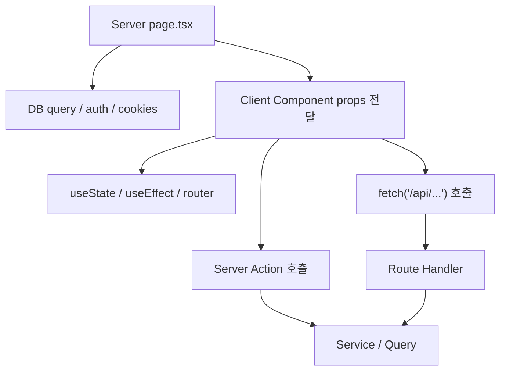

# 04. Server Component와 Client Component를 어떻게 나눴는가

## 이번 글에서 풀 문제

TownPet는 Next.js App Router를 사용합니다.  
이 구조를 처음 보면 가장 먼저 막히는 지점이 `어디까지 서버에서 렌더링하고, 어디부터 클라이언트에서 상태를 잡는가`입니다.

이 글은 TownPet에서 Server Component와 Client Component 경계를 어떻게 나눴는지 정리합니다.

특히 아래 질문에 답합니다.

- 왜 `page.tsx`는 서버에서 시작하는가
- 왜 `FeedInfiniteList`, `PostDetailClient`, `PostCreateForm`은 클라이언트 컴포넌트인가
- 왜 어떤 기능은 `Server Action`이고, 어떤 기능은 `route.ts` API인가

## 왜 이 글이 중요한가

Python/Java 백엔드 개발자에게 React는 흔히 “템플릿 + 상태관리” 정도로 보입니다.  
하지만 TownPet에서는 컴포넌트가 단순 뷰 조각이 아니라 `서버에서 시작할지`, `브라우저에서 상태를 가질지`, `서버 함수를 직접 호출할지`, `HTTP API를 거칠지`까지 같이 결정합니다.

이 구분을 이해해야 이후 글에서 나오는 인증, 피드, 댓글, 알림, 관리자 화면을 읽을 수 있습니다.

## 먼저 볼 핵심 파일

- `/Users/alex/project/townpet/app/src/app/feed/page.tsx`
- `/Users/alex/project/townpet/app/src/app/feed/guest/page.tsx`
- `/Users/alex/project/townpet/app/src/app/api/feed/guest/route.ts`
- `/Users/alex/project/townpet/app/src/app/posts/[id]/page.tsx`
- `/Users/alex/project/townpet/app/src/components/posts/feed-infinite-list.tsx`
- `/Users/alex/project/townpet/app/src/components/posts/post-detail-client.tsx`
- `/Users/alex/project/townpet/app/src/components/posts/post-create-form.tsx`
- `/Users/alex/project/townpet/app/src/server/actions/post.ts`

## 먼저 알아둘 개념

### 1. Server Component

`"use client"`가 없는 컴포넌트입니다.

특징:

- 서버에서 실행됩니다.
- DB query, `auth()`, `cookies()`, `headers()`를 직접 쓸 수 있습니다.
- 브라우저 이벤트 핸들러(`onClick`)를 직접 붙일 수 없습니다.
- 클라이언트 JS 번들 크기를 늘리지 않습니다.

Spring MVC로 치환하면:

- `Controller + 서버 템플릿 조합`에 더 가깝습니다.
- 다만 HTML string을 직접 만드는 게 아니라 React 트리를 서버에서 만듭니다.

### 2. Client Component

파일 상단에 `"use client"`가 있는 컴포넌트입니다.

특징:

- 브라우저에서 hydration됩니다.
- `useState`, `useEffect`, `useTransition`, `useRouter`를 쓸 수 있습니다.
- 클릭, 입력, optimistic UI 같은 상호작용을 담당합니다.
- 대신 DB나 서버 전용 API를 직접 호출하지 않습니다.

### 3. Server Action

TownPet에서는 `app/src/server/actions/*.ts`가 여기에 해당합니다.

특징:

- 파일 상단에 `"use server"`가 있습니다.
- 클라이언트 컴포넌트에서 함수처럼 호출하지만 실제 실행은 서버에서 됩니다.
- TownPet에서는 `createPostAction`, `updatePostAction`, `deletePostAction`처럼 “로그인 사용자의 단일 쓰기 액션”에 많이 씁니다.

### 4. Route Handler

`app/src/app/api/**/route.ts`입니다.

특징:

- HTTP API입니다.
- 브라우저 fetch, 외부 호출, 게스트 쓰기, 커서 기반 조회 같은 곳에 씁니다.
- 헤더, rate limit, cache-control, JSON 응답 제어가 필요할 때 적합합니다.

## TownPet의 기본 원칙

TownPet는 대체로 아래 규칙으로 경계를 나눕니다.

1. 첫 페이지 진입과 초기 데이터 결정은 Server Component에서 처리합니다.
2. 클릭, 입력, 무한스크롤, 실시간 동기화는 Client Component에서 처리합니다.
3. 로그인 사용자의 단순 쓰기 액션은 Server Action을 우선 사용합니다.
4. 게스트 처리, 헤더 기반 인증, 페이지네이션 API, 외부 접근 가능성이 있는 경로는 Route Handler를 사용합니다.

## 큰 그림



## 1. `/feed`는 왜 Server Component에서 시작하는가

파일:

- `/Users/alex/project/townpet/app/src/app/feed/page.tsx`

이 페이지는 서버에서 아래를 먼저 계산합니다.

- 세션: `auth()`
- 쿠키: `cookies()`
- 대표 동네
- 커뮤니티 목록
- 정책/개인화 컨텍스트
- 초기 피드 데이터

이렇게 서버에서 먼저 처리하는 이유:

1. 로그인 여부와 대표 동네가 피드 결과를 바꾸기 때문입니다.
2. 초기 SEO/metadata와 첫 화면 payload를 서버에서 바로 구성하는 편이 유리합니다.
3. 초기 렌더에서 불필요한 로딩 스피너를 줄일 수 있습니다.

즉 `/feed`는 “브라우저가 들어온 뒤 데이터를 모으는 페이지”가 아니라, “서버가 먼저 사용자 컨텍스트를 계산해서 화면을 만들어 주는 페이지”입니다.

## 2. 그런데 왜 `FeedInfiniteList`는 Client Component인가

파일:

- `/Users/alex/project/townpet/app/src/components/posts/feed-infinite-list.tsx`

이 컴포넌트는 `"use client"`입니다.

이유는 명확합니다.

- 무한스크롤
- 읽은 글 상태 저장
- 상대시간 갱신
- 라우터 이동
- dwell/personalization tracking

이 기능들은 모두 브라우저 상태와 이벤트가 필요합니다.

즉 TownPet는 `/feed`에서 이렇게 나눕니다.

- `page.tsx`: 초기 데이터와 정책을 서버에서 결정
- `FeedInfiniteList`: 이미 받은 목록을 브라우저에서 계속 확장

Spring으로 치환하면:

- `page.tsx`는 SSR controller + initial model
- `FeedInfiniteList`는 그 위에 붙는 JS widget

## 3. 게스트 피드는 왜 canonical `/feed`로 합쳤는가

파일:

- `/Users/alex/project/townpet/app/src/app/feed/page.tsx`
- `/Users/alex/project/townpet/app/src/app/feed/guest/page.tsx`
- `/Users/alex/project/townpet/app/src/app/api/feed/guest/route.ts`

예전에는 guest 피드가 별도 client page로 한 번 더 감싸져 있었습니다.

지금은 구조를 바꿨습니다.

- `/feed`가 로그인/비로그인 첫 페이지를 모두 서버에서 바로 렌더링합니다.
- `/feed/guest`는 호환용 redirect만 담당합니다.
- guest 전용 API는 첫 진입이 아니라, guest 무한스크롤과 공개 read 계약을 위한 경로로 남겼습니다.

이렇게 바꾼 이유:

1. 첫 화면에서 “준비 중” 같은 중간 상태를 덜 보여 주기 위해서입니다.
2. guest와 auth가 화면은 같고 정책만 다른데, entry를 둘로 나누면 유지 포인트만 늘어납니다.
3. canonical `/feed`가 이미 서버에서 사용자 컨텍스트와 첫 payload를 만들고 있었기 때문입니다.

즉 TownPet는 “게스트니까 따로 client page”가 아니라, **처음 보여 주는 화면은 최대한 서버에서 통일하고, 추가 페이지 로드만 guest API로 분리**하는 쪽으로 정리했습니다.

## 4. 글 상세는 왜 `page.tsx + PostDetailClient` 2단 구조인가

파일:

- `/Users/alex/project/townpet/app/src/app/posts/[id]/page.tsx`
- `/Users/alex/project/townpet/app/src/components/posts/post-detail-client.tsx`

`page.tsx`는 서버에서 아래만 합니다.

- 로그인 사용자 확인
- 비로그인이면 guest detail로 redirect
- 닉네임 미설정이면 profile redirect
- CSP nonce 준비

실제 상세의 상호작용은 `PostDetailClient`에서 처리합니다.

`PostDetailClient`가 맡는 것:

- 상세 fetch
- 댓글 prefetch
- 북마크, 반응, 신고
- 댓글 section 상태
- dwell tracking
- moderation panel

이건 TownPet가 “서버는 진입과 보안 조건을 담당, 클라이언트는 상호작용을 담당”하는 전형적인 예시입니다.

## 5. 글 작성 폼이 Client Component인 이유

파일:

- `/Users/alex/project/townpet/app/src/app/posts/new/page.tsx`
- `/Users/alex/project/townpet/app/src/components/posts/post-create-form.tsx`

`/posts/new/page.tsx`는 서버에서 아래를 준비합니다.

- 세션
- 사용자 동네 목록
- 커뮤니티 목록
- 입양 게시글 작성 권한

그 다음 `PostCreateForm`으로 넘깁니다.

`PostCreateForm`이 클라이언트인 이유:

- 제목/본문 입력
- 이미지 업로드
- structured field 입력
- draft 저장
- rich text editor 상태
- 제출 버튼 pending 상태

이 폼은 브라우저 상태가 매우 많기 때문에 Client Component가 자연스럽습니다.

## 6. 왜 글 작성은 Server Action을 쓰는가

파일:

- `/Users/alex/project/townpet/app/src/server/actions/post.ts`

대표 함수:

- `createPostAction`
- `updatePostAction`
- `deletePostAction`

TownPet는 로그인 사용자의 글 쓰기/수정/삭제를 Server Action으로 감쌌습니다.

이유:

1. UI 입장에서는 함수 호출처럼 단순합니다.
2. 인증 사용자 기준 revalidate를 같이 묶기 쉽습니다.
3. `requireCurrentUser()`와 rate limit을 action 레벨에 배치할 수 있습니다.

예를 들어 `createPostAction`은 이 순서로 동작합니다.

1. `requireCurrentUser()`
2. `enforceAuthenticatedWriteRateLimit(...)`
3. `createPost(...)`
4. `revalidatePath("/feed")`

즉 Action은 “폼에서 바로 부르는 서버 함수”이지만, 내부적으로는 인증/정책/캐시 invalidation을 같이 수행하는 thin orchestration layer입니다.

## 7. 그럼 왜 `/api/posts`도 있는가

파일:

- `/Users/alex/project/townpet/app/src/app/api/posts/route.ts`

이 route는 Action과 역할이 다릅니다.

`GET /api/posts`

- 피드 목록 조회
- 게스트/로그인 분기
- rate limit
- cache-control
- JSON 응답

`POST /api/posts`

- 로그인 사용자는 header 기반 fingerprint와 함께 작성 가능
- 게스트는 별도의 guest rate limit, step-up challenge, fingerprint, user-agent 검증

즉 TownPet는 이렇게 구분합니다.

- `Server Action`: 앱 내부에서 로그인 사용자가 호출하는 단순 명령
- `Route Handler`: 헤더/JSON/게스트/캐시/공개 API 계약이 필요한 경로

## 8. 경계를 정할 때 TownPet가 실제로 보는 기준

### Server Component로 보내는 기준

- 세션/쿠키/헤더를 먼저 읽어야 한다
- 초기 렌더에서 바로 결과가 필요하다
- SEO/metadata와 같이 움직인다
- DB query를 서버에서 직접 처리하는 편이 낫다

### Client Component로 보내는 기준

- 입력창이 있다
- 클릭/토글/모달이 있다
- 무한스크롤이나 브라우저 저장소를 쓴다
- `useState`, `useEffect`, `useTransition`, `useRouter`가 필요하다

### Server Action으로 보내는 기준

- 로그인 사용자의 단일 write command다
- UI에서 함수처럼 호출하는 게 편하다
- revalidate를 같이 묶고 싶다

### Route Handler로 보내는 기준

- JSON API가 필요하다
- 게스트도 호출한다
- 헤더 기반 계약이 있다
- cache-control이나 pagination cursor가 필요하다

## 9. 이 구조의 장점

1. 서버와 브라우저 책임이 분리됩니다.
2. 초기 진입과 상호작용을 각각 최적화할 수 있습니다.
3. 인증/정책/캐시 invalidation 위치가 명확합니다.
4. Python/Java 개발자 기준으로도 `page -> client -> action/route -> service` 순서로 읽기 쉽습니다.

## 10. 이 구조의 비용

1. 파일 수가 늘어납니다.
2. 같은 기능이 `page.tsx`, client component, action, route로 나뉘어 보일 수 있습니다.
3. 처음 보면 “왜 이건 action이고 저건 route인가”가 헷갈립니다.

TownPet는 이 비용을 감수하고도, 기능이 커질수록 경계가 분명한 편이 유지보수에 낫다고 판단한 구조입니다.

## 테스트는 어떻게 읽어야 하는가

이 파트는 아래 테스트와 함께 읽으면 좋습니다.

- `/Users/alex/project/townpet/app/src/server/actions/post.test.ts`
- `/Users/alex/project/townpet/app/src/app/api/posts/route.test.ts`
- `/Users/alex/project/townpet/app/src/components/posts/post-detail-client.test.tsx`
- `/Users/alex/project/townpet/app/src/components/posts/post-create-form.test.tsx`

읽는 순서:

1. action test: 로그인 write command가 어떻게 검증되는지
2. route test: 공개 API 계약과 에러 코드를 어떻게 검증하는지
3. client component test: UI 상태가 어떻게 변하는지

## 직접 실행해 보고 싶다면

```bash
cd /Users/alex/project/townpet
corepack pnpm -C app dev
```

그 다음 아래를 비교해 보면 경계가 잘 보입니다.

- `/feed`
- `/feed/guest`
- `/api/feed/guest`
- `/posts/new`
- `/posts/[id]`

## 현재 구현의 한계

- `Server Component`와 `Client Component` 경계가 파일명만으로는 항상 드러나지 않습니다.
- 일부 기능은 첫 화면은 서버에서 시작하지만, 추가 페이지 로드나 공개 read path는 별도 API 계약을 유지합니다.
- Route Handler와 Server Action이 함께 있는 기능은 초보자에게 중복처럼 보일 수 있습니다.

## Python/Java 개발자용 요약

- `page.tsx` = 서버 진입점
- `"use client"` 컴포넌트 = 브라우저 상태/이벤트 담당
- `"use server"` action = 로그인 사용자 명령 처리
- `app/api/**/route.ts` = 공개 JSON API / 게스트 계약 / 헤더 처리

즉 TownPet는 “SSR 페이지 + 브라우저 상호작용 레이어 + 서버 명령/HTTP API”를 분리해서 읽는 프로젝트입니다.

## 면접에서 이렇게 설명할 수 있다

> TownPet는 Next.js App Router를 쓰지만, 모든 걸 클라이언트에 몰지 않았습니다. 초기 페이지 진입과 사용자 컨텍스트 계산은 Server Component에서 처리했고, 무한스크롤/폼/댓글/상세 상호작용은 Client Component로 분리했습니다. 로그인 사용자의 단순 쓰기 명령은 Server Action으로, 게스트나 공개 JSON 계약이 필요한 경로는 Route Handler로 나눠서 책임을 구분했습니다.
