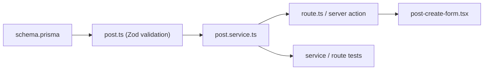
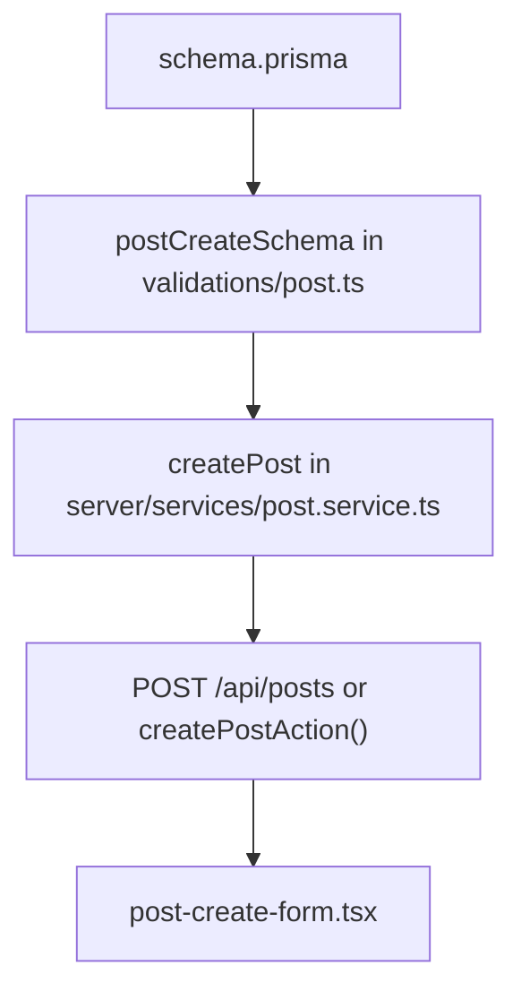

# 05. Prisma -> Zod -> Service -> Route/UI 순서로 읽는 법

## 이번 글에서 풀 문제

TownPet는 기능이 많지만, 실제로 코드를 읽는 가장 안전한 순서는 거의 고정돼 있습니다.

- `Prisma -> Zod -> Service -> Route/UI`

이 글은 왜 이 순서가 중요한지, 그리고 게시글 생성 흐름을 예시로 어떻게 읽으면 되는지 정리합니다.

## 왜 이 순서가 필요한가

처음 TownPet를 보면 보통 UI부터 보게 됩니다.

예:

- [`app/src/components/posts/post-create-form.tsx`](/Users/alex/project/townpet/app/src/components/posts/post-create-form.tsx)

하지만 UI부터 읽으면 오히려 헷갈립니다.

이유:

- 폼 상태가 많습니다.
- 구조화 필드가 많습니다.
- 인증/비회원 정책이 섞여 있습니다.
- 업로드, moderation, cache invalidation까지 뒤에서 이어집니다.

그래서 TownPet는 **바깥이 아니라 안쪽부터 읽는 방식**이 훨씬 효율적입니다.

## 권장 읽기 순서

1. `schema.prisma`
2. `validation`
3. `service`
4. `route` 또는 `server action`
5. `UI`
6. `test`

이 순서를 지키면:

- 데이터 구조
- 입력 계약
- 비즈니스 규칙
- 호출 방식
- 화면 표현

을 안쪽에서 바깥으로 이해할 수 있습니다.

## 예시로 볼 기능: 게시글 생성

이번 글은 게시글 생성을 예시로 설명합니다.

주요 파일:

- [`app/prisma/schema.prisma`](/Users/alex/project/townpet/app/prisma/schema.prisma)
- [`app/src/lib/validations/post.ts`](/Users/alex/project/townpet/app/src/lib/validations/post.ts)
- [`app/src/server/services/post.service.ts`](/Users/alex/project/townpet/app/src/server/services/post.service.ts)
- [`app/src/app/api/posts/route.ts`](/Users/alex/project/townpet/app/src/app/api/posts/route.ts)
- [`app/src/server/actions/post.ts`](/Users/alex/project/townpet/app/src/server/actions/post.ts)
- [`app/src/components/posts/post-create-form.tsx`](/Users/alex/project/townpet/app/src/components/posts/post-create-form.tsx)
- [`app/src/server/services/post.service.test.ts`](/Users/alex/project/townpet/app/src/server/services/post.service.test.ts)

## 흐름을 먼저 그림으로 보면

핵심은 UI가 출발점처럼 보이더라도, 실제 안정성의 중심은 `schema -> validation -> service` 안쪽에 있다는 점입니다.

## 1. Prisma: 어떤 데이터를 다루는가

가장 먼저 볼 파일은:

- [`app/prisma/schema.prisma`](/Users/alex/project/townpet/app/prisma/schema.prisma)

게시글 생성 흐름에서 최소한 알아야 하는 모델은:

- `User`
- `Neighborhood`
- `Post`
- `PostReaction`
- `PostBookmark`
- 구조화 서브모델
  - `HospitalReview`
  - `PlaceReview`
  - `WalkRoute`
  - `AdoptionListing`
  - `VolunteerRecruitment`

이 단계에서 확인할 질문은 이것입니다.

- 게시글은 어떤 필드를 가지는가
- 어떤 enum을 쓰는가
- 어떤 관계를 가지는가
- 어떤 index가 있는가

즉 “저장소의 진짜 형태”를 먼저 보는 단계입니다.

## 2. Zod: 어떤 입력을 허용하는가

다음은:

- [`app/src/lib/validations/post.ts`](/Users/alex/project/townpet/app/src/lib/validations/post.ts)

핵심 스키마는 이 셋입니다.

- `postCreateSchema`
- `postListSchema`
- `postUpdateSchema`

게시글 생성에서는 특히 `postCreateSchema`가 중요합니다.

이 스키마는 단순 타입 체크만 하지 않습니다.

- 제목/본문 길이 제한
- 공백-only 차단
- trusted upload URL만 허용
- 리뷰 카테고리 규칙
- 공용 보드와 petType 제약
- 동물 태그 필수 여부

즉 Zod를 DTO 검증기 정도로만 보면 부족하고, **입력 정책 레이어**로 봐야 합니다.

또 구조화 필드도 이 레이어에서 정규화합니다.

예:

- 병원명
- 치료유형
- 보호소명
- 지역명
- 품종

## 3. Service: 실제 비즈니스 로직은 어디 있는가

핵심 파일:

- [`app/src/server/services/post.service.ts`](/Users/alex/project/townpet/app/src/server/services/post.service.ts)

이 파일에서 게시글 생성 엔트리는:

- `createPost`

입니다.

이 함수는 단순히 `prisma.post.create()`만 하지 않습니다.

실제로 하는 일:

- 입력을 `postCreateSchema`로 검증
- guest/user 여부 분기
- 신규 계정 정책 검사
- 금칙어/연락처 moderation 검사
- 구조화 필드 normalization
- 이미지 URL 정리
- guest identity 처리
- DB 저장
- 알림/cache version bump
- 업로드 attach/release 후처리

즉 service는 TownPet에서 **정책, 트랜잭션, 후처리의 중심**입니다.

여기서 중요한 점은:

- route는 service를 호출한다
- action도 service를 호출한다
- UI는 service를 직접 호출하지 않는다

## 4. Route Handler: 공개 API 계약은 어디 있는가

파일:

- [`app/src/app/api/posts/route.ts`](/Users/alex/project/townpet/app/src/app/api/posts/route.ts)

여기서 `POST`는 게시글 생성 API입니다.

하는 일:

- request body 읽기
- 현재 사용자 확인
- 로그인 사용자는 authenticated write throttle 적용
- 비로그인 사용자는 guest rate limit + step-up 정책 적용
- 최종적으로 `createPost()` 호출
- 에러를 `jsonError()`로 정규화

즉 route의 책임은:

- HTTP
- 인증
- rate limit
- request/response 계약

입니다.

비즈니스 규칙의 본체는 여기에 두지 않습니다.

## 5. Server Action: UI 내부 서버 호출은 어떻게 하는가

파일:

- [`app/src/server/actions/post.ts`](/Users/alex/project/townpet/app/src/server/actions/post.ts)

여기에는:

- `createPostAction`
- `updatePostAction`
- `deletePostAction`

이 있습니다.

`createPostAction()`은:

- 현재 로그인 사용자를 강제
- client fingerprint를 받음
- write throttle 적용
- `createPost()` 호출
- 성공 후 `revalidatePath("/feed")`

를 수행합니다.

즉 Action은:

- 브라우저 폼/버튼에서 직접 쓰는 서버 엔트리
- 성공 후 화면 재검증까지 묶는 레이어

입니다.

## 6. UI: 마지막에 봐야 하는 이유

파일:

- [`app/src/components/posts/post-create-form.tsx`](/Users/alex/project/townpet/app/src/components/posts/post-create-form.tsx)

이 파일은 길고 복잡합니다. 하지만 앞 단계를 알고 보면 훨씬 읽기 쉬워집니다.

이 UI가 하는 일은 대략 이렇습니다.

- 제목/본문 입력 상태 관리
- 게시판 타입 선택
- 구조화 필드 섹션 조건부 렌더링
- 업로드 UI
- draft 저장
- `createPostAction()` 호출

중요한 포인트:

- UI는 “규칙의 최종 기준”이 아닙니다.
- 최종 기준은 여전히 `postCreateSchema`와 `createPost()`입니다.

즉 UI는 친절한 입력기이고, 진짜 보호막은 서버에 있습니다.

## 전체 흐름을 그림으로 보면

읽는 순서와 실행 순서가 완전히 같지는 않지만, **이 순서대로 이해하는 편이 안정적**입니다.

## 왜 Query는 여기서 뒤로 빠지는가

쓰기 흐름에서는 `queries`보다 `services`가 먼저입니다.

이유:

- `queries`는 읽기 모델입니다.
- 생성/수정/삭제의 핵심은 service에 있습니다.

반대로 목록/상세/검색을 이해할 때는:

- `schema -> validation(query input) -> query -> page/API -> component`

순서가 더 자연스럽습니다.

즉 TownPet는 기능에 따라 읽기와 쓰기를 나눠 읽는 편이 좋습니다.

## 실패 경로는 어디서 확인하는가

TownPet를 이해할 때는 성공 흐름만 보면 부족합니다.

실패 경로를 보면 설계 의도가 더 잘 보입니다.

예를 들어 게시글 생성 실패는 아래에서 드러납니다.

- Zod validation 실패
- 권한 부족
- 로컬/글로벌 정책 위반
- 신규 계정 제한
- 금칙어/연락처 정책 위반
- 업로드 URL 정책 위반

이 실패 경로는 주로:

- [`app/src/server/services/post.service.test.ts`](/Users/alex/project/townpet/app/src/server/services/post.service.test.ts)
- [`app/src/server/actions/post.test.ts`](/Users/alex/project/townpet/app/src/server/actions/post.test.ts)

에서 확인할 수 있습니다.

즉 TownPet는 “무엇이 안 되게 했는가”를 보는 것도 중요합니다.

## Java/Spring으로 치환하면

### Prisma

- JPA Entity + schema 기준

### Zod

- Request DTO + Bean Validation

### Service

- Application Service + Domain rule 조합

### Route Handler

- REST Controller

### Server Action

- 폼 전용 서버 핸들러

### UI

- 템플릿 + 브라우저 상호작용 계층

## TownPet를 읽을 때 왜 이 순서가 강한가

이 순서의 장점은:

- DB와 계약을 먼저 본다
- 서버 정책을 먼저 본다
- UI의 복잡성에 휘둘리지 않는다
- 실패 경로를 같이 추적할 수 있다

즉 구현을 “보이는 순서”가 아니라 “안정적인 순서”로 읽게 됩니다.

## 지금 기준으로 추천하는 실제 읽기 루트

### 게시글 생성

1. [`app/prisma/schema.prisma`](/Users/alex/project/townpet/app/prisma/schema.prisma)
2. [`app/src/lib/validations/post.ts`](/Users/alex/project/townpet/app/src/lib/validations/post.ts)
3. [`app/src/server/services/post.service.ts`](/Users/alex/project/townpet/app/src/server/services/post.service.ts)
4. [`app/src/server/actions/post.ts`](/Users/alex/project/townpet/app/src/server/actions/post.ts)
5. [`app/src/components/posts/post-create-form.tsx`](/Users/alex/project/townpet/app/src/components/posts/post-create-form.tsx)
6. [`app/src/server/services/post.service.test.ts`](/Users/alex/project/townpet/app/src/server/services/post.service.test.ts)

### 게시글 목록/피드

1. [`app/prisma/schema.prisma`](/Users/alex/project/townpet/app/prisma/schema.prisma)
2. [`app/src/lib/validations/post.ts`](/Users/alex/project/townpet/app/src/lib/validations/post.ts)
3. [`app/src/server/queries/post.queries.ts`](/Users/alex/project/townpet/app/src/server/queries/post.queries.ts)
4. [`app/src/app/feed/page.tsx`](/Users/alex/project/townpet/app/src/app/feed/page.tsx)
5. [`app/src/components/posts/feed-infinite-list.tsx`](/Users/alex/project/townpet/app/src/components/posts/feed-infinite-list.tsx)

## 현재 구조의 장점

- validation과 business rule이 서버에 있습니다.
- API route와 server action이 같은 service를 공유해 규칙이 분산되지 않습니다.
- service와 query가 나뉘어 읽기/쓰기를 구분하기 쉽습니다.
- 테스트도 계층별로 붙어 있어 원인 추적이 빠릅니다.

## 현재 구조의 한계

- 파일 수가 많아 보입니다.
- Next.js를 처음 보는 사람에게는 `action`과 `route`가 동시에 있는 구조가 낯설 수 있습니다.
- service 내부가 강력한 만큼 파일 하나가 커질 수 있습니다.

하지만 기능이 복잡한 커뮤니티 서비스에서는 이 정도 분리가 오히려 유지보수에 유리합니다.

## Python/Java 개발자용 요약

- TownPet는 UI부터 읽지 말고 `schema -> validation -> service -> route/action -> UI`로 읽어야 합니다.
- `service`가 핵심 비즈니스 로직입니다.
- `route`는 HTTP 계약, `action`은 UI용 서버 엔트리입니다.
- UI는 마지막에 봐야 규칙과 데이터 구조가 먼저 머리에 잡힙니다.

## 면접에서 이렇게 설명할 수 있다

> TownPet는 구현 순서를 `Prisma -> Zod -> Service -> Route/UI`로 두고 읽는 게 맞습니다. 먼저 DB 모델과 입력 계약을 보고, 그 위에 실제 정책과 트랜잭션을 가진 service를 이해한 뒤, API route나 server action이 그 service를 어떻게 노출하는지 봅니다. 마지막에 UI를 보면 폼과 상태 관리가 단순한 입력기라는 게 보이고, 핵심 규칙은 서버에 있다는 점을 설명할 수 있습니다.
