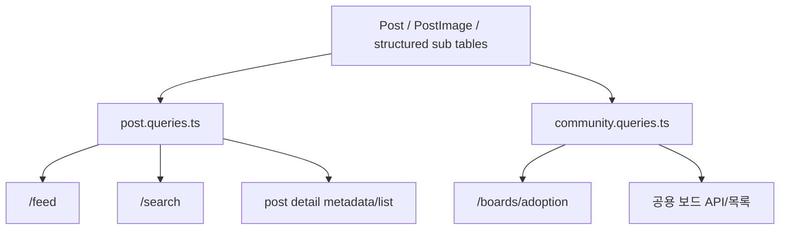

# 06. 피드와 게시판 구조

## 이번 글에서 풀 문제

TownPet는 게시글을 한 군데에만 모아두지 않습니다.

- 메인 `/feed`
- 게스트 피드
- 입양 게시판
- 공용 보드
- 검색 결과

이 화면들은 모두 게시글을 보여주지만, 완전히 같은 규칙으로 동작하지도 않습니다.  
이 글은 TownPet가 `하나의 Post 모델` 위에 여러 읽기 표면을 어떻게 올렸는지 정리합니다.

## 왜 이 글이 중요한가

TownPet의 설계 핵심은 “게시글 테이블 하나에 기능을 우겨 넣는 것”이 아니라,  
`피드`, `전용 보드`, `공용 보드`, `검색`, `상세`가 같은 데이터를 각자 다른 규칙으로 보여주도록 읽기 계층을 나눈 데 있습니다.

이 구조를 이해해야:

- 왜 `/feed`와 `/boards/adoption`이 다르게 보이는지
- 왜 `post.queries.ts`와 `community.queries.ts`가 분리돼 있는지
- 왜 일부 게시판은 카드형, 일부는 리스트형인지

를 설명할 수 있습니다.

## 먼저 볼 핵심 파일

- `/Users/alex/project/townpet/app/src/app/feed/page.tsx`
- `/Users/alex/project/townpet/app/src/app/feed/guest/page.tsx`
- `/Users/alex/project/townpet/app/src/components/posts/feed-loading-skeleton.tsx`
- `/Users/alex/project/townpet/app/src/components/posts/feed-infinite-list.tsx`
- `/Users/alex/project/townpet/app/src/components/posts/guest-feed-page-client.tsx`
- `/Users/alex/project/townpet/app/src/app/boards/adoption/page.tsx`
- `/Users/alex/project/townpet/app/src/server/queries/post.queries.ts`
- `/Users/alex/project/townpet/app/src/server/services/posts/feed-page-query.service.ts`
- `/Users/alex/project/townpet/app/src/server/queries/community.queries.ts`
- `/Users/alex/project/townpet/app/src/lib/community-board.ts`

## 먼저 알아둘 개념

### 1. 메인 피드와 전용 보드는 다른 읽기 표면이다

TownPet는 같은 `Post`를 보여줘도, 목적이 다르면 조회 계층을 분리합니다.

- 메인 피드: 전체 서비스에서 “지금 볼 가치가 있는 글”을 훑는 공간
- 입양 게시판: 입양 전용 필드를 카드형으로 비교하는 공간
- 검색: query relevance가 우선인 공간

### 2. Query layer를 분리한다

TownPet는 조회를 service에 섞지 않고 `queries` 폴더로 분리합니다.

- `/src/server/queries/post.queries.ts`
- `/src/server/queries/community.queries.ts`

Spring으로 치환하면:

- `Repository`보다 한 단계 위의 `read model query layer`에 가깝습니다.

## 큰 그림



## 1. `/feed`는 TownPet의 기본 읽기 표면이다

파일:

- `/Users/alex/project/townpet/app/src/app/feed/page.tsx`

이 페이지는 아래 요소를 한 화면에 모읍니다.

- `ALL / BEST` 모드
- `GLOBAL / LOCAL`
- pet type/community filter
- review category
- 정렬/기간
- 검색어/검색 범위
- personalization

즉 `/feed`는 단순 목록이 아니라 TownPet의 가장 복합적인 읽기 표면입니다.

그래서 이 페이지는 서버에서 먼저 아래를 계산합니다.

- 사용자 세션
- 대표 동네
- 커뮤니티 목록
- 개인화 컨텍스트
- guest policy
- 초기 아이템과 페이지 수

그리고 client list에 넘깁니다.

여기서 중요한 구현 포인트가 하나 있습니다.

`/feed`는 첫 화면에서 `countPosts/countBestPosts`와 `listPosts/listBestPosts`를 무조건 직렬로 기다리지 않습니다.
`feed-page-query.service.ts` helper가 먼저 count와 requested page 조회를 병렬로 시작하고, **요청 page가 totalPages를 넘친 경우에만** resolved page를 다시 조회합니다.

즉 TownPet는:

- 첫 페이지(`page=1`) 같은 흔한 진입은 응답을 최대한 앞당기고
- 드물게 page overflow가 난 경우만 안전하게 한 번 더 정정하는

쪽으로 설계했습니다.

## 2. `FeedInfiniteList`는 읽기 전용 UI 엔진이다

파일:

- `/Users/alex/project/townpet/app/src/components/posts/feed-infinite-list.tsx`

이 컴포넌트가 맡는 일:

- 초기 아이템 렌더
- 추가 페이지 fetch
- 읽은 글 상태
- 상대시간 갱신
- 광고/개인화 tracking
- mixed list 스타일 표시

중요한 점은, 이 컴포넌트는 “DB를 아는 컴포넌트”가 아닙니다.  
이미 query layer가 만들어 준 `FeedPostItem`을 화면에 맞게 소비하는 렌더링 엔진입니다.

즉 TownPet는 피드 UI를 다음처럼 나눴습니다.

- query layer: 어떤 글을 어떤 순서로 가져올지
- page: 어떤 사용자 컨텍스트인지
- client list: 어떻게 스크롤/렌더링할지

## 3. 게스트 피드는 별도 흐름으로 유지한다

파일:

- `/Users/alex/project/townpet/app/src/app/feed/guest/page.tsx`
- `/Users/alex/project/townpet/app/src/components/posts/guest-feed-page-client.tsx`

게스트 피드는 로그인 사용자 피드와 일부 계약이 다릅니다.

- 로그인 필요 카테고리 차단
- guest API 호출
- scope 정규화
- 게이트 응답

TownPet는 이 차이를 숨기기보다 별도 클라이언트 entry로 분리했습니다.  
이게 중요한 이유는 `Local`과 `Global`, guest와 auth를 섞지 않기 위해서입니다.

대신 로딩 UX는 별도 문구를 남발하지 않고 공통 skeleton으로 맞췄습니다.

- `/feed/loading.tsx`
- `feed-loading-skeleton.tsx`
- `/feed/guest/page.tsx`
- `guest-feed-page-client.tsx`

이렇게 맞춰 두면 cold start나 guest API 응답이 느릴 때도, 사용자는 “빈 화면”보다 “목록이 곧 채워질 레이아웃”을 먼저 보게 됩니다.

## 4. 입양 게시판은 피드가 아니라 비교 카드 화면이다

파일:

- `/Users/alex/project/townpet/app/src/app/boards/adoption/page.tsx`
- `/Users/alex/project/townpet/app/src/server/queries/community.queries.ts`

입양 게시판은 `/feed`와 목적이 다릅니다.

메인 피드 목적:

- 최근성과 중요도 기준으로 훑기

입양 게시판 목적:

- 보호소명, 지역, 동물종, 품종, 성별, 중성화, 예방접종 같은 필드를 카드형으로 비교하기

그래서 TownPet는 입양 게시판을 별도 query로 뽑습니다.

- `countAdoptionBoardPosts`
- `listAdoptionBoardPostsPage`

이 쿼리는 아래 조건을 강하게 고정합니다.

- `PostStatus.ACTIVE`
- `boardScope: "COMMON"`
- `commonBoardType: ADOPTION`
- `type: PostType.ADOPTION_LISTING`

즉 입양 게시판은 “피드 필터를 많이 건 결과”가 아니라,  
처음부터 `입양용 읽기 모델`로 취급합니다.

## 5. 왜 `post.queries.ts`와 `community.queries.ts`를 분리했는가

### `post.queries.ts`

담당:

- 메인 피드
- 베스트 피드
- 검색
- 상세
- 메타데이터
- 개인화/추천 보조 쿼리

즉 “TownPet 전역에서 공통으로 읽히는 post surface”를 담당합니다.

### `community.queries.ts`

담당:

- 커뮤니티 네비게이션
- 공용 보드 목록
- 입양 게시판

즉 “보드/카테고리별 읽기 surface”를 담당합니다.

이렇게 나누면:

- 메인 피드 로직과 보드별 카드 로직이 서로 오염되지 않습니다.
- 입양 게시판 같은 특수 보드를 따로 최적화하기 쉽습니다.

## 6. 구조화 검색은 보드에서도 일관되게 쓴다

`community.queries.ts`는 공용 보드 검색에서 `structuredSearchText`를 사용합니다.

이건 중요한 포인트입니다.

입양 게시판은 자유 텍스트만 검색하면 품질이 낮아집니다.  
TownPet는 보호소명, 지역, 동물종, 품종 같은 구조화 필드를 정규화해 shadow text로 만들고, 보드 검색에서도 그 값을 활용합니다.

즉 보드 검색도 단순 `title/content contains`가 아닙니다.

## 7. 게시판 네비게이션도 데이터 모델에 맞춰 설계한다

파일:

- `/Users/alex/project/townpet/app/src/lib/community-board.ts`

이 파일은 단순 상수 모음이 아닙니다.

역할:

- 어떤 `PostType`이 어떤 보드로 가는지
- 공용 보드인지, 자유 보드인지
- 전용 경로가 있는지
- 동물 태그가 필요한지

즉 라우팅과 제품 규칙을 연결하는 메타 계층입니다.

Spring 개발자 기준으로 보면:

- enum helper + routing policy + presenter metadata가 섞인 지원 레이어에 가깝습니다.

## 8. 피드와 보드는 “같은 Post를 다른 형태로 읽는” 구조다

예를 들어 같은 `ADOPTION_LISTING` 글이라도:

- `/feed`에서는 mixed list의 한 아이템
- `/boards/adoption`에서는 비교 카드
- `/search`에서는 relevance 결과
- `/posts/[id]`에서는 상세 정보 패널

로 나타납니다.

이게 TownPet의 좋은 점입니다.

- 쓰기 모델은 하나로 유지
- 읽기 표면은 목적별로 분리

즉 write model과 read model을 완전히 CQRS처럼 쪼개진 않았지만, 화면 관점에서는 꽤 강하게 분리한 구조입니다.

## 9. 이 구조의 장점

1. 피드는 피드답게 빠르게 최적화할 수 있습니다.
2. 입양 보드는 입양 보드답게 카드형 비교에 집중할 수 있습니다.
3. 검색과 보드를 따로 고도화할 수 있습니다.
4. 정책 분리도 쉽습니다.
   - guest 차단
   - local/global 분리
   - 공용 보드 visibility

## 10. 이 구조의 비용

1. 같은 `Post`라도 읽기 경로가 많아집니다.
2. query layer가 커집니다.
3. 피드와 보드의 UI/쿼리 일관성을 계속 맞춰야 합니다.

TownPet는 이 비용을 감수하고 “서비스 표면마다 목적이 다른 읽기 경험”을 선택했습니다.

## 테스트는 어떻게 읽어야 하는가

아래 테스트를 같이 보면 좋습니다.

- `/Users/alex/project/townpet/app/src/server/queries/post.queries.test.ts`
- `/Users/alex/project/townpet/app/src/server/queries/community.queries.test.ts`
- `/Users/alex/project/townpet/app/src/app/api/boards/[board]/posts/route.test.ts`

읽는 포인트:

- `HIDDEN` 글 제외
- 차단 작성자 제외
- stable ordering
- structured search 동작

즉 TownPet의 게시판 구조는 화면보다 query contract를 먼저 읽는 편이 이해가 쉽습니다.

## 직접 실행해 보고 싶다면

```bash
cd /Users/alex/project/townpet
corepack pnpm -C app dev
```

그 다음 아래를 비교해 보면 차이가 분명합니다.

- `/feed`
- `/feed/guest`
- `/boards/adoption`
- `/search`

## 현재 구현의 한계

- 공용 보드 종류가 더 늘어나면 `community.queries.ts`도 다시 더 쪼개야 할 수 있습니다.
- 메인 피드와 보드 검색 품질을 완전히 같은 엔진으로 통일하는 일은 아직 진행형입니다.
- 화면은 목적별로 분리돼 있지만, 초보자가 보면 “왜 같은 글인데 화면이 다르지?”가 처음엔 낯설 수 있습니다.

## Python/Java 개발자용 요약

- `Post`는 쓰기 모델의 중심입니다.
- `post.queries.ts`는 전역 피드/검색/상세 read model입니다.
- `community.queries.ts`는 보드/카테고리 read model입니다.
- `/feed`와 `/boards/adoption`은 같은 데이터를 다른 제품 목적에 맞춰 다르게 읽는 표면입니다.

## 면접에서 이렇게 설명할 수 있다

> TownPet는 게시글 데이터를 한 군데에만 쓰지 않고, 메인 피드와 전용 게시판을 별도 읽기 표면으로 나눴습니다. `/feed`는 최신성, 정렬, 개인화, 지역성을 반영하는 전역 목록이고, `/boards/adoption`은 구조화 필드를 카드형으로 비교하는 전용 보드입니다. 그래서 `post.queries.ts`와 `community.queries.ts`를 분리해 같은 Post를 목적에 따라 다르게 읽도록 설계했습니다.

## 면접 Q&A

### Q1. 왜 `post.queries.ts`와 `community.queries.ts`를 굳이 나눴나요?

메인 피드와 전용 게시판은 같은 `Post`를 읽더라도 정렬 기준, 카드 구조, 필터, 검색 문맥이 다릅니다. 그래서 쓰기 모델은 하나로 유지하고, 읽기 모델을 목적별로 분리했습니다.

### Q2. 같은 글인데 화면이 다르면 중복 아닌가요?

중복이라기보다 읽기 표면 분리입니다. TownPet는 “같은 데이터, 다른 제품 경험”을 의도적으로 만든 구조입니다.

### Q3. 구조화 보드가 왜 중요한가요?

입양, 병원, 봉사처럼 비교가 필요한 도메인은 자유글보다 구조화 입력과 카드형 조회가 훨씬 강한 사용자 경험을 만듭니다.
