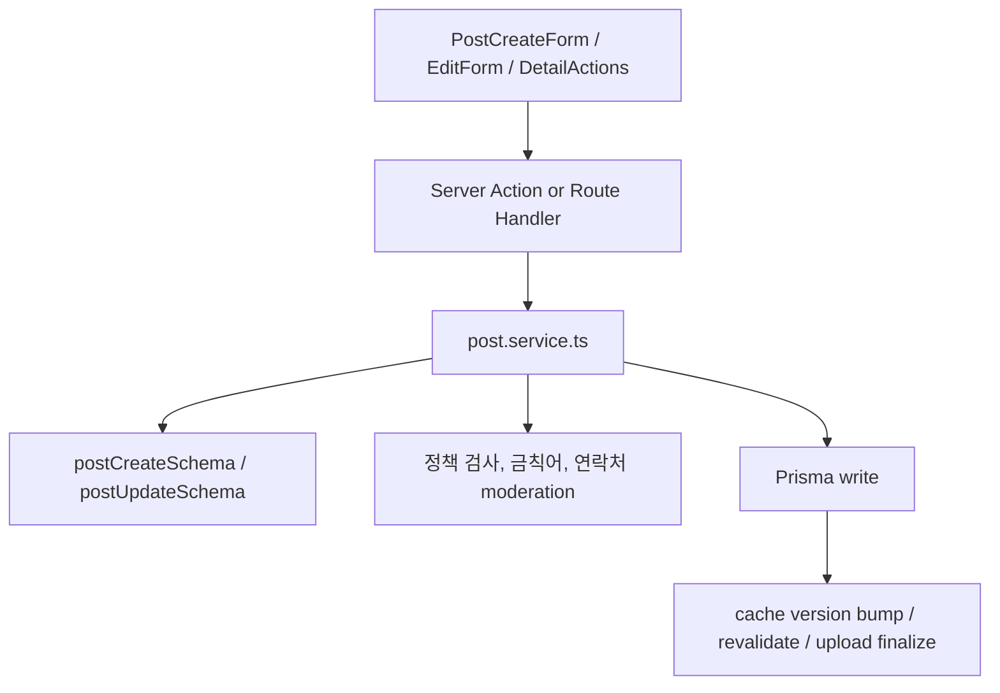

# 07. 글 작성/수정/삭제 흐름

## 이번 글에서 풀 문제

TownPet에서 글 한 건은 단순히 `title`, `content`만 저장하지 않습니다.

- 게시글 타입
- 지역/글로벌 범위
- 반려동물 타입
- 리뷰/입양/봉사 같은 구조화 필드
- 이미지 업로드
- 금칙어/연락처 정책
- guest/로그인 사용자 분기
- 캐시 무효화

이 글은 TownPet에서 글 작성/수정/삭제가 어떤 계층을 거쳐 처리되는지 설명합니다.

## 왜 이 글이 중요한가

TownPet의 핵심 구현 원칙은 아래 순서입니다.

`Prisma -> Zod -> Service -> Action/Route -> UI -> Tests`

이 원칙이 가장 잘 드러나는 기능이 글 CRUD입니다.  
이 흐름을 이해하면 이후 댓글, 알림, 신고, 관리자 기능도 훨씬 쉽게 읽힙니다.

## 먼저 볼 핵심 파일

- `/Users/alex/project/townpet/app/src/app/posts/new/page.tsx`
- `/Users/alex/project/townpet/app/src/components/posts/post-create-form.tsx`
- `/Users/alex/project/townpet/app/src/components/posts/post-detail-edit-form.tsx`
- `/Users/alex/project/townpet/app/src/components/posts/post-detail-actions.tsx`
- `/Users/alex/project/townpet/app/src/lib/validations/post.ts`
- `/Users/alex/project/townpet/app/src/server/actions/post.ts`
- `/Users/alex/project/townpet/app/src/app/api/posts/route.ts`
- `/Users/alex/project/townpet/app/src/server/services/post.service.ts`

## 먼저 알아둘 개념

### 1. TownPet는 작성과 조회를 분리한다

조회는 `queries`에서, 쓰기는 `services`에서 담당합니다.

- 조회: `post.queries.ts`, `community.queries.ts`
- 쓰기: `post.service.ts`

### 2. Zod가 DTO validation 역할을 한다

파일:

- `/Users/alex/project/townpet/app/src/lib/validations/post.ts`

Spring으로 치환하면:

- `Request DTO + Validator`

### 3. Action과 Route가 둘 다 존재한다

- 로그인 사용자의 앱 내부 명령: `server/actions/post.ts`
- 공개 JSON API / 게스트 쓰기: `app/api/posts/route.ts`

이 둘은 중복이 아니라 진입점이 다릅니다.

## 큰 그림



## 1. 새 글 작성 페이지는 서버에서 준비만 한다

파일:

- `/Users/alex/project/townpet/app/src/app/posts/new/page.tsx`

이 페이지가 서버에서 하는 일:

- `auth()`로 세션 확인
- 사용자 동네 목록 조회
- 커뮤니티 목록 조회
- 역할에 따라 입양 게시글 작성 가능 여부 결정

즉 페이지는 폼이 필요한 초기 데이터만 준비하고, 실제 입력 상태는 클라이언트 폼으로 넘깁니다.

## 2. `PostCreateForm`은 브라우저 상태를 전부 담당한다

파일:

- `/Users/alex/project/townpet/app/src/components/posts/post-create-form.tsx`

이 컴포넌트가 맡는 것:

- 제목/본문 상태
- rich text editor
- 이미지 업로드/토큰 삽입
- draft 저장
- 게시글 타입별 구조화 필드 입력
- guest 닉네임/비밀번호
- 제출 버튼 pending 상태

여기서 중요한 점은, 폼이 복잡해도 DB write를 직접 하지 않는다는 것입니다.  
폼은 payload를 만들고, 쓰기는 서버 계층에 넘깁니다.

## 3. 생성 payload는 타입별로 꽤 다르다

글 작성 폼은 게시글 타입에 따라 다른 구조를 포함합니다.

- 기본 공통 필드
  - `title`
  - `content`
  - `type`
  - `scope`
  - `neighborhoodId`
  - `petTypeId`
  - `imageUrls`
- 병원 후기
  - `hospitalReview`
- 입양
  - `adoptionListing`
- 보호소 봉사
  - `volunteerRecruitment`

즉 TownPet의 게시글은 단순 자유글과 구조화 글을 같은 쓰기 경로로 받지만, validation과 normalization은 타입별로 다시 분기합니다.

## 4. Zod validation은 1차 방어선이다

파일:

- `/Users/alex/project/townpet/app/src/lib/validations/post.ts`

대표 스키마:

- `postCreateSchema`
- `postUpdateSchema`
- `hospitalReviewSchema`
- `adoptionListingSchema`
- `volunteerRecruitmentSchema`

여기서 처리하는 것:

- required / optional
- max length
- trusted upload URL
- 공백-only 차단
- 게시글 타입별 필수 항목
- 공용 보드의 동물 태그 요구

중요한 점:

- TownPet는 프론트에서만 검사하지 않습니다.
- 서비스 레이어에서도 `safeParse`를 다시 실행합니다.

## 5. 진짜 핵심은 `createPost()`에 있다

파일:

- `/Users/alex/project/townpet/app/src/server/services/post.service.ts`

`createPost()`는 아래 순서로 동작합니다.

1. `postCreateSchema.safeParse(input)`
2. 이미지 URL 정규화
3. animal tag 정규화
4. 게시글 타입 기준 board/scope 결정
5. 타입별 structured input parse
6. structured field normalization
7. 금칙어 조회
8. 작성자 분기
   - 로그인 사용자
   - guest 사용자
9. 신규 계정 제한 / admin-only post type 검사
10. 연락처 moderation
11. guest safety / guest policy 검사
12. Prisma transaction write
13. 업로드 finalize
14. feed/search/suggest/detail/comment cache bump

즉 `createPost()`는 단순 ORM insert가 아니라,  
TownPet의 `쓰기 정책 집합`이 모이는 곳입니다.

## 6. 로그인 작성자와 guest 작성자는 어떻게 다른가

### 로그인 사용자

서비스에서 확인하는 것:

- 작성자 존재 여부
- `assertUserInteractionAllowed()`
- 신규 계정 제한
- admin-only post type
- 연락처 제한

### guest 사용자

서비스에서 확인하는 것:

- guest identity 존재
- guest ban 여부
- 닉네임/비밀번호 존재
- guest blocked post type
- guest scope 제한
- 최대 이미지 수

그리고 API 진입점에서는 여기에 더해:

- rate limit
- step-up challenge
- fingerprint
- user-agent

까지 추가됩니다.

즉 guest 쓰기는 UI 한 군데에서만 막는 게 아니라,  
API 진입점 + service 둘 다에서 막습니다.

## 7. 왜 로그인 사용자는 Server Action을 쓰는가

파일:

- `/Users/alex/project/townpet/app/src/server/actions/post.ts`

대표 함수:

- `createPostAction`
- `updatePostAction`
- `deletePostAction`

예를 들어 `createPostAction`은:

1. `requireCurrentUser()`
2. `enforceAuthenticatedWriteRateLimit(...)`
3. `createPost(...)`
4. `revalidatePath("/feed")`

을 수행합니다.

즉 Action은 서비스 앞에 붙는 얇은 orchestration layer입니다.

## 8. 왜 guest 쓰기는 `/api/posts`를 쓰는가

파일:

- `/Users/alex/project/townpet/app/src/app/api/posts/route.ts`

guest POST는 다음을 처리해야 합니다.

- IP
- fingerprint
- guest rate limit
- guest step-up challenge
- JSON 응답

이건 Server Action보다 Route Handler가 더 적합합니다.

그래서 TownPet는:

- 로그인 사용자는 Action
- guest는 Route Handler

로 진입점을 나눴습니다.

## 9. 수정은 왜 생성보다 단순한가

파일:

- `/Users/alex/project/townpet/app/src/components/posts/post-detail-edit-form.tsx`
- `/Users/alex/project/townpet/app/src/server/services/post.service.ts`

수정은 `postUpdateSchema`를 씁니다.

핵심 차이:

- 선택 필드만 허용
- 빈 update 금지
- scope/neighborhood/image 정도만 수정
- 기존 post 조회 후 author ownership 검사

`updatePost()`는 다음을 추가로 합니다.

- 기존 post 조회
- author 일치 여부 확인
- 금칙어 재검사
- 연락처 moderation
- 이미지 교체 시 이전 URL release

즉 생성보다 입력 종류는 적지만, 기존 상태와의 diff를 관리해야 합니다.

## 10. 삭제는 hard delete가 아니라 soft delete다

파일:

- `/Users/alex/project/townpet/app/src/server/services/post.service.ts`
- `/Users/alex/project/townpet/app/src/components/posts/post-detail-actions.tsx`

`deletePost()`는 아래 순서로 동작합니다.

1. 상호작용 제재 여부 확인
2. 기존 post 조회
3. author ownership 확인
4. `softDeletePostDependents(postId)`
   - 댓글 status 정리
   - 댓글 반응 삭제
   - 게시글 반응 삭제
   - 북마크 삭제
   - 알림 archive
   - post status = `DELETED`
5. 업로드 release
6. cache version bump

즉 TownPet의 삭제는 “row를 지우는 delete”가 아니라,  
연관 데이터와 운영 정합성을 함께 정리하는 soft-delete workflow입니다.

## 11. 캐시 invalidation도 write 흐름의 일부다

`post.service.ts`에는 `notifyPostCacheChange()`가 있습니다.

이 함수가 bump하는 것:

- feed
- search
- suggest
- post detail
- post comments

즉 TownPet는 write가 끝났다고 해서 DB 저장만 성공하면 끝나지 않습니다.  
read model cache를 무효화해야 진짜 쓰기 흐름이 끝납니다.

## 12. 업로드 URL도 CRUD 흐름에 포함된다

생성/수정/삭제는 모두 업로드 자산을 함께 처리합니다.

- 생성: `attachUploadUrls`
- 수정: 기존 이미지와 새 이미지 diff 계산 후 release
- 삭제: 전체 이미지 release

이건 TownPet가 이미지 업로드를 “부가 기능”이 아니라 `게시글 수명주기 일부`로 본다는 뜻입니다.

## 13. 테스트는 어떻게 읽어야 하는가

아래 테스트를 같이 보면 좋습니다.

- `/Users/alex/project/townpet/app/src/lib/validations/post.test.ts`
- `/Users/alex/project/townpet/app/src/server/actions/post.test.ts`
- `/Users/alex/project/townpet/app/src/server/services/post.service.test.ts`
- `/Users/alex/project/townpet/app/src/server/services/post-create-policy.test.ts`
- `/Users/alex/project/townpet/app/src/app/api/posts/route.test.ts`

읽는 순서:

1. validation test
2. service policy test
3. action test
4. route test

이 순서가 TownPet 구현 순서와도 맞습니다.

## 직접 실행해 보고 싶다면

```bash
cd /Users/alex/project/townpet
corepack pnpm -C app dev
```

그 다음 아래를 따라가면 됩니다.

1. `/posts/new`
2. 글 작성
3. `/posts/[id]/edit`
4. 상세 화면에서 삭제

그리고 코드에서는 이 순서로 보면 됩니다.

1. `post-create-form.tsx`
2. `post.ts` validation
3. `server/actions/post.ts`
4. `server/services/post.service.ts`

## 현재 구현의 한계

- 글 생성 로직이 타입별 분기를 많이 갖고 있어서 `post.service.ts`가 큽니다.
- guest와 auth 경로가 달라서 처음엔 중복처럼 보일 수 있습니다.
- update는 현재 전체 게시글 타입을 다시 바꾸는 흐름보다 “기존 타입 유지 + 일부 필드 수정”에 더 가깝습니다.

## Python/Java 개발자용 요약

- `post.ts` = DTO validation
- `post.service.ts` = 정책과 DB write가 모이는 핵심 service
- `server/actions/post.ts` = 로그인 사용자용 command facade
- `api/posts/route.ts` = guest/public HTTP API facade
- `post-create-form.tsx` = 브라우저 입력 상태 관리

즉 TownPet의 글 CRUD는 `폼 -> Action/Route -> Service -> Prisma + cache invalidation` 구조입니다.

## 면접에서 이렇게 설명할 수 있다

> TownPet의 글 CRUD는 단순 컨트롤러-서비스-리포지토리 구조가 아니라, 게시글 타입별 structured input, guest/auth 분기, 금칙어/연락처 moderation, 신규 계정 제한, 업로드 수명주기, 캐시 invalidation까지 한 흐름으로 묶여 있습니다. 로그인 사용자의 쓰기는 Server Action으로 단순화했고, guest 쓰기처럼 헤더와 rate limit이 중요한 경로는 Route Handler로 분리했습니다.
