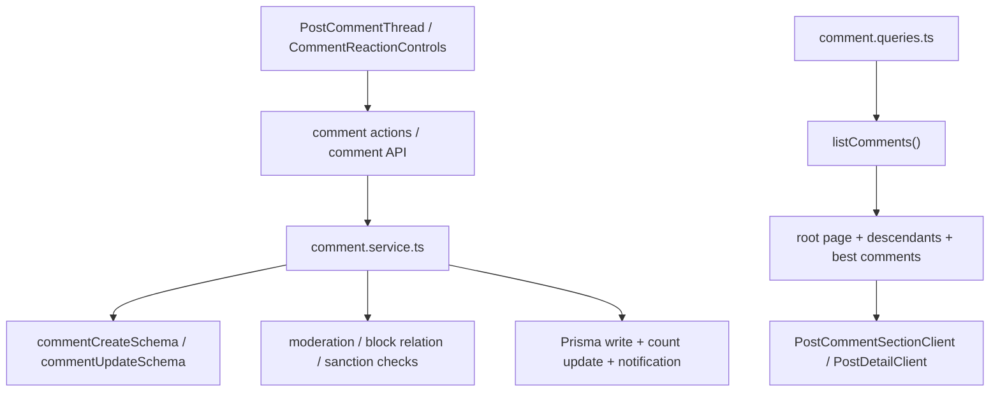

# 08. 댓글과 반응 구조

## 이번 글에서 풀 문제

TownPet의 댓글은 단순히 `Comment` row를 하나 추가하는 기능이 아닙니다.

- root comment / reply
- guest / auth 분기
- 차단 관계 검사
- 금칙어 / 연락처 moderation
- best comment
- root 기준 페이지네이션
- 댓글 좋아요 / 싫어요
- 댓글 알림

이 글은 TownPet가 댓글과 반응을 어떤 계층으로 나눠 구현했는지 설명합니다.

## 왜 이 글이 중요한가

게시글 본문보다 댓글이 더 자주 흔들리는 서비스가 많습니다.  
TownPet도 실제로 댓글 쪽에 페이지네이션, guest write, best comment, 신고, 차단, 반응, 알림이 한꺼번에 붙어 있습니다.

즉 댓글 구조를 이해하면 TownPet의 “커뮤니티 핵심 복잡도”를 거의 다 읽을 수 있습니다.

## 먼저 볼 핵심 파일

- `/Users/alex/project/townpet/app/src/lib/validations/comment.ts`
- `/Users/alex/project/townpet/app/src/server/services/comment.service.ts`
- `/Users/alex/project/townpet/app/src/server/actions/comment.ts`
- `/Users/alex/project/townpet/app/src/server/queries/comment.queries.ts`
- `/Users/alex/project/townpet/app/src/app/api/posts/[id]/comments/route.ts`
- `/Users/alex/project/townpet/app/src/components/posts/post-comment-section-client.tsx`
- `/Users/alex/project/townpet/app/src/components/posts/post-comment-thread.tsx`
- `/Users/alex/project/townpet/app/src/components/posts/comment-reaction-controls.tsx`
- `/Users/alex/project/townpet/app/src/lib/comment-client.ts`

## 먼저 알아둘 개념

### 1. TownPet의 댓글 페이지네이션 기준은 “root comment”다

댓글 수가 많아도 한 페이지는 `루트 댓글` 기준으로 끊습니다.  
각 루트에 속한 reply는 함께 내려보냅니다.

즉 페이지네이션 단위는:

- `comment row` 전체 수가 아니라
- `parentId = null`인 root comment 수입니다.

### 2. 댓글에도 guest/auth 분기가 있다

게시글과 마찬가지로:

- 로그인 사용자는 action/server path
- guest 사용자는 API route path

를 주로 탑니다.

### 3. 반응도 댓글 자체에 denormalized count를 저장한다

`CommentReaction` row를 따로 두지만, `Comment.likeCount`, `Comment.dislikeCount`도 갱신합니다.

이유:

- 상세 화면 렌더링 속도
- best comment ranking
- 반복 count query 감소

## 큰 그림



## 1. validation은 매우 얇지만 필수다

파일:

- `/Users/alex/project/townpet/app/src/lib/validations/comment.ts`

TownPet의 댓글 validation은 단순합니다.

- `commentCreateSchema`
- `commentUpdateSchema`

둘 다:

- 공백-only 차단
- 최대 길이 제한

정도만 담당합니다.

중요한 점은 validation이 약한 것이 아니라,  
나머지 정책 검사를 service로 밀어낸 구조라는 점입니다.

## 2. 진짜 복잡도는 `createComment()`에 있다

파일:

- `/Users/alex/project/townpet/app/src/server/services/comment.service.ts`

`createComment()`는 대략 이 순서로 동작합니다.

1. `commentCreateSchema.safeParse(input)`
2. 작성자 조회
3. `assertUserInteractionAllowed()`
4. 연락처 moderation
5. 금칙어 검사
6. guest면 ban 여부 확인
7. transaction 시작
8. post 조회 + 읽기 가능 여부 확인
9. local post면 대표 동네 확인
10. 차단 관계 확인
11. parent comment면 reply 가능 여부 확인
12. comment create
13. post.commentCount 증가
14. transaction 종료
15. post author / parent author / mention 알림 생성

즉 댓글 생성은 “입력값 저장”이 아니라  
게시글 컨텍스트와 관계 정책을 함께 통과해야 하는 write입니다.

## 3. reply는 parent comment를 별도로 검증한다

`parentId`가 있으면 아래를 추가로 검사합니다.

- parent가 같은 post에 속하는지
- parent status가 `ACTIVE`인지
- parent author와 차단 관계가 없는지

즉 TownPet는 reply를 그냥 nested row로 넣지 않고,  
“유효한 스레드 관계인지”를 먼저 검증합니다.

## 4. mention 알림은 댓글 생성 흐름 안에 있다

`createComment()`에는 `extractMentionNicknames()`가 있고,  
실제 알림 생성은:

- `notifyCommentOnPost`
- `notifyReplyToComment`
- `notifyMentionInComment`

로 분기됩니다.

이때 중복 대상은 줄입니다.

- post author
- parent author
- self
- 이미 알림 간 대상

즉 알림도 댓글 기능 바깥의 별도 부가요소가 아니라, 댓글 service 흐름 안에서 함께 처리됩니다.

## 5. 수정/삭제는 reply 존재 여부를 강하게 본다

파일:

- `/Users/alex/project/townpet/app/src/server/services/comment.service.ts`

`updateComment()`와 `deleteComment()`는 공통으로:

- author ownership 확인
- status가 `ACTIVE`인지 확인
- reply count 확인

을 수행합니다.

핵심 정책:

- 답글이 있으면 수정 불가
- 답글이 있으면 삭제 불가

이 정책은 thread 문맥을 안정적으로 유지하려는 선택입니다.

## 6. 삭제는 hard delete가 아니라 placeholder 기반 soft delete다

삭제 service는:

- `Comment.status = DELETED`
- `Post.commentCount` 감소

까지만 수행합니다.

읽기 쪽에서는 `DELETED_COMMENT_PLACEHOLDER_CONTENT = "삭제된 댓글입니다."`를 써서 placeholder를 보여줍니다.

즉 TownPet는 댓글도 게시글과 비슷하게 “삭제 사실은 남기고, 원문만 숨기는” 구조입니다.

## 7. guest 댓글은 별도 credential과 identity를 가진다

route:

- `/Users/alex/project/townpet/app/src/app/api/posts/[id]/comments/route.ts`

service:

- `hashGuestCommentPassword`
- `updateGuestComment`
- `deleteGuestComment`
- `matchesGuestIdentity`

guest 댓글은 작성 시:

- guest displayName
- guest password hash
- IP hash
- fingerprint hash

를 같이 저장합니다.

수정/삭제 시에는:

- identity 일치
- password 검증
- reply 존재 여부

를 함께 검사합니다.

즉 guest 댓글은 “로그인 없이 아무나 수정/삭제”가 아니라,  
TownPet 내부 guest credential 모델을 따르는 별도 write path입니다.

## 8. 댓글 목록 조회는 `listComments()` 하나에 모인다

파일:

- `/Users/alex/project/townpet/app/src/server/queries/comment.queries.ts`

`listComments()`가 반환하는 것:

- `comments`
- `bestComments`
- `totalCount`
- `totalRootCount`
- `page`
- `totalPages`
- `limit`

이 함수는 내부에서 아래를 수행합니다.

1. viewer 기준 hidden author 그룹 조회
2. root comment count
3. total comment count
4. best comment 계산
5. root comment 페이지 조회
6. root의 descendants 전부 조회
7. muted placeholder 적용

즉 상세 댓글 화면은 “댓글 목록 하나”를 받는 것처럼 보이지만,  
실제로는 꽤 무거운 read model을 받습니다.

## 9. 왜 best comment에 `threadPage`가 붙는가

best comment는 현재 페이지에 없는 경우가 많습니다.

그래서 TownPet는 best comment 조회 시:

- 그 comment가 속한 root thread를 찾고
- 그 root가 몇 번째 페이지에 있는지 계산해서
- `threadRootId`, `threadPage`

를 같이 내려줍니다.

이 덕분에 상세 화면에서:

- “베스트 댓글 클릭”
- 해당 댓글이 있는 root page로 이동
- 해당 위치로 scroll

흐름이 가능합니다.

이건 TownPet 댓글 구조에서 꽤 중요한 구현 포인트입니다.

## 10. `PostCommentSectionClient`는 댓글 로더다

파일:

- `/Users/alex/project/townpet/app/src/components/posts/post-comment-section-client.tsx`

이 컴포넌트가 하는 일:

- 초기 prefetch state 반영
- 댓글 페이지 fetch
- auth login/logout sync
- comment count sync event emit
- error/loading 상태 관리

즉 `PostCommentThread`가 실제 UI 스레드라면,  
`PostCommentSectionClient`는 그 앞에 있는 client-side loader입니다.

## 11. `PostCommentThread`는 거의 댓글 앱 자체다

파일:

- `/Users/alex/project/townpet/app/src/components/posts/post-comment-thread.tsx`

이 컴포넌트가 담당하는 것:

- root / reply 렌더링
- best comment 점프
- reply 열기/닫기
- edit 열기/닫기
- report 열기/닫기
- guest action password prompt
- create/update/delete 실행
- mute/unmute 후 refresh

즉 댓글 UI는 작은 컴포넌트 하나가 아니라,  
thread app 전체가 이 파일 하나에 많이 모여 있는 구조입니다.

## 12. 반응은 `CommentReactionControls`가 optimistic UI로 처리한다

파일:

- `/Users/alex/project/townpet/app/src/components/posts/comment-reaction-controls.tsx`
- `/Users/alex/project/townpet/app/src/server/actions/comment.ts`

흐름:

1. 현재 reaction / like / dislike count 상태 보유
2. 클릭 시 optimistic state 계산
3. `toggleCommentReactionAction(...)`
4. 실패 시 rollback
5. 성공 시 서버 count로 재동기화

중요한 점:

- auth logout event를 구독해 즉시 반응 비활성화
- 로그인 필요 프롬프트는 UI에서 직접 제어

즉 반응 버튼도 단순 서버 round-trip이 아니라, viewer shell 상태와 연결된 작은 상태 머신입니다.

## 13. 댓글 반응 write는 transaction + count 재계산 방식이다

서비스 함수:

- `toggleCommentReaction(...)`

순서:

1. comment 존재 / ACTIVE 확인
2. 차단 관계 확인
3. 기존 reaction row 확인
4. create/update/delete
5. `LIKE`, `DISLIKE` count 다시 계산
6. `Comment.likeCount`, `Comment.dislikeCount` 업데이트
7. 필요하면 반응 알림 생성

즉 count를 단순 increment/decrement만 하지 않고,  
실제 reaction row를 다시 세서 정합성을 맞춥니다.

## 14. 댓글 route는 guest/auth/public 계약을 모두 관리한다

파일:

- `/Users/alex/project/townpet/app/src/app/api/posts/[id]/comments/route.ts`

`GET`

- `x-guest-mode`
- viewerId / hiddenAuthorViewerId 분리
- post read access 확인
- comment list 조회
- guest identity sanitize
- deleted comment placeholder 치환

`POST`

- auth면 authenticated write throttle
- guest면 rate limit + step-up + guest author create + password hash

즉 댓글 route는 단순 CRUD endpoint가 아니라,  
“댓글을 public surface로 어떻게 안전하게 노출하고 작성하게 할 것인가”의 계약을 담고 있습니다.

## 테스트는 어떻게 읽어야 하는가

아래 테스트를 같이 보면 좋습니다.

- `/Users/alex/project/townpet/app/src/server/services/comment.service.test.ts`
- `/Users/alex/project/townpet/app/src/server/queries/comment.queries.test.ts`
- `/Users/alex/project/townpet/app/src/server/actions/comment.test.ts`
- `/Users/alex/project/townpet/app/src/app/api/posts/[id]/comments/route.test.ts`
- `/Users/alex/project/townpet/app/src/components/posts/post-comment-thread.test.tsx`
- `/Users/alex/project/townpet/app/src/components/posts/comment-reaction-controls.test.tsx`

추천 읽기 순서:

1. service test
2. query test
3. route/action test
4. UI test

## 직접 실행해 보고 싶다면

```bash
cd /Users/alex/project/townpet
corepack pnpm -C app dev
```

그 다음 아래를 확인해 보면 됩니다.

1. 글 상세 진입
2. 댓글 작성
3. reply 작성
4. 댓글 추천/싫어요
5. best comment jump

## 현재 구현의 한계

- `PostCommentThread`가 꽤 큰 client component라 역할 분리가 더 가능할 수 있습니다.
- reply가 많은 thread에서는 descendant 조회가 여전히 복잡합니다.
- guest와 auth 경로가 분리돼 있어 처음 읽을 때 중복처럼 보일 수 있습니다.

## Python/Java 개발자용 요약

- `comment.ts` = 댓글 DTO validation
- `comment.service.ts` = 정책/알림/정합성 포함 write core
- `comment.queries.ts` = root page + descendants + best comments read model
- `comment.ts action` = 로그인 사용자용 command facade
- `comments/route.ts` = guest/public HTTP contract
- `PostCommentThread` = 실제 댓글 앱 UI

## 면접에서 이렇게 설명할 수 있다

> TownPet의 댓글은 단순 CRUD가 아니라 thread, guest/auth 분기, 차단 관계, 금칙어, best comment, reaction, 알림이 한꺼번에 붙는 구조입니다. 그래서 write는 `comment.service.ts`, read는 `comment.queries.ts`로 분리했고, UI에서는 `PostCommentSectionClient`와 `PostCommentThread`를 나눠 페이지네이션과 상호작용을 관리했습니다.
