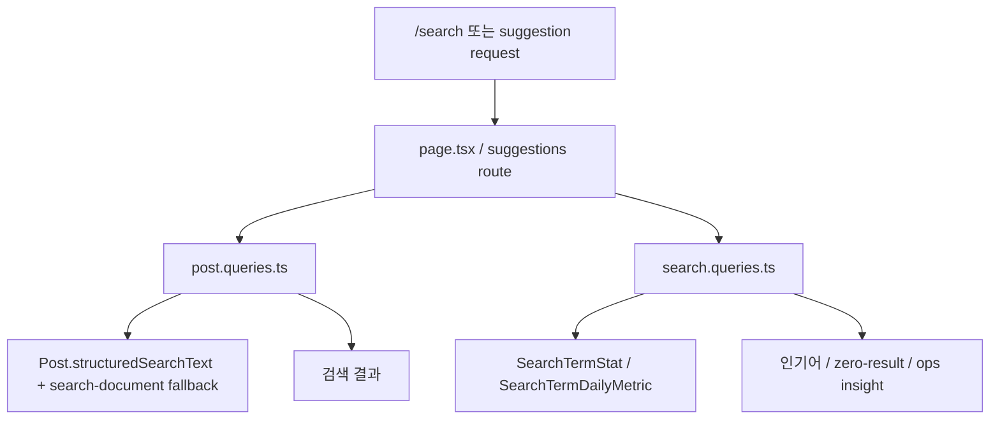
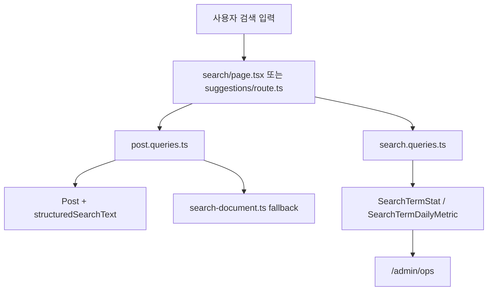

# 09. 검색, 구조화 검색, suggestion

## 이번 글에서 풀 문제

TownPet 검색은 단순한 `title LIKE '%q%'` 수준이 아닙니다.

실제로는 아래가 같이 엮여 있습니다.

- 일반 검색
- 구조화 필드 검색
- 자동완성 suggestion
- zero-result telemetry
- compact/초성 fallback
- 운영 대시보드 집계

이 글은 검색을 “한 함수”가 아니라 **여러 계층이 연결된 시스템**으로 정리합니다.

## 왜 이 글이 중요한가

커뮤니티 서비스에서 검색은 단순 편의 기능이 아닙니다.

- 원하는 글을 못 찾으면 재방문율이 떨어집니다.
- zero-result가 많으면 데이터가 있어도 없는 서비스처럼 느껴집니다.
- 운영자가 어떤 검색이 실패하는지 모르면 개선도 느립니다.

TownPet는 그래서 검색을:

- 사용자 기능
- 운영 기능

둘 다로 취급합니다.

## 먼저 알아둘 개념

TownPet 검색은 크게 3층입니다.

1. 게시글 자체를 찾는 검색
2. 검색어 통계와 suggestion
3. 운영용 검색 인사이트

핵심 파일은 이렇습니다.

- [`app/src/app/search/page.tsx`](../app/src/app/search/page.tsx)
- [`app/src/app/api/posts/suggestions/route.ts`](../app/src/app/api/posts/suggestions/route.ts)
- [`app/src/server/queries/post.queries.ts`](../app/src/server/queries/post.queries.ts)
- [`app/src/server/queries/search.queries.ts`](../app/src/server/queries/search.queries.ts)
- [`app/src/lib/search-document.ts`](../app/src/lib/search-document.ts)
- [`app/src/lib/post-structured-search.ts`](../app/src/lib/post-structured-search.ts)
- [`app/prisma/schema.prisma`](../app/prisma/schema.prisma)

## 검색 흐름을 먼저 그림으로 보면

TownPet 검색은 본검색, suggestion, telemetry가 분리돼 있지만 운영 기준에서는 한 시스템처럼 묶여 있습니다.

## 검색에서 먼저 봐야 하는 Prisma 모델

### `Post.structuredSearchText`

`Post` 모델에는 구조화 검색용 shadow field가 있습니다.

근거:

- [`app/prisma/schema.prisma`](../app/prisma/schema.prisma)

이 필드의 역할은:

- 병원명
- 치료유형
- 보호소명
- 지역명
- 품종
- 산책 경로명
- 봉사 유형

같이 서브테이블에 흩어진 구조화 값을 한 줄 텍스트로 모아두는 것입니다.

즉 검색 시 매번 relation join으로 문자열을 다시 조합하지 않기 위한 장치입니다.

### `SearchTermStat`

이 모델은 검색어 통계입니다.

- 인기 검색어
- zero-result 횟수
- 마지막 결과 수
- 현재 문맥(scope/type/searchIn)

를 저장합니다.

### `SearchTermDailyMetric`

이 모델은 일자별 집계입니다.

- 오늘 검색이 얼마나 늘었는지
- zero-result 비율이 갑자기 올라갔는지

를 운영자가 `/admin/ops`에서 보기 위한 데이터입니다.

## 1. 사용자 검색 결과는 어디서 만들어지는가

검색 페이지 진입점:

- [`app/src/app/search/page.tsx`](../app/src/app/search/page.tsx)

이 페이지는:

- 로그인 사용자 여부 확인
- `LOCAL / GLOBAL` scope 판단
- 대표 동네 확인
- 인기 검색어 조회
- 본검색 실행

을 합니다.

실제 본검색은:

- [`listRankedSearchPosts`](../app/src/server/queries/post.queries.ts#L3964)

가 담당합니다.

즉 검색 page는:

- 파라미터와 사용자 문맥을 해석

하고, 실제 랭킹 계산은 `post.queries.ts`로 넘깁니다.

## 2. 자동완성 suggestion은 어디서 만들어지는가

진입점:

- [`app/src/app/api/posts/suggestions/route.ts`](../app/src/app/api/posts/suggestions/route.ts)

이 route는 suggestion을 만들 때 두 소스를 합칩니다.

1. 검색어 통계 기반 suggestion
   - [`listSearchTermSuggestions`](../app/src/server/queries/search.queries.ts#L506)
2. 게시글 기반 suggestion
   - [`listPostSearchSuggestions`](../app/src/server/queries/post.queries.ts#L4263)

즉 suggestion은 “미리 저장된 인기어”만 쓰는 게 아니라, 실제 게시글 텍스트도 같이 봅니다.

그리고 현재 문맥도 반영합니다.

- scope
- type
- searchIn

예를 들어:

- `LOCAL` 검색
- 병원후기만 검색
- 제목만 검색

같은 상황에서 suggestion도 완전히 동일한 맥락을 따라가도록 구성돼 있습니다.

## 3. 구조화 검색은 어떻게 동작하는가

TownPet에는 구조화 게시판이 있습니다.

- 병원 후기
- 장소 후기
- 산책 코스
- 입양
- 봉사

이런 게시판은 자유 텍스트만 검색하면 품질이 나빠집니다.

그래서 TownPet는 게시글 저장 시:

- [`buildPostStructuredSearchText`](../app/src/lib/post-structured-search.ts)

로 구조화 값을 모아 `structuredSearchText`를 만듭니다.

이 함수는 대략 이런 값을 묶습니다.

- `hospitalReview.hospitalName`
- `hospitalReview.treatmentType`
- `adoptionListing.shelterName`
- `adoptionListing.region`
- `adoptionListing.breed`
- `volunteerRecruitment.volunteerType`

즉 사용자는 “게시글 본문에 안 적혀 있어도” 구조화 필드로 검색할 수 있습니다.

## 4. compact 검색과 초성 검색은 어떻게 붙는가

핵심 helper:

- [`app/src/lib/search-document.ts`](../app/src/lib/search-document.ts)

이 파일은 검색용 텍스트를 3가지 형태로 다룹니다.

- `normalizedText`
- `compactText`
- `choseongText`

예를 들어:

- `건강 검진`
- `건강검진`
- `ㄱㄱㄱ`

같이 사람이 비슷한 의미로 입력하는 케이스를 다루기 위해서입니다.

주요 함수:

- `buildSearchDocumentParts`
- `matchesSearchDocumentQuery`
- `resolveSearchDocumentMatchRank`

이 helper는 suggestion과 ranked fallback 둘 다에 재사용됩니다.

즉 TownPet 검색은 “SQL만”으로 끝나지 않고, 마지막 단계에서 **runtime text matching fallback**도 같이 사용합니다.

## 5. 검색어 통계는 어떻게 기록되는가

핵심 파일:

- [`app/src/server/queries/search.queries.ts`](../app/src/server/queries/search.queries.ts)

중요한 함수:

- [`recordSearchTerm`](../app/src/server/queries/search.queries.ts#L756)
- [`getPopularSearchTerms`](../app/src/server/queries/search.queries.ts#L427)

TownPet는 검색어를 기록할 때 단순 raw string을 바로 저장하지 않습니다.

- 정규화
- privacy filter
- 문맥(scope/type/searchIn)
- 결과 수

를 같이 저장합니다.

즉 “어떤 검색어가 많이 쓰였는가”뿐 아니라,

- 어떤 문맥에서 실패했는가
- zero-result가 얼마나 반복됐는가

도 같이 볼 수 있습니다.

## 6. 운영자는 어디서 검색 품질을 보는가

운영 화면:

- [`/admin/ops`](../app/src/app/admin/ops/page.tsx)

데이터 소스:

- [`app/src/server/queries/search.queries.ts`](../app/src/server/queries/search.queries.ts)
- [`app/src/server/queries/ops-overview.queries.ts`](../app/src/server/queries/ops-overview.queries.ts)

운영자는 여기서:

- 최근 7일 검색량
- zero-result 검색어
- low-result 검색어
- 문맥별 검색 실패

를 볼 수 있습니다.

즉 TownPet 검색은 사용자 기능이면서 동시에 운영 루프입니다.

## 전체 흐름을 그림으로 보면

## Java/Spring으로 치환하면

- `search/page.tsx`
  - 검색 화면용 controller + view assembly
- `api/posts/suggestions/route.ts`
  - suggestion REST endpoint
- `post.queries.ts`
  - 검색 query service
- `search.queries.ts`
  - 검색 통계 query service
- `search-document.ts`
  - 검색 전용 text utility
- `structuredSearchText`
  - denormalized search column

즉 Spring 기준으로 보면:

- 검색 기능 서비스
- 검색 로그/통계 서비스
- 검색 인덱스용 shadow field

를 한 프로젝트 안에서 같이 관리하는 구조입니다.

## 추천 읽기 순서

1. [`app/prisma/schema.prisma`](../app/prisma/schema.prisma)
2. [`app/src/lib/post-structured-search.ts`](../app/src/lib/post-structured-search.ts)
3. [`app/src/lib/search-document.ts`](../app/src/lib/search-document.ts)
4. [`app/src/server/queries/post.queries.ts`](../app/src/server/queries/post.queries.ts)
5. [`app/src/server/queries/search.queries.ts`](../app/src/server/queries/search.queries.ts)
6. [`app/src/app/api/posts/suggestions/route.ts`](../app/src/app/api/posts/suggestions/route.ts)
7. [`app/src/app/search/page.tsx`](../app/src/app/search/page.tsx)

## 현재 구조의 장점

- 구조화 게시판 검색 품질이 일반 커뮤니티보다 훨씬 안정적입니다.
- suggestion이 통계와 실제 게시글을 같이 씁니다.
- zero-result를 운영자가 관찰할 수 있습니다.
- compact/초성 fallback이 있어 한글 검색 실사용성이 좋습니다.

## 현재 구조의 한계

- 검색 로직이 여러 파일에 나뉘어 있어 처음엔 추적 비용이 있습니다.
- SQL 랭킹과 runtime fallback이 함께 있어 완전한 단일 엔진은 아닙니다.
- 검색 품질은 여전히 운영 데이터와 alias 보정에 의존하는 부분이 있습니다.

## Python/Java 개발자용 요약

- TownPet 검색은 `쿼리 한 번`이 아니라 `검색 결과 + suggestion + 통계 + 운영 대시보드`를 함께 보는 구조입니다.
- `post.queries.ts`는 실제 검색 결과를 만들고, `search.queries.ts`는 검색 통계를 관리합니다.
- `search-document.ts`는 compact/초성 fallback을 담당합니다.
- `structuredSearchText`는 구조화 게시판 검색 품질을 위한 shadow field입니다.

## 면접에서 이렇게 설명할 수 있다

> TownPet 검색은 단순 본문 검색이 아니라 구조화 게시판까지 고려한 검색 시스템입니다. 저장 시점에 `structuredSearchText`를 만들고, 검색 시에는 랭킹 query와 compact/초성 fallback을 함께 사용합니다. 또 `SearchTermStat`, `SearchTermDailyMetric`으로 검색 실패를 운영자가 직접 관찰할 수 있게 만들어, 검색을 기능과 운영의 두 층으로 설계했습니다.
