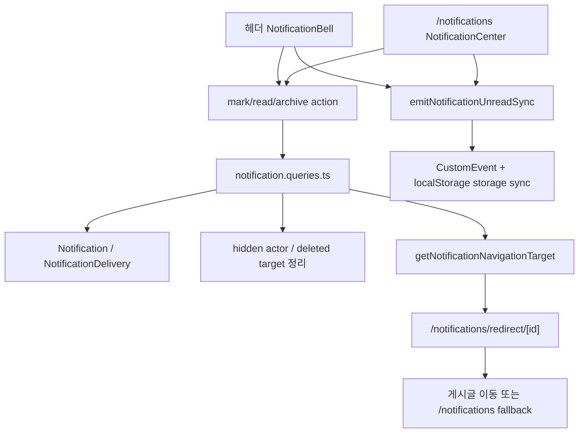
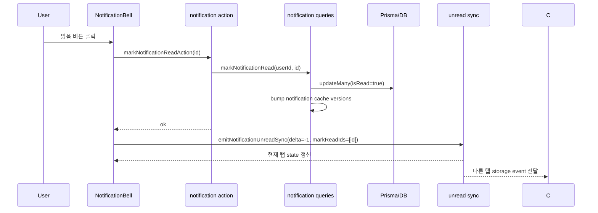

# 10. 알림 센터와 unread sync

## 이번 글에서 풀 문제

TownPet의 알림은 단순히 `Notification` 테이블을 읽어오는 기능이 아닙니다.

실제로는 아래가 같이 움직입니다.

- 헤더 종 아이콘의 preview
- `/notifications` 전체 목록
- 읽음 처리 / 전체 읽음 / 보관
- 여러 탭 동기화
- hidden actor, 삭제된 대상, unavailable target 정리
- outbox delivery flush

이 글은 알림을 **단순 UI 컴포넌트가 아니라 읽기 모델 + 동기화 프로토콜 + 네비게이션 게이트**로 정리합니다.

## 왜 이 글이 중요한가

알림은 커뮤니티 제품에서 재방문과 신뢰에 직접 연결됩니다.

예를 들면:

- 헤더 badge 숫자와 알림 페이지 숫자가 다르면 바로 신뢰가 깨집니다.
- 이미 삭제된 글 알림을 눌렀는데 404가 뜨면 UX가 거칠어집니다.
- 다른 탭에서 읽었는데 현재 탭 badge가 안 줄어들면 제품이 느슨해 보입니다.

TownPet는 이 문제를

- 서버 쿼리 계층에서 알림 유효성 정리
- 서버 액션으로 읽음/보관 처리
- 브라우저 이벤트 + storage 이벤트로 unread 동기화
- redirect route로 안전한 이동 처리

로 나눠 해결합니다.

## 먼저 볼 핵심 파일

- [`app/src/components/notifications/notification-bell.tsx`](/Users/alex/project/townpet/app/src/components/notifications/notification-bell.tsx)
- [`app/src/components/notifications/notification-center.tsx`](/Users/alex/project/townpet/app/src/components/notifications/notification-center.tsx)
- [`app/src/lib/notification-unread-sync.ts`](/Users/alex/project/townpet/app/src/lib/notification-unread-sync.ts)
- [`app/src/server/actions/notification.ts`](/Users/alex/project/townpet/app/src/server/actions/notification.ts)
- [`app/src/server/queries/notification.queries.ts`](/Users/alex/project/townpet/app/src/server/queries/notification.queries.ts)
- [`app/src/app/notifications/redirect/[id]/route.ts`](/Users/alex/project/townpet/app/src/app/notifications/redirect/[id]/route.ts)
- [`app/src/server/queries/notification.queries.test.ts`](/Users/alex/project/townpet/app/src/server/queries/notification.queries.test.ts)

## 먼저 알아둘 JS/Next 개념

이 글에서는 세 가지를 알아두면 읽기 쉽습니다.

### 1. Client Component

[`notification-bell.tsx`](/Users/alex/project/townpet/app/src/components/notifications/notification-bell.tsx)와 [`notification-center.tsx`](/Users/alex/project/townpet/app/src/components/notifications/notification-center.tsx)는 둘 다 `"use client"` 파일입니다.

즉:

- 브라우저 상태를 가진다
- 클릭 이벤트를 처리한다
- `window`, `localStorage`, `focus`, `pageshow` 이벤트를 쓸 수 있다

### 2. Server Action

[`app/src/server/actions/notification.ts`](/Users/alex/project/townpet/app/src/server/actions/notification.ts)의 함수들은 브라우저 컴포넌트에서 직접 호출하지만, 실제 실행은 서버에서 됩니다.

Spring으로 치환하면:

- 버튼 클릭 -> AJAX -> Controller

에 가깝지만, Next에서는 함수 import 형태로 보인다는 점이 다릅니다.

### 3. Route Handler

[`/notifications/redirect/[id]`](/Users/alex/project/townpet/app/src/app/notifications/redirect/[id]/route.ts)는 페이지가 아니라 서버 route입니다.

이 route는:

- 현재 사용자 확인
- 알림 대상 유효성 검사
- 읽음 처리
- 최종 이동 URL 계산

을 하고 redirect 응답을 보냅니다.

## 1. 전체 구조를 한 장으로 보면



핵심은 `NotificationBell`, `NotificationCenter`, `notification.queries.ts`가 각자 따로 노는 것이 아니라, **같은 알림 모델 위에 다른 UX를 얹는 구조**라는 점입니다.

## 2. 헤더 종 아이콘은 어떤 책임만 가지는가

핵심 파일:

- [`notification-bell.tsx`](/Users/alex/project/townpet/app/src/components/notifications/notification-bell.tsx)

핵심 entry point:

- `NotificationBell`
- `loadPreview`
- `markOneAsRead`
- `archiveOne`
- `markAllAsRead`

이 컴포넌트의 역할은 세 가지입니다.

1. unread badge 보여주기
2. preview 6개만 빠르게 열어보기
3. 읽음/보관이 일어나면 전역 unread sync 이벤트를 쏘기

중요한 점은 이 컴포넌트가 **전체 알림 목록의 source of truth가 아니라는 것**입니다.

실제 데이터 정합성은 서버 쿼리 계층이 맡고, `NotificationBell`은 그 결과를 preview 형태로 소비합니다.

그래서 이 파일은:

- `/api/notifications`로 preview를 가져오고
- 읽음/보관 액션 후 `emitNotificationUnreadSync(...)`
- focus/pageshow 시 다시 preview refresh

정도만 담당합니다.

## 3. 전체 알림 페이지는 무엇이 더 추가되는가

핵심 파일:

- [`notification-center.tsx`](/Users/alex/project/townpet/app/src/components/notifications/notification-center.tsx)

핵심 entry point:

- `NotificationCenter`
- `handleApplyFilter`
- `handleMarkRead`
- `handleMove`
- `handleMarkAll`
- `handleArchive`

`NotificationCenter`는 `NotificationBell`보다 책임이 조금 더 많습니다.

- 탭 필터 (`ALL`, `COMMENT`, `REACTION`, `SYSTEM`)
- `unreadOnly`
- 페이지네이션
- 전체 목록 상태 유지
- 목록 내 optimistic update

하지만 여기도 원칙은 같습니다.

- 읽음 처리 자체는 서버 action
- unread 숫자 동기화는 sync event
- 삭제되거나 숨겨진 알림 정리는 서버 쿼리

즉 페이지가 커졌다고 해서 브라우저에서 비즈니스 규칙을 더 많이 가지지 않습니다.

## 4. unread sync는 왜 전역 상태 라이브러리 대신 이벤트를 썼는가

핵심 파일:

- [`notification-unread-sync.ts`](/Users/alex/project/townpet/app/src/lib/notification-unread-sync.ts)

여기에는 함수가 두 개뿐입니다.

- `emitNotificationUnreadSync`
- `subscribeNotificationUnreadSync`

구조는 단순합니다.

1. 현재 탭 안에서는 `CustomEvent`
2. 다른 탭까지는 `localStorage.setItem(...)` + `storage` 이벤트

이 선택이 중요한 이유:

- unread 숫자 하나 때문에 전역 상태 라이브러리를 크게 들이지 않음
- cross-tab sync를 쉽게 해결함
- `NotificationBell`과 `NotificationCenter`를 느슨하게 연결할 수 있음

Spring/Java 관점으로 치환하면, 이건 서버 세션 공유가 아니라 **브라우저 내 간단한 event bus**입니다.

## 5. 읽음/보관 버튼은 왜 action 파일로 한 번 더 감싸는가

핵심 파일:

- [`app/src/server/actions/notification.ts`](/Users/alex/project/townpet/app/src/server/actions/notification.ts)

주요 함수:

- `markNotificationReadAction`
- `markAllNotificationsReadAction`
- `archiveNotificationAction`

이 action layer의 역할은:

1. 현재 사용자 확인
2. query 함수 호출
3. `revalidatePath("/notifications")`
4. `revalidatePath("/", "layout")`
5. `ServiceError`를 UI-friendly 형태로 normalize

즉 브라우저가 직접 query layer를 만지는 것이 아니라, action이 **UI와 query 사이의 thin server boundary** 역할을 합니다.

Java/Spring으로 치환하면:

- Controller와 Service 사이를 더 얇게 쪼갠 adapter

에 가깝습니다.

## 6. 실제 정합성은 notification query 계층이 책임진다

핵심 파일:

- [`notification.queries.ts`](/Users/alex/project/townpet/app/src/server/queries/notification.queries.ts)

이 파일에서 먼저 봐야 할 함수 순서는 이렇습니다.

1. `listNotificationsByUser`
2. `countUnreadNotifications`
3. `markNotificationRead`
4. `markAllNotificationsRead`
5. `archiveNotification`
6. `getNotificationNavigationTarget`
7. `createNotificationDelivery`
8. `deliverNotificationDelivery`
9. `flushNotificationDeliveriesForUser`

이 파일이 중요한 이유는 알림을 단순 CRUD로 보지 않기 때문입니다.

실제 이 계층은:

- outbox delivery flush
- hidden actor filtering
- 삭제된 post/comment target archive
- unread/list cache version bump
- notification redirect target resolution

까지 맡습니다.

즉 TownPet에서 알림의 source of truth는 UI 컴포넌트가 아니라 **이 query file**입니다.

## 7. `listNotificationsByUser`는 왜 먼저 flush와 archive를 하는가

핵심 함수:

- `listNotificationsByUser`
- `archiveUnavailableNotificationsForUser`
- `flushNotificationDeliveriesForUser`

`listNotificationsByUser`를 보면 조회 전에 먼저 아래를 실행합니다.

1. `flushNotificationDeliveriesForUser(userId)`
2. `archiveUnavailableNotificationsForUser(userId)`
3. `listHiddenAuthorIdsForViewer(userId)`

즉 "목록 조회"가 단순 SELECT가 아닙니다.

이렇게 한 이유:

- outbox에 쌓여 있던 pending delivery를 화면 진입 시 최대한 배송
- 이미 삭제되었거나 숨겨진 actor의 알림을 lazy archive
- 현재 사용자 기준 block/mute 정책 적용

이 구조 덕분에 TownPet의 알림 목록은 **읽을 때 정합성을 한 번 더 회복하는 read model**이 됩니다.

## 8. unread badge도 목록과 같은 정합성 규칙을 따른다

핵심 함수:

- `countUnreadNotifications`

이 함수도 `listNotificationsByUser`와 비슷하게:

- delivery flush
- unavailable archive
- hidden actor filtering

을 거친 뒤 unread count를 계산합니다.

이게 중요합니다.

만약 unread badge만 별도 단순 count를 해버리면:

- 헤더 badge 숫자
- `/notifications` 목록 수
- 실제 unread state

가 서로 어긋나기 쉽습니다.

TownPet는 이걸 피하려고 badge count도 같은 정책 축으로 묶었습니다.

## 9. redirect route는 왜 꼭 필요한가

핵심 파일:

- [`/notifications/redirect/[id]/route.ts`](/Users/alex/project/townpet/app/src/app/notifications/redirect/[id]/route.ts)

핵심 query:

- `getNotificationNavigationTarget`

이 구조의 장점은 큽니다.

알림 아이템이 `postId`나 `commentId`를 직접 링크로 들고 있어도,

- 숨겨진 actor인지
- 삭제된 댓글인지
- 삭제된 게시글인지
- 본인 알림인지

를 마지막 순간에 서버에서 확인할 수 있습니다.

즉 알림 클릭은 단순 `<Link href="/posts/123" />`가 아니라,

1. 현재 사용자 검증
2. 대상 유효성 검사
3. 필요 시 읽음 처리
4. 이동 URL 계산

을 거친 뒤 redirect 됩니다.

그래서 invalid target이면 404 대신 `/notifications` fallback으로 보낼 수 있습니다.

## 10. 캐시는 어떻게 다루는가

알림 계층은 사용자별 캐시 버전을 따로 씁니다.

핵심 함수:

- `bumpNotificationUnreadCacheVersion(userId)`
- `bumpNotificationListCacheVersion(userId)`

즉 캐시 범위가 전역이 아니라:

- `notification-unread:${userId}`
- `notification-list:${userId}`

로 잘게 나뉩니다.

이 구조 덕분에:

- A 사용자의 읽음 처리 때문에 B의 캐시를 날릴 필요가 없고
- unread와 list를 따로 다룰 수 있습니다.

Java/Spring에서 흔히 보는 `@CacheEvict("notifications")`보다 더 세밀한 버전 관리 방식이라고 보면 됩니다.

## 11. 전체 요청 흐름을 따라가면

예를 들어 헤더 종 아이콘에서 한 알림을 읽는 흐름은 이렇게 읽으면 됩니다.



## 12. 테스트는 어떻게 읽어야 하는가

핵심 테스트:

- [`notification.queries.test.ts`](/Users/alex/project/townpet/app/src/server/queries/notification.queries.test.ts)

이 테스트에서 먼저 볼 포인트:

- COMMENT 필터에 `MENTION_IN_COMMENT`가 포함되는지
- REACTION 필터에 `REACTION_ON_COMMENT`가 포함되는지
- hidden actor가 목록에서 빠지는지
- cache 사용/우회 조건이 맞는지

즉 이 테스트는 "알림이 보이느냐"보다 **정합성 규칙이 유지되느냐**를 고정합니다.

가능하면 같이 볼 파일:

- [`app/scripts/e2e-notification-comment-flow.ts`](/Users/alex/project/townpet/app/scripts/e2e-notification-comment-flow.ts)

## 13. 직접 실행해 보고 싶다면

```bash
cd /Users/alex/project/townpet/app
corepack pnpm test -- src/server/queries/notification.queries.test.ts src/server/actions/notification.test.ts
```

로컬에서 확인할 화면:

- `/notifications`
- 헤더 종 아이콘
- `/notifications/redirect/[id]`

확인 질문:

- 다른 탭에서 읽었을 때 badge가 줄어드는가
- 삭제된 댓글 알림을 눌렀을 때 안전하게 fallback 되는가
- comment/reaction/system 필터가 기대한 대로 나뉘는가

## 현재 구현의 한계

- sync는 브라우저 이벤트 + storage 이벤트 기반이라, 완전한 실시간 push 모델은 아닙니다.
- 목록 진입 시 delivery flush를 수행하므로, 대량 pending delivery가 쌓이면 첫 진입이 무거워질 수 있습니다.
- unread sync는 가볍고 실용적이지만, 서버 authoritative websocket 모델처럼 강한 보장은 아닙니다.

## Python/Java 개발자용 요약

- `NotificationBell`, `NotificationCenter`는 View layer입니다.
- `notification-unread-sync.ts`는 브라우저 내부 event bus입니다.
- `actions/notification.ts`는 controller-adapter 같은 얇은 서버 경계입니다.
- `notification.queries.ts`가 실제 알림 정책과 정합성을 책임지는 core query layer입니다.
- `/notifications/redirect/[id]`는 안전한 navigation gateway입니다.

## 면접에서 이렇게 설명할 수 있다

> TownPet의 알림은 단순 목록 렌더가 아니라, hidden actor 필터링, 삭제 대상 archive, outbox delivery flush, 사용자별 캐시 invalidation, cross-tab unread sync까지 포함한 read model로 설계했습니다. 브라우저에서는 `CustomEvent + storage` 기반으로 가볍게 동기화하고, 실제 정합성은 `notification.queries.ts`에서 유지했습니다.
