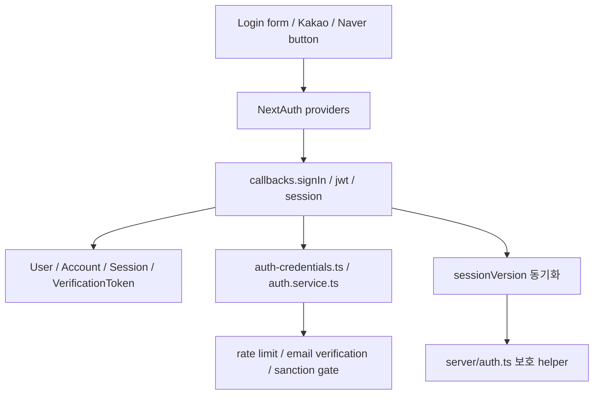
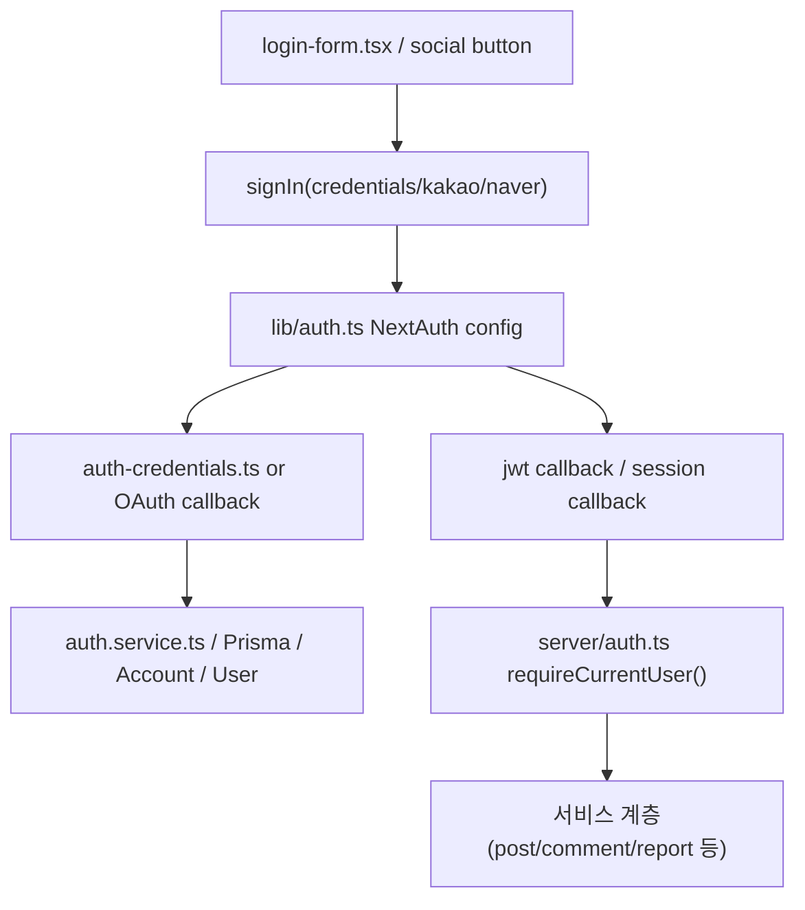

# 11. Credentials + Kakao + Naver 인증 구조

## 이번 글에서 풀 문제

TownPet 인증은 단순 로그인 폼이 아닙니다.

- 이메일/비밀번호 로그인
- 카카오 로그인
- 네이버 로그인
- 이메일 인증
- 비밀번호 재설정
- 소셜 계정 연결/해제
- 세션 강제 무효화
- 제재 사용자 차단

이 글은 인증 구조를 “버튼 몇 개”가 아니라 **세션, provider, 보안 정책, 계정 lifecycle** 관점으로 정리합니다.

## 왜 이 글이 중요한가

커뮤니티 서비스에서 인증은 모든 흐름의 입구입니다.

- 피드/검색은 비교적 느슨하지만
- 글 작성, 댓글, 반응, 알림, 관리자 화면은 모두 인증과 연결됩니다.

그래서 TownPet는 인증을:

- 로그인 수단
- 세션 상태
- 계정 보안
- 제재 정책

이 네 층으로 같이 다룹니다.

## 인증 흐름을 먼저 그림으로 보면

핵심은 로그인 버튼보다 `callback + sessionVersion + server/auth.ts` 조합이 인증의 실제 중심이라는 점입니다.

## 먼저 볼 핵심 파일

- [`app/src/lib/auth.ts`](/Users/alex/project/townpet/app/src/lib/auth.ts)
- [`app/src/server/auth.ts`](/Users/alex/project/townpet/app/src/server/auth.ts)
- [`app/src/server/auth-credentials.ts`](/Users/alex/project/townpet/app/src/server/auth-credentials.ts)
- [`app/src/server/services/auth.service.ts`](/Users/alex/project/townpet/app/src/server/services/auth.service.ts)
- [`app/src/components/auth/login-form.tsx`](/Users/alex/project/townpet/app/src/components/auth/login-form.tsx)
- [`app/src/components/auth/kakao-signin-button.tsx`](/Users/alex/project/townpet/app/src/components/auth/kakao-signin-button.tsx)
- [`app/src/components/auth/naver-signin-button.tsx`](/Users/alex/project/townpet/app/src/components/auth/naver-signin-button.tsx)
- [`app/src/app/login/page.tsx`](/Users/alex/project/townpet/app/src/app/login/page.tsx)
- [`app/prisma/schema.prisma`](/Users/alex/project/townpet/app/prisma/schema.prisma)

## Prisma에서 먼저 봐야 하는 모델

인증 구조를 이해하려면 아래 모델부터 봐야 합니다.

- `User`
- `Account`
- `Session`
- `VerificationToken`
- `PasswordResetToken`
- `AuthAuditLog`

특히 `User`에서는 아래 필드가 중요합니다.

- `email`
- `passwordHash`
- `emailVerified`
- `sessionVersion`
- `role`

이 다섯 개가 TownPet 인증의 핵심 축입니다.

## 1. NextAuth 설정은 어디 있는가

핵심 파일:

- [`app/src/lib/auth.ts`](/Users/alex/project/townpet/app/src/lib/auth.ts)

여기서 TownPet는 `NextAuth(...)`를 직접 구성합니다.

주요 포인트:

- `PrismaAdapter`
- `Credentials`
- `Kakao`
- `Naver`
- JWT session strategy
- 커스텀 session cookie 이름

즉 이 파일은 TownPet 인증의 “프레임워크 설정 중심”입니다.

마지막 export도 중요합니다.

- `handlers`
- `auth`
- `signIn`
- `signOut`
- `unstable_update`

이 값들이 앱 전체에서 재사용됩니다.

## 2. Credentials 로그인은 어떻게 검증하는가

핵심 파일:

- [`app/src/server/auth-credentials.ts`](/Users/alex/project/townpet/app/src/server/auth-credentials.ts)

핵심 함수:

- `authorizeCredentialsLogin`

이 함수는 단순 비밀번호 비교만 하지 않습니다.

- login schema validation
- rate limit
- 로그인 실패 지연
- 이메일 인증 여부 확인
- 비밀번호 존재 여부 확인
- 제재 상태 확인
- auth audit 기록

즉 “이메일 로그인”은 이 파일에서 보안적으로 닫힙니다.

### 읽을 때 주의할 점

이 함수는 실패 시 바로 예외를 많이 던지지 않습니다.  
인증 계층 특성상 일부 실패는 `null`로 정규화하고 audit log를 남기는 방식입니다.

이건 보안상 흔한 패턴입니다.

## 3. 로그인 폼은 어디까지 책임지는가

UI 진입점:

- [`app/src/app/login/page.tsx`](/Users/alex/project/townpet/app/src/app/login/page.tsx)
- [`app/src/components/auth/login-form.tsx`](/Users/alex/project/townpet/app/src/components/auth/login-form.tsx)

페이지는:

- 카카오/네이버 사용 가능 여부
- 로컬 preview/dev mode 여부

를 결정합니다.

폼은:

- 이메일/비밀번호 입력
- `next` path 처리
- OAuth notice/error 표시
- `signIn("credentials")` 호출

을 담당합니다.

즉 UI는 로그인 경험을 제공하지만, 진짜 규칙은 여전히 서버에 있습니다.

## 4. 카카오/네이버 로그인은 어떻게 붙는가

소셜 버튼:

- [`kakao-signin-button.tsx`](/Users/alex/project/townpet/app/src/components/auth/kakao-signin-button.tsx)
- [`naver-signin-button.tsx`](/Users/alex/project/townpet/app/src/components/auth/naver-signin-button.tsx)

이 버튼은 내부적으로:

- `signIn("kakao")`
- `signIn("naver")`

를 호출합니다.

개발 환경에서는 `social-dev` fallback도 있습니다.

즉 실제 provider가 없어도 로컬 preview나 E2E에서 흐름을 검증할 수 있게 했습니다.

## 5. 소셜 로그인에서 가장 중요한 보호 장치

다시 [`app/src/lib/auth.ts`](/Users/alex/project/townpet/app/src/lib/auth.ts)을 보면 `callbacks.signIn`이 중요합니다.

여기서 TownPet는:

- 카카오/네이버 이메일 누락 차단
- 이미 연결된 providerAccountId 불일치 차단
- 제재 사용자 로그인 차단

을 수행합니다.

즉 provider를 붙이는 것보다 **account linking 충돌을 막는 것**에 더 신경 쓴 구조입니다.

## 6. 세션은 어떻게 유지되는가

### JWT 전략

TownPet는 DB session이 아니라:

- `session: { strategy: "jwt" }`

를 씁니다.

즉 세션 상태 일부는 token에 담깁니다.

### `sessionVersion`

TownPet 인증에서 가장 중요한 값 중 하나가:

- `sessionVersion`

입니다.

이 값은 다음 때 증가합니다.

- 비밀번호 변경
- 비밀번호 재설정
- 일부 소셜 계정 해제
- 세션 무효화가 필요한 보안 이벤트

즉 강제 로그아웃/세션 폐기를 위해 token 버전 비교를 씁니다.

`jwt` callback은 현재 DB user와 token을 비교해:

- 사용자가 사라졌으면 token 무효화
- 제재가 걸렸으면 token 무효화
- sessionVersion이 달라졌으면 sync

를 수행합니다.

## 7. `server/auth.ts`는 무엇을 하는가

파일:

- [`app/src/server/auth.ts`](/Users/alex/project/townpet/app/src/server/auth.ts)

이 파일은 TownPet 내부의 인증 접근 게이트입니다.

주요 함수:

- `getCurrentUserId`
- `requireCurrentUser`
- `requireModerator`
- `requireAdmin`

중요한 점:

- 단순 로그인 여부만 보지 않습니다.
- `requireCurrentUser()` 안에서 `assertUserInteractionAllowed()`를 호출해 제재 상태도 확인합니다.

즉 TownPet에서 “인증”은 곧 “상호작용 가능 상태 확인”까지 포함합니다.

## 8. 회원가입/이메일 인증/비밀번호 재설정은 어디 있는가

핵심 파일:

- [`app/src/server/services/auth.service.ts`](/Users/alex/project/townpet/app/src/server/services/auth.service.ts)

이 서비스는:

- `registerUser`
- `requestEmailVerification`
- `confirmEmailVerification`
- `requestPasswordReset`
- `confirmPasswordReset`
- `setPasswordForUser`

를 담당합니다.

즉 TownPet는 인증 lifecycle을:

- 로그인
- 계정 생성
- 이메일 인증
- 비밀번호 설정
- 비밀번호 재설정

으로 나눠 service 계층에서 관리합니다.

## 9. 소셜 계정 연결/해제는 어디 있는가

같은 파일에서 중요한 함수:

- `linkSocialAccountForUser`
- `unlinkSocialAccountForUser`

여기서 TownPet는 특히 **마지막 로그인 수단 제거 금지**를 강하게 잡습니다.

즉:

- 비밀번호도 없고
- 다른 소셜 provider도 없는데
- 마지막 provider까지 끊는 것

은 허용하지 않습니다.

또 현재 세션 provider를 끊는 경우에는:

- `sessionVersion` 증가
- 세션 무효화

까지 같이 처리합니다.

이 부분은 보안/운영 품질 차이를 만드는 디테일입니다.

## 전체 흐름을 그림으로 보면

## Java/Spring으로 치환하면

- `lib/auth.ts`
  - Spring Security 설정 + AuthenticationProvider 조합
- `auth-credentials.ts`
  - credentials authentication service
- `server/auth.ts`
  - 인증/권한 helper
- `auth.service.ts`
  - 계정 lifecycle service
- `login-form.tsx`
  - 로그인 화면

즉 Spring 기준으로 보면:

- Security config
- Login provider
- Account service
- Access guard

가 파일로 나뉜 구조입니다.

## 추천 읽기 순서

1. [`app/prisma/schema.prisma`](/Users/alex/project/townpet/app/prisma/schema.prisma)
2. [`app/src/lib/auth.ts`](/Users/alex/project/townpet/app/src/lib/auth.ts)
3. [`app/src/server/auth-credentials.ts`](/Users/alex/project/townpet/app/src/server/auth-credentials.ts)
4. [`app/src/server/auth.ts`](/Users/alex/project/townpet/app/src/server/auth.ts)
5. [`app/src/server/services/auth.service.ts`](/Users/alex/project/townpet/app/src/server/services/auth.service.ts)
6. [`app/src/components/auth/login-form.tsx`](/Users/alex/project/townpet/app/src/components/auth/login-form.tsx)
7. [`app/src/components/auth/kakao-signin-button.tsx`](/Users/alex/project/townpet/app/src/components/auth/kakao-signin-button.tsx)
8. [`app/src/components/auth/naver-signin-button.tsx`](/Users/alex/project/townpet/app/src/components/auth/naver-signin-button.tsx)

## 현재 구조의 장점

- credentials와 social login이 같은 session model 위에 놓입니다.
- sessionVersion으로 강제 세션 무효화가 가능합니다.
- 이메일 인증/비밀번호 재설정/소셜 연결 해제까지 lifecycle이 닫혀 있습니다.
- 제재 상태가 인증과 분리되지 않고 실제 상호작용 게이트에 연결돼 있습니다.

## 현재 구조의 한계

- NextAuth callback 안에 중요한 보안 규칙이 많아 초반에 읽기 어렵습니다.
- 인증 UI, provider 설정, 계정 lifecycle이 여러 파일에 분산돼 있습니다.
- Java/Spring 개발자에게는 callback 기반 흐름이 익숙하지 않을 수 있습니다.

## Python/Java 개발자용 요약

- TownPet 인증의 중심은 `lib/auth.ts`입니다.
- 이메일 로그인 검증은 `auth-credentials.ts`에 있습니다.
- 계정 생성/이메일 인증/비밀번호 재설정/소셜 연결은 `auth.service.ts`가 담당합니다.
- 앱 내부에서 실제 접근 제어는 `server/auth.ts`의 `requireCurrentUser`, `requireModerator`, `requireAdmin`이 맡습니다.
- `sessionVersion`은 세션 강제 무효화용 핵심 필드입니다.

## 면접에서 이렇게 설명할 수 있다

> TownPet는 NextAuth를 쓰지만 기본 설정에만 의존하지 않고, credentials 검증, 이메일 인증, 비밀번호 재설정, 소셜 연결/해제, sessionVersion 기반 세션 무효화까지 자체 service와 callback으로 보강했습니다. 그래서 로그인 자체보다 계정 lifecycle과 보안 정책을 함께 다루는 인증 구조라고 설명할 수 있습니다.
