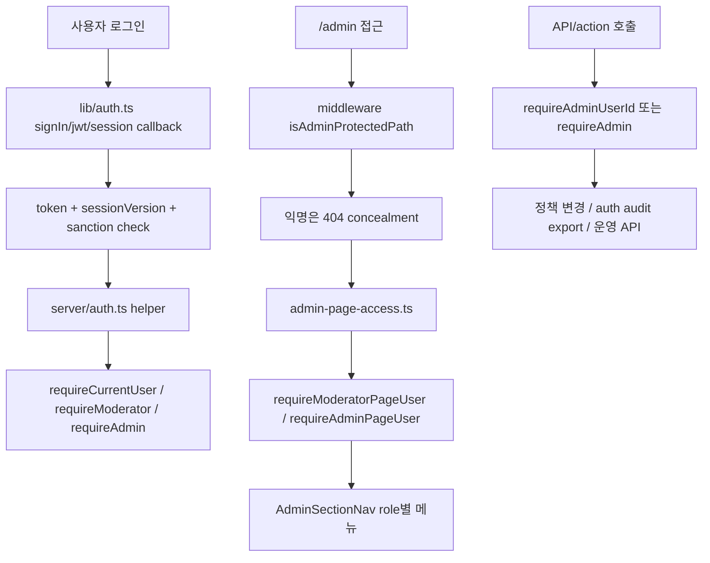

# 12. 세션, role, 관리자 surface

## 이번 글에서 풀 문제

TownPet에서 인증은 "로그인 성공"으로 끝나지 않습니다.

실제로는 아래가 이어집니다.

- JWT/session에 어떤 정보를 싣는가
- sanctions가 있으면 세션을 어떻게 무효화하는가
- `USER`, `MODERATOR`, `ADMIN`이 어디서 갈라지는가
- `/admin` 표면을 익명 사용자에게 어떻게 숨기는가
- admin-only 화면과 moderator 공용 화면은 어떻게 나누는가

이 글은 TownPet의 인증/권한 구조를 **로그인 기능이 아니라 세션 상태 머신 + 관리자 surface 게이트**로 정리합니다.

## 왜 이 글이 중요한가

권한 문제는 보통 두 군데에서 실패합니다.

- 세션은 있는데 role 체크가 느슨함
- 페이지는 숨겼는데 API는 열려 있음

TownPet는 이 문제를 여러 층으로 나눠서 다룹니다.

- NextAuth session/JWT callback
- server auth helper
- page-level guard
- API-level guard
- middleware의 admin concealment
- 관리자 메뉴 노출 분리

즉 하나의 `isAdmin` 조건으로 끝내지 않고, **페이지/라우트/UI에서 서로 다른 책임을 가지도록** 설계합니다.

## 먼저 볼 핵심 파일

- [`app/src/lib/auth.ts`](../app/src/lib/auth.ts)
- [`app/src/lib/session-version.ts`](../app/src/lib/session-version.ts)
- [`app/src/server/auth.ts`](../app/src/server/auth.ts)
- [`app/src/server/admin-page-access.ts`](../app/src/server/admin-page-access.ts)
- [`app/middleware.ts`](../app/middleware.ts)
- [`app/src/components/admin/admin-section-nav.tsx`](../app/src/components/admin/admin-section-nav.tsx)
- [`app/src/app/api/admin/auth-audits/export/route.ts`](../app/src/app/api/admin/auth-audits/export/route.ts)
- [`app/src/server/actions/policy.ts`](../app/src/server/actions/policy.ts)
- [`app/src/server/services/sanction.service.ts`](../app/src/server/services/sanction.service.ts)
- [`app/src/server/auth.test.ts`](../app/src/server/auth.test.ts)

## 먼저 알아둘 개념

### 1. NextAuth session 전략

TownPet는 DB session이 아니라 JWT 기반 session 전략을 씁니다.

즉:

- 로그인 후 token을 만들고
- `jwt` callback에서 token을 갱신하고
- `session` callback에서 브라우저 session payload를 조립합니다.

Spring으로 치환하면:

- 서버 메모리 session보다는 stateless token 기반 인증에 가깝습니다.

### 2. page guard와 API guard는 다르다

페이지는 `notFound()`로 숨길 수 있고, API는 `401/403`을 명시적으로 반환할 수 있습니다.

TownPet는 이 둘을 일부러 다르게 씁니다.

### 3. role만으로 끝나지 않는다

`USER`, `MODERATOR`, `ADMIN` role이 있어도,

- sanctions
- nickname 미완성
- sessionVersion mismatch

같은 추가 상태가 실제 접근 권한을 바꿉니다.

## 1. 세션은 어디서 만들어지는가

핵심 파일:

- [`lib/auth.ts`](../app/src/lib/auth.ts)

먼저 볼 callback:

- `signIn`
- `jwt`
- `session`

`signIn` 단계에서 TownPet는 단순 provider 성공만 보지 않습니다.

- social provider email 존재 여부
- 이미 다른 provider 계정과 연결된 경우 `OAuthAccountNotLinked`
- active sanction 여부

를 확인합니다.

즉 로그인 성공 직후에도 "이 세션을 정말 열어도 되는가"를 한 번 더 검증합니다.

## 2. `jwt` callback은 왜 매번 DB를 다시 보는가

`jwt` callback을 보면 token에 user state를 싣고, 이후에도 DB에서 현재 상태를 다시 확인합니다.

주요 포인트:

- `applyUserSessionStateToToken(...)`
- `syncSessionVersionToken(...)`
- `getActiveInteractionSanction(...)`

즉 token은 로그인 순간의 스냅샷이 아니라, **현재 사용자 상태와 계속 동기화되는 session state**입니다.

이렇게 한 이유:

- 닉네임 변경 반영
- 프로필 이미지 반영
- sessionVersion mismatch 시 강제 로그아웃
- sanction 발생 시 세션 무효화

정리하면 TownPet는 JWT를 "한 번 발급하고 끝"이 아니라 **검증 가능한 세션 캐시**처럼 씁니다.

## 3. `sessionVersion`은 왜 필요한가

핵심 파일:

- [`session-version.ts`](../app/src/lib/session-version.ts)

주요 함수:

- `applyUserSessionStateToToken`
- `syncSessionVersionToken`

의미:

- user row의 `sessionVersion`
- token에 들어 있는 `sessionVersion`

을 비교해서 다르면 token을 invalid 상태로 돌립니다.

이 패턴이 필요한 이유:

- 소셜 계정 연결/해제
- 인증 정보 변경
- 보안상 세션 전체 무효화

같은 이벤트 후 기존 session을 일괄 종료할 수 있기 때문입니다.

Java/Spring으로 치환하면:

- user 테이블에 있는 `session_epoch`를 비교해 refresh token을 무효화하는 패턴

과 비슷합니다.

## 4. 브라우저에서 보이는 session payload는 어디서 정해지는가

`session(...)` callback은 브라우저가 읽는 `session.user`를 최종 조립합니다.

TownPet는 여기에:

- `id`
- `nickname`
- `image`
- `authProvider`

를 넣습니다.

반대로 session이 invalidated 상태면:

- `user: undefined`

로 내려서 브라우저는 로그인 세션이 없는 것처럼 행동하게 만듭니다.

즉 "세션이 깨졌다"는 상태를 별도 에러로 던지기보다, **브라우저가 자연스럽게 guest 상태로 돌아가게** 설계한 것입니다.

## 5. 서버에서 현재 사용자를 읽는 helper는 어떻게 나뉘는가

핵심 파일:

- [`server/auth.ts`](../app/src/server/auth.ts)

먼저 볼 함수:

- `getCurrentUserId`
- `requireCurrentUser`
- `requireModerator`
- `requireAdmin`
- `requireModeratorUserId`
- `requireAdminUserId`

이 파일은 인증 helper 계층입니다.

특징:

- `requireCurrentUser()`는 단순 로그인 확인이 아니라 `assertUserInteractionAllowed()`까지 호출
- `requireModerator()`는 `ADMIN`과 `MODERATOR` 허용
- `requireAdmin()`은 `ADMIN`만 허용

즉 서비스/action/API는 여기서부터 권한 게이트를 시작합니다.

## 6. sanctions는 왜 auth helper 안으로 들어오는가

`requireCurrentUser()` 안에서:

- `assertUserInteractionAllowed(user.id)`

를 호출하는 것이 핵심입니다.

의미:

- 로그인은 되어 있어도
- 현재 제재 상태면
- write/action 계층 진입을 막는다

즉 TownPet는 제재를 moderator 화면의 별도 정보가 아니라, **일상적인 auth gate에 통합된 제약**으로 봅니다.

이 구조 덕분에 게시글, 댓글, 업로드, 신고 같은 곳마다 sanction check를 잊을 가능성이 줄어듭니다.

## 7. 페이지 접근 제어는 왜 auth helper와 또 분리되는가

핵심 파일:

- [`admin-page-access.ts`](../app/src/server/admin-page-access.ts)

주요 함수:

- `requireModeratorPageUser`
- `requireAdminPageUser`

이 함수들은 페이지용 guard입니다.

특징:

- 사용자 없으면 `notFound()`
- nickname 없으면 `/profile` 유도
- role 불일치면 `notFound()`

즉 page layer에서는 `401/403`보다 **화면 concealment**가 우선입니다.

Spring으로 치환하면:

- `@PreAuthorize` + 실패 시 403

보다는,

- 존재 자체를 숨기는 보안 페이지

에 가깝습니다.

## 8. middleware는 admin surface를 어디까지 숨기는가

핵심 파일:

- [`middleware.ts`](../app/middleware.ts)

먼저 볼 함수:

- `isAdminProtectedPath`
- `resolveSessionToken`
- `createNotFoundResponse`

핵심 흐름:

- `/admin`, `/admin/*`, `/api/admin/*`는 admin protected path
- session token이 전혀 없으면 바로 404
- `x-robots-tag: noindex, nofollow, noarchive`

즉 익명 사용자에게는 admin 표면이 존재 자체를 덜 드러냅니다.

하지만 middleware는 여기서 role까지 최종 판정하지 않습니다.

이유:

- Edge에서 최소 정보만 보고 빠르게 걸러내기
- 진짜 role 판정은 page/API guard에서 수행하기

즉 **concealment는 middleware**, **authorization은 server helper**로 나눕니다.

## 9. 관리자 메뉴는 왜 role별로 링크 자체가 달라지는가

핵심 파일:

- [`admin-section-nav.tsx`](../app/src/components/admin/admin-section-nav.tsx)

주요 함수:

- `getAdminSectionLinks`
- `AdminSectionNav`

여기서 `adminOnly`가 붙은 메뉴는 `ADMIN`만 봅니다.

예:

- `/admin/ops`
- `/admin/auth-audits`
- `/admin/policies`
- `/admin/personalization`
- `/admin/breeds`

즉 TownPet는 페이지 접근만 막는 것이 아니라, **UI 메뉴 단계에서도 권한 surface를 줄입니다.**

이건 단순 편의가 아니라, 운영 도구가 많아질수록 중요한 UX/보안 설계입니다.

## 10. API 레벨에서도 admin/moderator가 다시 갈린다

대표 예시:

- [`/api/admin/auth-audits/export/route.ts`](../app/src/app/api/admin/auth-audits/export/route.ts)
- [`server/actions/policy.ts`](../app/src/server/actions/policy.ts)

여기서:

- auth audit export는 `requireAdminUserId()`
- 정책 변경 action은 `requireAdmin()`

을 사용합니다.

즉 페이지에서 admin-only 화면을 보여줬더라도, API/action에서 **한 번 더** admin 권한을 확인합니다.

이중 게이트가 중요한 이유:

- 직접 API 호출
- 잘못된 링크 공유
- UI 우회

를 막기 위해서입니다.

## 11. moderator와 admin의 실제 차이는 무엇인가

TownPet 기준으로 보면:

### moderator가 가능한 것

- 신고 큐 확인
- 직접 모더레이션
- moderation logs
- 병원 후기 의심 신호 검토

### admin만 가능한 것

- ops 대시보드
- auth audit 열람/export
- 정책 변경
- personalization 관리
- 품종 사전 관리

즉 moderator는 **콘텐츠/커뮤니티 운영**, admin은 **시스템/정책 운영**에 더 가깝게 분리됩니다.

## 12. 전체 흐름을 그림으로 보면



## 13. 테스트는 어떻게 읽어야 하는가

핵심 테스트:

- [`app/src/server/auth.test.ts`](../app/src/server/auth.test.ts)

여기서 보면:

- `requireModeratorUserId`
- `requireAdminUserId`
- `requireModerator`
- `requireAdmin`

가 role별로 어떻게 동작하는지 확인할 수 있습니다.

가능하면 같이 볼 파일:

- [`app/src/middleware.test.ts`](../app/src/middleware.test.ts)

이 테스트는 admin path concealment가 익명 기준으로 어떻게 동작하는지 확인하는 데 좋습니다.

## 14. 직접 실행해 보고 싶다면

```bash
cd /Users/alex/project/townpet/app
corepack pnpm test -- src/server/auth.test.ts src/middleware.test.ts
```

수동 확인 경로:

- `/admin`
- `/admin/ops`
- `/admin/reports`
- `/api/admin/auth-audits/export`

확인 질문:

- 익명 사용자는 admin surface를 아예 못 보는가
- moderator는 신고/직접 모더레이션까지만 보이는가
- admin만 정책/ops/auth-audit에 들어가는가

## 현재 구현의 한계

- middleware는 session 존재 여부를 빠르게 가리는 역할이라, role 최종 판정은 page/API에서 다시 합니다.
- 운영 역할이 `ADMIN` / `MODERATOR` 두 단계라 더 세분화된 팀 권한 모델은 아직 아닙니다.
- 세션 무효화는 강하지만 MFA나 step-up 같은 관리자 전용 추가 인증은 아직 아닙니다.

## Python/Java 개발자용 요약

- `lib/auth.ts`는 NextAuth 설정과 session/JWT lifecycle입니다.
- `session-version.ts`는 강제 로그아웃/세션 무효화 장치입니다.
- `server/auth.ts`는 role-aware auth helper 계층입니다.
- `admin-page-access.ts`는 page guard입니다.
- `middleware.ts`는 admin surface concealment를 담당합니다.
- `AdminSectionNav`는 role별 UI surface를 줄입니다.

## 면접에서 이렇게 설명할 수 있다

> TownPet는 권한을 한 곳에서만 검사하지 않았습니다. NextAuth callback에서 세션과 제재 상태를 정리하고, server auth helper에서 role을 판정하고, middleware에서는 admin surface를 익명에게 숨기고, 페이지와 API에서 다시 admin/moderator 권한을 확인하도록 나눴습니다. 그래서 세션, UI, API가 같은 권한 모델을 공유하면서도 각 계층이 다른 책임을 가집니다.

## 면접 Q&A

### Q1. 왜 middleware만으로 권한 검사를 끝내지 않았나요?

middleware는 빠른 은닉과 1차 차단에 적합하지만, 최종 role 판정은 페이지와 API에서 다시 해야 안전합니다. TownPet는 concealment와 authorization을 분리했습니다.

### Q2. `sessionVersion`이 꼭 필요한 이유는 무엇인가요?

비밀번호 변경, 소셜 연결 해제, 제재 같은 이벤트 후 현재 세션을 강제로 무효화해야 할 때가 있습니다. `sessionVersion`은 그걸 단순하게 풀어줍니다.

### Q3. `ADMIN`과 `MODERATOR`를 나눈 이유는 무엇인가요?

신고 처리와 직접 모더레이션은 moderator도 가능하지만, 정책 변경, auth audit, ops 같은 민감 표면은 admin만 접근하도록 분리했습니다.
