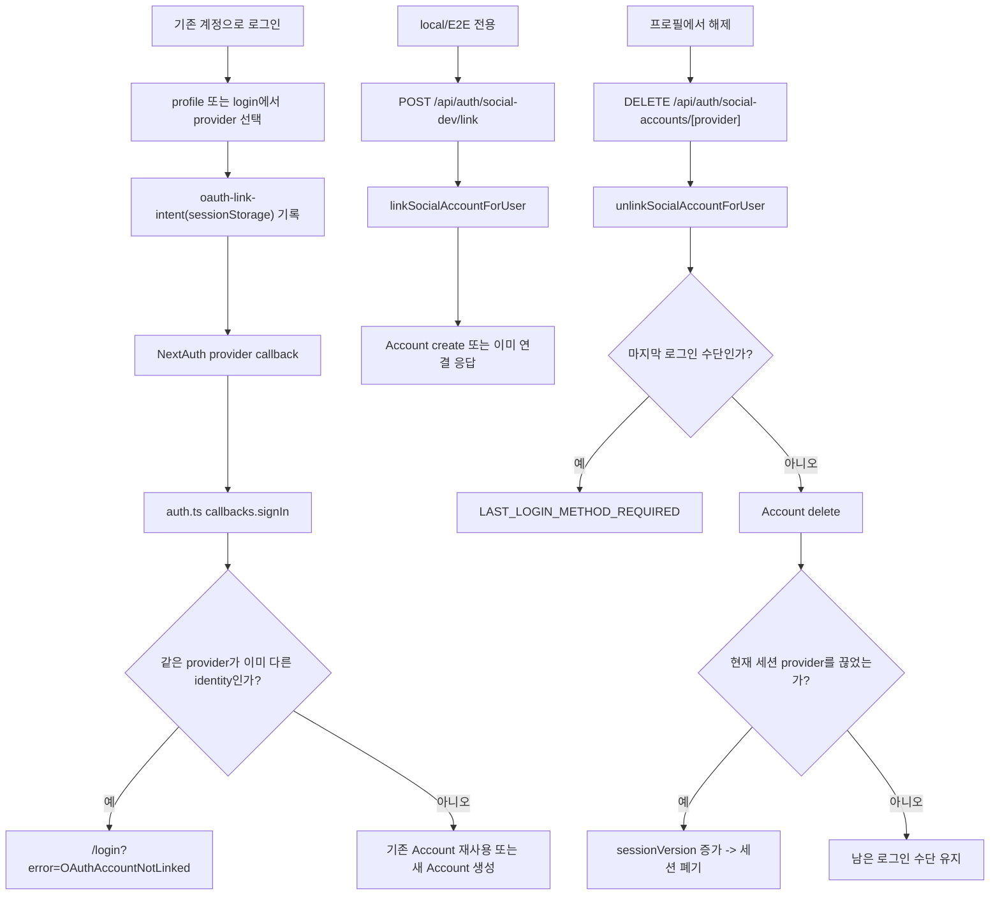

# 13. 소셜 계정 연결/해제 lifecycle

## 이번 글에서 풀 문제

TownPet의 소셜 로그인은 "카카오 버튼", "네이버 버튼"으로 끝나지 않습니다.

실제로는 아래 흐름이 같이 묶여 있습니다.

- 기존 계정으로 로그인
- 소셜 provider로 진입
- 이미 연결된 provider인지 확인
- 다른 계정에 연결된 provider인지 확인
- 마지막 로그인 수단 보호
- 현재 세션 강제 무효화
- `OAuthAccountNotLinked` 복구 메시지

이 글은 소셜 로그인 연동을 **버튼 이벤트가 아니라 계정 lifecycle**로 정리합니다.

## 왜 이 글이 중요한가

소셜 로그인에서 가장 위험한 순간은 "처음 로그인"이 아니라 "같은 이메일처럼 보이는 서로 다른 계정을 어떻게 연결하거나 분리할 것인가"입니다.

잘못 처리하면 아래 문제가 바로 생깁니다.

- 다른 사용자의 카카오 계정을 내 계정에 붙이는 문제
- 마지막 로그인 수단을 끊어서 계정에 다시 못 들어오는 문제
- 현재 로그인 수단을 끊었는데 세션이 계속 살아 있는 문제
- 사용자는 연결하려고 했는데 시스템은 충돌만 보여주는 문제

TownPet는 그래서 소셜 연동을

- 인증 설정
- account linking 규칙
- profile lifecycle
- 세션 무효화

이 네 층으로 나눕니다.

## 먼저 볼 핵심 파일

- [`app/src/lib/auth.ts`](/Users/alex/project/townpet/app/src/lib/auth.ts)
- [`app/src/server/services/auth.service.ts`](/Users/alex/project/townpet/app/src/server/services/auth.service.ts)
- [`app/src/app/api/auth/social-accounts/[provider]/route.ts`](/Users/alex/project/townpet/app/src/app/api/auth/social-accounts/[provider]/route.ts)
- [`app/src/app/api/auth/social-dev/link/route.ts`](/Users/alex/project/townpet/app/src/app/api/auth/social-dev/link/route.ts)
- [`app/src/lib/oauth-link-intent.ts`](/Users/alex/project/townpet/app/src/lib/oauth-link-intent.ts)
- [`app/src/lib/social-auth.ts`](/Users/alex/project/townpet/app/src/lib/social-auth.ts)
- [`app/src/lib/validations/auth.ts`](/Users/alex/project/townpet/app/src/lib/validations/auth.ts)
- [`app/src/app/profile/page.tsx`](/Users/alex/project/townpet/app/src/app/profile/page.tsx)
- [`app/e2e/profile-social-account-linking.spec.ts`](/Users/alex/project/townpet/app/e2e/profile-social-account-linking.spec.ts)
- [`app/src/server/services/auth-account-link.service.test.ts`](/Users/alex/project/townpet/app/src/server/services/auth-account-link.service.test.ts)

## Prisma에서 먼저 봐야 하는 모델

핵심 모델은 세 개입니다.

- `User`
- `Account`
- `Session` 대신 JWT token + `sessionVersion`

특히 이 필드가 중요합니다.

- `User.passwordHash`
- `User.sessionVersion`
- `Account.provider`
- `Account.providerAccountId`

즉 TownPet는 "연결된 소셜 계정 목록"을 `Account`로 보관하고, "현재 로그인 세션이 계속 유효한가"는 `sessionVersion`으로 제어합니다.

## 1. 자동 로그인과 명시 연결은 무엇이 다른가

여기서 먼저 개념을 분리해야 합니다.

1. **자동 로그인**
   - 사용자가 카카오/네이버로 바로 로그인
   - NextAuth provider callback이 계정을 찾거나 만든다
2. **명시 연결**
   - 이미 로그인한 계정에 소셜 provider를 붙인다
   - 나중에 같은 계정으로 카카오/네이버 로그인을 허용한다

TownPet는 이 둘을 같은 문제로 취급하지 않습니다.

자동 로그인은 [`app/src/lib/auth.ts`](/Users/alex/project/townpet/app/src/lib/auth.ts)의 provider/adapter/callback이 담당하고, 명시 연결/해제는 [`auth.service.ts`](/Users/alex/project/townpet/app/src/server/services/auth.service.ts)에서 따로 다룹니다.

## 2. NextAuth callback은 무엇을 막는가

핵심은 [`callbacks.signIn`](/Users/alex/project/townpet/app/src/lib/auth.ts)입니다.

여기서 TownPet는 소셜 로그인 진입 시 아래를 먼저 검사합니다.

- 카카오 이메일 누락 -> `KAKAO_EMAIL_REQUIRED`
- 네이버 이메일 누락 -> `NAVER_EMAIL_REQUIRED`
- 같은 provider가 이미 붙어 있는데 `providerAccountId`가 다름 -> `OAuthAccountNotLinked`
- 제재 계정 로그인 -> `ACCOUNT_SUSPENDED`, `ACCOUNT_PERMANENTLY_BANNED`

즉 provider callback의 역할은 "로그인 허용 여부 판단"입니다.

중요한 점:

- `allowDangerousEmailAccountLinking: false`
- 같은 provider라도 다른 `providerAccountId`면 자동 병합하지 않음

즉 TownPet는 이메일이 같아 보여도 provider identity를 보수적으로 다룹니다.

## 3. 명시 연결은 어디서 처리되는가

핵심 서비스:

- [`linkSocialAccountForUser`](/Users/alex/project/townpet/app/src/server/services/auth.service.ts)

이 함수는 `socialAccountLinkSchema`를 먼저 검증합니다.

근거:

- [`app/src/lib/validations/auth.ts`](/Users/alex/project/townpet/app/src/lib/validations/auth.ts)

검증 후 실제 규칙은 이 순서입니다.

1. 현재 사용자에게 같은 provider가 이미 연결돼 있는가
2. 연결돼 있다면 `providerAccountId`가 같은가
3. 같으면 `alreadyLinked: true` 반환
4. 다르면 `PROVIDER_ALREADY_CONNECTED`
5. 다른 사용자에게 같은 `provider + providerAccountId`가 연결돼 있는가
6. 그렇다면 `ACCOUNT_ALREADY_LINKED`
7. 아니면 `Account` row 생성

즉 "같은 카카오는 하나만", "같은 `providerAccountId`는 한 계정에만"이라는 규칙을 서버에서 강제합니다.

## 4. 명시 연결 API는 왜 `social-dev`용 route가 따로 있는가

로컬/E2E에서는 deterministic linking이 필요합니다.

그 역할이:

- [`POST /api/auth/social-dev/link`](/Users/alex/project/townpet/app/src/app/api/auth/social-dev/link/route.ts)

입니다.

이 route는:

- `ENABLE_SOCIAL_DEV_LOGIN`이 켜져 있을 때만 열림
- 현재 로그인 사용자를 가져옴
- `providerAccountId = social-dev:${provider}:${user.id}`로 고정
- `linkSocialAccountForUser`를 호출

즉 로컬/E2E에서는 실제 카카오/네이버 OAuth round-trip 없이도 account linking 규칙을 안정적으로 검증할 수 있습니다.

Python/Java 백엔드로 치환하면 이 route는 "실제 외부 provider를 흉내 내는 테스트 전용 controller"입니다.

## 5. 해제는 어디서 처리되는가

핵심 서비스:

- [`unlinkSocialAccountForUser`](/Users/alex/project/townpet/app/src/server/services/auth.service.ts)

핵심 API:

- [`DELETE /api/auth/social-accounts/[provider]`](/Users/alex/project/townpet/app/src/app/api/auth/social-accounts/[provider]/route.ts)

이 route는:

- `requireCurrentUser()`
- `auth()`로 현재 세션의 `authProvider`
- `provider` path param

을 모아서 서비스에 넘깁니다.

즉 해제는 provider path만 보는 게 아니라, **현재 세션이 어떤 로그인 수단인지**도 같이 봅니다.

## 6. 마지막 로그인 수단 보호는 왜 중요한가

`unlinkSocialAccountForUser`의 가장 중요한 보호 장치는 이것입니다.

- 비밀번호가 없음
- 남아 있는 다른 소셜 provider도 없음

이 두 조건이 동시에 성립하면 해제를 막습니다.

에러 코드는:

- `LAST_LOGIN_METHOD_REQUIRED`

입니다.

즉 TownPet는 "이 계정에서 마지막으로 남아 있는 로그인 수단"은 끊지 못하게 합니다.

이 규칙이 없으면:

- 카카오만으로 가입한 계정
- 비밀번호 없음
- 다른 provider 없음

상태에서 사용자가 카카오 연결을 끊는 순간 계정에 다시 들어올 수 없게 됩니다.

## 7. 현재 로그인 수단을 끊으면 왜 `sessionVersion`을 올리는가

`unlinkSocialAccountForUser`는 `authProvider`도 같이 받습니다.

그리고

- 현재 로그인 provider == 지금 끊는 provider

이면:

- `sessionRevoked = true`
- `User.sessionVersion` 증가

를 수행합니다.

즉 "현재 카카오 로그인 세션으로 접속 중인데 카카오 연결을 끊었다"면 그 세션을 계속 살려 두지 않습니다.

Java/Spring 관점으로 치환하면:

- 단순 `DELETE /connections/kakao`
- 가 아니라
- "현재 SecurityContext가 어느 provider에서 왔는지"까지 보고 세션 invalidation을 결정하는 구조입니다.

## 8. 사용자는 이 흐름을 어디서 체감하는가

TownPet는 UI 메시지를 별도 helper로 분리해 둡니다.

핵심 파일:

- [`app/src/lib/social-auth.ts`](/Users/alex/project/townpet/app/src/lib/social-auth.ts)
- [`app/src/lib/oauth-link-intent.ts`](/Users/alex/project/townpet/app/src/lib/oauth-link-intent.ts)

여기서 관리하는 값:

- `SOCIAL_ACCOUNT_LINKED_*`
- `SOCIAL_ACCOUNT_UNLINKED_*`
- `SOCIAL_ACCOUNT_PROVIDER_ALREADY_CONNECTED_*`
- `OAuthAccountNotLinked`

특히 `oauth-link-intent`는 sessionStorage에

- 어떤 provider를 연결하려고 했는지
- 끝나고 어디로 돌아가야 하는지

를 저장합니다.

그래서 사용자가 소셜 연결 중 충돌을 만나도 `/login`에서 "원래 로그인 방식으로 먼저 접속한 뒤 프로필에서 다시 확인하라"는 회복 메시지를 보여줄 수 있습니다.

## 9. 전체 흐름을 그림으로 보면



## 10. 테스트는 어떻게 읽어야 하는가

### 서비스 단위 테스트

- [`app/src/server/services/auth-account-link.service.test.ts`](/Users/alex/project/townpet/app/src/server/services/auth-account-link.service.test.ts)

이 테스트는 규칙 자체를 고정합니다.

- provider account 생성
- 같은 provider 중복 연결 차단
- 마지막 로그인 수단 해제 차단
- 현재 provider 해제 시 `sessionVersion` 증가

### route 테스트

- [`app/src/app/api/auth/social-accounts/[provider]/route.test.ts`](/Users/alex/project/townpet/app/src/app/api/auth/social-accounts/[provider]/route.test.ts)

이 테스트는:

- `requireCurrentUser`
- `authProvider`
- service error -> JSON 응답

같이 controller 레이어를 확인합니다.

### E2E

- [`app/e2e/profile-social-account-linking.spec.ts`](/Users/alex/project/townpet/app/e2e/profile-social-account-linking.spec.ts)

이 시나리오는:

- local dev에서 카카오 연결
- 카카오 해제
- 유일한 로그인 수단일 때 버튼 비활성
- `OAuthAccountNotLinked` 복구 메시지

를 끝까지 검증합니다.

## 11. 직접 실행해 보고 싶다면

```bash
corepack pnpm -C app test -- src/server/services/auth-account-link.service.test.ts
corepack pnpm -C app test -- 'src/app/api/auth/social-accounts/[provider]/route.test.ts'
corepack pnpm -C app test:e2e -- e2e/profile-social-account-linking.spec.ts --project=chromium
```

로컬/E2E 명시 연결은 `ENABLE_SOCIAL_DEV_LOGIN=1` 환경을 요구합니다.

## 12. 현재 구현의 한계

- 명시 연결의 deterministic route는 현재 `social-dev` 기준이라, 로컬/E2E 설명과 실제 production OAuth round-trip은 완전히 동일하지는 않습니다.
- provider linking UI는 버전별로 달라질 수 있으므로, 최종 truth는 항상 `auth.service.ts`, `auth.ts`, route 테스트를 먼저 봐야 합니다.
- account linking 정책이 보수적이어서 "같은 이메일이니 자동 병합" 같은 UX는 의도적으로 허용하지 않습니다.

## Python/Java 개발자용 요약

- `Account`는 소셜 로그인 연결 테이블입니다.
- `linkSocialAccountForUser`는 provider uniqueness를 보장하는 서비스입니다.
- `unlinkSocialAccountForUser`는 마지막 로그인 수단 보호와 현재 세션 폐기까지 책임집니다.
- `auth.ts callbacks.signIn`은 OAuth callback에서 잘못된 연결을 조기에 끊는 보안 게이트입니다.

## 면접에서 이렇게 설명할 수 있다

> TownPet의 소셜 로그인은 단순 OAuth 추가가 아니라 account linking 문제로 봤습니다. 같은 provider가 이미 다른 identity로 연결돼 있으면 자동 병합하지 않았고, 마지막 로그인 수단 해제도 서버에서 차단했습니다. 현재 로그인 수단을 끊는 경우에는 `sessionVersion`을 올려 세션까지 바로 폐기했습니다.
