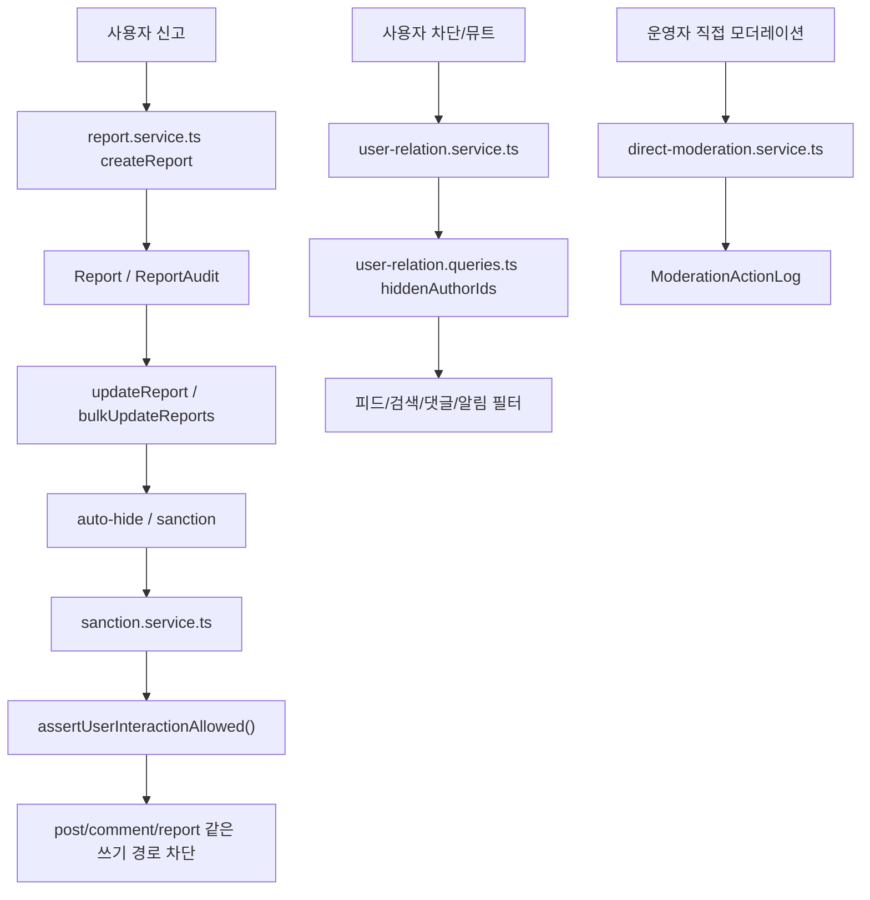

# 14. 신고, 차단, 제재, 직접 모더레이션

## 이번 글에서 풀 문제

TownPet의 trust & safety는 한 기능이 아닙니다.

- 신고
- 차단
- 뮤트
- 단계적 제재
- 직접 모더레이션
- 관리자 감사 로그

이 여섯 가지가 같이 움직입니다.

이 글의 목표는 “나쁜 사용자를 막는다” 수준이 아니라, **어떤 레이어가 어떤 종류의 위험을 막는가**를 설명하는 것입니다.

## 왜 이 글이 중요한가

커뮤니티는 기능보다 운영이 더 빨리 무너질 수 있습니다.

예를 들어:

- 악성 댓글
- 반복 신고
- 병원 후기 조작
- 차단한 사용자의 잔존 노출
- 운영자 임의 숨김

같은 문제가 생기면 단일 기능으로는 해결되지 않습니다.

그래서 TownPet는 moderation을 여러 축으로 나눕니다.

## 먼저 볼 핵심 파일

- [`app/src/server/services/report.service.ts`](/Users/alex/project/townpet/app/src/server/services/report.service.ts)
- [`app/src/server/services/user-relation.service.ts`](/Users/alex/project/townpet/app/src/server/services/user-relation.service.ts)
- [`app/src/server/queries/user-relation.queries.ts`](/Users/alex/project/townpet/app/src/server/queries/user-relation.queries.ts)
- [`app/src/server/services/sanction.service.ts`](/Users/alex/project/townpet/app/src/server/services/sanction.service.ts)
- [`app/src/server/services/direct-moderation.service.ts`](/Users/alex/project/townpet/app/src/server/services/direct-moderation.service.ts)
- [`app/src/server/moderation-action-log.ts`](/Users/alex/project/townpet/app/src/server/moderation-action-log.ts)
- [`app/src/app/admin/reports/page.tsx`](/Users/alex/project/townpet/app/src/app/admin/reports/page.tsx)
- [`app/src/server/auth.ts`](/Users/alex/project/townpet/app/src/server/auth.ts)

## Prisma에서 먼저 봐야 하는 모델

핵심 모델:

- `Report`
- `ReportAudit`
- `UserSanction`
- `ModerationActionLog`
- `UserBlock`
- `UserMute`

이 모델들을 보면 TownPet moderation이 크게 두 층이라는 걸 알 수 있습니다.

1. 사용자 간 관계 제어
2. 운영자 개입과 제재

## 1. 신고는 어디서 시작되는가

핵심 서비스:

- [`createReport`](/Users/alex/project/townpet/app/src/server/services/report.service.ts#L243)

이 함수는:

- 입력 validation
- 중복 신고 차단
- 대상 존재 여부 확인
- 자기 자신 신고 차단
- 차단 관계 확인
- 신고 저장

을 처리합니다.

중요한 점은, 신고 대상이 이제 `POST`만이 아니라 `COMMENT`도 포함한다는 것입니다.

즉 TownPet는 “댓글 괴롭힘” 같은 운영 이슈도 신고로 흡수할 수 있습니다.

## 2. 신고 처리와 자동숨김은 어떻게 이어지는가

같은 파일의 핵심은:

- `updateReport`
- `bulkUpdateReports`

입니다.

이 단계에서 TownPet는 단순 상태 변경만 하지 않습니다.

- 신고 승인/기각
- auto-hide 기준 반영
- 단계적 제재 트리거
- 감사 로그 생성

을 함께 처리합니다.

즉 신고는 그냥 inbox가 아니라 **운영 실행 엔진**입니다.

## 3. 차단과 뮤트는 어디서 처리되는가

핵심 파일:

- [`app/src/server/services/user-relation.service.ts`](/Users/alex/project/townpet/app/src/server/services/user-relation.service.ts)
- [`app/src/server/queries/user-relation.queries.ts`](/Users/alex/project/townpet/app/src/server/queries/user-relation.queries.ts)

쓰기:

- `blockUser`
- `unblockUser`
- `muteUser`
- `unmuteUser`

읽기:

- `getUserRelationState`
- `listHiddenAuthorIdsForViewer`

TownPet에서 차단/뮤트는 단순 버튼이 아니라 **필터 계약**입니다.

즉 차단/뮤트하면:

- 피드
- 검색
- 댓글
- 알림

같은 곳에서 해당 작성자를 숨기는 데 재사용됩니다.

## 4. 제재는 어떻게 단계적으로 올라가는가

핵심 파일:

- [`app/src/server/services/sanction.service.ts`](/Users/alex/project/townpet/app/src/server/services/sanction.service.ts)

대표 함수:

- `issueNextUserSanction`
- `getActiveInteractionSanction`
- `assertUserInteractionAllowed`

TownPet의 제재는 대략:

- WARNING
- SUSPEND_7D
- SUSPEND_30D
- PERMANENT_BAN

순으로 올라갑니다.

즉 운영자는 “무조건 영구정지”만 하는 게 아니라, 단계적으로 escalation할 수 있습니다.

## 5. 제재는 어디서 실제로 막히는가

가장 중요한 함수는:

- [`assertUserInteractionAllowed`](/Users/alex/project/townpet/app/src/server/services/sanction.service.ts#L241)

이 함수는 여러 쓰기 경로에서 재사용됩니다.

예:

- 게시글 작성
- 댓글 작성
- 반응 남기기
- 로그인 이후 상호작용

즉 제재는 단순 DB 상태가 아니라 **실제 기능 게이트**로 연결됩니다.

그리고 [`app/src/server/auth.ts`](/Users/alex/project/townpet/app/src/server/auth.ts) 의 `requireCurrentUser()`도 이 함수를 호출합니다.

즉 인증과 moderation이 완전히 분리되어 있지 않습니다.

## 6. 직접 모더레이션은 무엇인가

신고 기반 처리만으로는 부족한 상황이 있습니다.

예:

- 운영자가 바로 숨겨야 하는 글
- 특정 사용자의 최근 콘텐츠 일괄 숨김
- 사람이 직접 검토한 강한 제재

이때 쓰는 게:

- [`app/src/server/services/direct-moderation.service.ts`](/Users/alex/project/townpet/app/src/server/services/direct-moderation.service.ts)

대표 함수:

- `applyDirectUserSanction`
- `hideDirectUserContent`
- `restoreDirectUserContent`

즉 TownPet는 신고 큐와 별개로 **운영자가 직접 개입할 수 있는 도구**도 둡니다.

## 7. 왜 moderation action log가 중요한가

핵심 파일:

- [`app/src/server/moderation-action-log.ts`](/Users/alex/project/townpet/app/src/server/moderation-action-log.ts)

또는 스키마의:

- `ModerationActionLog`

이 로그는 “누가 무엇을 했는가”를 남깁니다.

예:

- 대상 숨김
- 대상 숨김 해제
- 제재 발급
- 정책 변경

커뮤니티 운영에서 이건 굉장히 중요합니다.

이유:

- 나중에 왜 숨겼는지 추적 가능
- 자동 처리와 수동 처리를 구분 가능
- 운영자 실수를 되짚을 수 있음

## 8. 관리자 화면은 어디서 이어지는가

신고 큐 UI:

- [`app/src/app/admin/reports/page.tsx`](/Users/alex/project/townpet/app/src/app/admin/reports/page.tsx)

이 페이지는:

- 신고 상태 필터
- target type 필터
- 우선순위 정렬
- 제재 라벨
- 감사 이력

을 같이 보여줍니다.

즉 관리자 화면은 단순 테이블이 아니라 **운영 우선순위 큐**입니다.

## 전체 흐름을 그림으로 보면

## Java/Spring으로 치환하면

- `report.service.ts`
  - 신고 application service
- `user-relation.service.ts`
  - block/mute 관계 service
- `sanction.service.ts`
  - 제재 policy service
- `direct-moderation.service.ts`
  - 운영자 수동 조치 service
- `user-relation.queries.ts`
  - 차단/뮤트 조회 query layer
- `ModerationActionLog`
  - 운영 감사 로그

즉 Spring 기준으로 보면 moderation을 하나의 service로 뭉치지 않고, **관계 제어 / 신고 처리 / 제재 / 운영자 직접 개입**으로 분리한 구조입니다.

## 추천 읽기 순서

1. [`app/prisma/schema.prisma`](/Users/alex/project/townpet/app/prisma/schema.prisma)
2. [`app/src/server/services/user-relation.service.ts`](/Users/alex/project/townpet/app/src/server/services/user-relation.service.ts)
3. [`app/src/server/queries/user-relation.queries.ts`](/Users/alex/project/townpet/app/src/server/queries/user-relation.queries.ts)
4. [`app/src/server/services/report.service.ts`](/Users/alex/project/townpet/app/src/server/services/report.service.ts)
5. [`app/src/server/services/sanction.service.ts`](/Users/alex/project/townpet/app/src/server/services/sanction.service.ts)
6. [`app/src/server/services/direct-moderation.service.ts`](/Users/alex/project/townpet/app/src/server/services/direct-moderation.service.ts)
7. [`app/src/app/admin/reports/page.tsx`](/Users/alex/project/townpet/app/src/app/admin/reports/page.tsx)

## 현재 구조의 장점

- 사용자 차단/뮤트와 운영 제재가 분리돼 있습니다.
- 신고가 곧바로 운영 처리로 이어질 수 있습니다.
- 제재가 실제 쓰기 경로에서 강제됩니다.
- 운영자 조치가 action log에 남습니다.

## 현재 구조의 한계

- 파일이 여러 개라 moderation 전체 그림이 한 번에 보이지 않을 수 있습니다.
- auto-hide, sanction, direct moderation이 각각 다른 계층에 있어 초반엔 복잡해 보입니다.
- 운영 정책 문서와 코드 구조를 같이 봐야 이해가 더 잘 됩니다.

## Python/Java 개발자용 요약

- 차단/뮤트는 `user-relation` 계층입니다.
- 신고는 `report.service.ts`가 중심입니다.
- 제재 단계는 `sanction.service.ts`가 관리합니다.
- 운영자 직접 개입은 `direct-moderation.service.ts`가 맡습니다.
- 모든 중요한 운영 행위는 `ModerationActionLog`로 남깁니다.

## 면접에서 이렇게 설명할 수 있다

> TownPet의 moderation은 한 서비스에 몰아넣지 않고, 사용자 관계 제어(block/mute), 신고 처리, 단계적 제재, 직접 모더레이션으로 분리했습니다. 신고는 auto-hide와 제재로 이어질 수 있고, 제재는 실제 쓰기 경로에서 `assertUserInteractionAllowed()`로 강제됩니다. 또 운영자 조치는 `ModerationActionLog`로 남겨 운영 추적성을 확보했습니다.
