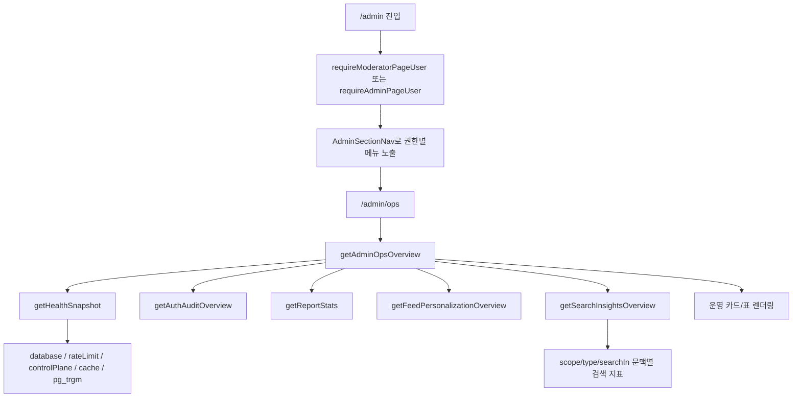

# 15. 관리자 허브와 운영 대시보드

## 이번 글에서 풀 문제

TownPet의 관리자 화면은 "숨김 처리 페이지 몇 개"가 아닙니다.

실제로는 아래가 같이 맞물립니다.

- `/admin` 허브
- 역할별 메뉴 노출
- admin 전용 화면과 moderator 공용 화면 분리
- `/admin/ops` 단일 대시보드
- `/api/health` 기반 상태 점검
- 검색/신고/인증/개인화 지표 집계

이 글의 목표는 관리자 표면을 **페이지 모음이 아니라 운영 시스템의 입구**로 이해하는 것입니다.

## 왜 이 글이 중요한가

커뮤니티 서비스는 기능을 만드는 것보다 "지금 문제가 없는가"를 빠르게 보는 것이 더 중요할 때가 많습니다.

예를 들면:

- 검색 zero-result가 갑자기 늘었는지
- auth failure가 튀는지
- 신고 적체가 쌓이는지
- cache / pg_trgm / rate limit 상태가 괜찮은지

이런 건 사용자 페이지만 보고는 알 수 없습니다.

그래서 TownPet는 관리자 표면을

- 이동 허브
- 권한 게이트
- health snapshot
- 운영 지표 종합판

으로 나눠 설계합니다.

## 먼저 볼 핵심 파일

- [`app/src/app/admin/page.tsx`](/Users/alex/project/townpet/app/src/app/admin/page.tsx)
- [`app/src/components/admin/admin-section-nav.tsx`](/Users/alex/project/townpet/app/src/components/admin/admin-section-nav.tsx)
- [`app/src/server/admin-page-access.ts`](/Users/alex/project/townpet/app/src/server/admin-page-access.ts)
- [`app/src/app/admin/ops/page.tsx`](/Users/alex/project/townpet/app/src/app/admin/ops/page.tsx)
- [`app/src/server/queries/ops-overview.queries.ts`](/Users/alex/project/townpet/app/src/server/queries/ops-overview.queries.ts)
- [`app/src/server/health-overview.ts`](/Users/alex/project/townpet/app/src/server/health-overview.ts)
- [`app/src/app/api/health/route.ts`](/Users/alex/project/townpet/app/src/app/api/health/route.ts)
- [`app/src/server/queries/auth-audit.queries.ts`](/Users/alex/project/townpet/app/src/server/queries/auth-audit.queries.ts)
- [`app/src/server/queries/report.queries.ts`](/Users/alex/project/townpet/app/src/server/queries/report.queries.ts)
- [`app/src/server/queries/search.queries.ts`](/Users/alex/project/townpet/app/src/server/queries/search.queries.ts)

## 1. `/admin`은 왜 허브 페이지가 필요한가

진입점:

- [`app/src/app/admin/page.tsx`](/Users/alex/project/townpet/app/src/app/admin/page.tsx)

이 페이지는 단순한 인덱스가 아닙니다.

- `requireModeratorPageUser()`로 관리자/모더레이터만 통과
- 현재 사용자 표시
- `AdminSectionNav` 그리드 렌더

즉 `/admin`은 "어떤 운영 화면이 있는가"를 한 장에서 보여주는 허브입니다.

이 구조가 필요한 이유:

- 헤더에 관리자 링크를 여러 개 나열하지 않음
- 권한에 따라 보이는 메뉴를 한 번에 제어 가능
- 모바일에서도 운영 화면 진입이 단순해짐

## 2. 역할별 메뉴는 어디서 갈라지는가

핵심 파일:

- [`app/src/components/admin/admin-section-nav.tsx`](/Users/alex/project/townpet/app/src/components/admin/admin-section-nav.tsx)

여기에는 `ADMIN_SECTION_LINKS`가 있고, 각 항목에는 `adminOnly` 플래그가 붙습니다.

대표 예:

- `/admin/ops` -> admin 전용
- `/admin/auth-audits` -> admin 전용
- `/admin/policies` -> admin 전용
- `/admin/reports` -> moderator 포함
- `/admin/moderation/direct` -> moderator 포함
- `/admin/moderation-logs` -> moderator 포함

즉 TownPet는 "같은 관리자 화면"처럼 보여도 실제로는 권한별로 메뉴를 잘라 냅니다.

## 3. 페이지 접근 제어는 어디서 하는가

핵심 파일:

- [`app/src/server/admin-page-access.ts`](/Users/alex/project/townpet/app/src/server/admin-page-access.ts)

주요 함수:

- `requireModeratorPageUser`
- `requireAdminPageUser`

이 함수는 단순 `role === ADMIN`만 보지 않습니다.

- 현재 로그인 사용자 확인
- 닉네임 누락 시 프로필로 유도
- 권한 없으면 `notFound()`

즉 `/admin` 표면은 "권한 없음" 페이지를 노출하지 않고, 아예 없는 페이지처럼 처리합니다.

Spring 관점으로 치환하면:

- `@PreAuthorize` + `404 concealment`

를 helper 함수로 묶어 각 admin page에서 공통으로 호출하는 구조입니다.

## 4. `/admin/ops`는 어떤 데이터를 합치는가

핵심 함수:

- [`getAdminOpsOverview`](/Users/alex/project/townpet/app/src/server/queries/ops-overview.queries.ts)

이 함수는 여러 overview를 병렬로 묶습니다.

- `getHealthSnapshot({ includeDetailedHealth: true })`
- `getAuthAuditOverview(1)`
- `getReportStats(7)`
- `getFeedPersonalizationOverview(7)`
- `getSearchInsightsOverview(8, context)`

즉 `/admin/ops`는 스스로 계산을 많이 하지 않고, 각 도메인의 집계 함수를 orchestration하는 쿼리 조립층입니다.

Java/Spring으로 치환하면:

- `AdminOpsFacadeQueryService`

처럼 읽으면 됩니다.

## 5. health snapshot은 왜 별도 파일로 분리했는가

핵심 파일:

- [`app/src/server/health-overview.ts`](/Users/alex/project/townpet/app/src/server/health-overview.ts)

이 파일은 시스템 상태를 한 번에 읽는 공용 함수입니다.

검사 항목:

- database `SELECT 1`
- `pg_trgm` extension 존재 여부
- rate limit backend 상태
- moderation control plane 상태
- query cache backend/bypass 상태
- runtime env validation

즉 `/api/health`와 `/admin/ops`가 서로 다른 방식으로 헬스를 구현하는 것이 아니라, 같은 snapshot을 재사용합니다.

이 분리가 중요한 이유:

- API contract과 관리자 화면이 같은 truth를 봄
- 테스트도 한 곳에 모을 수 있음
- 내부 토큰이 있을 때만 더 자세한 diagnostics를 열 수 있음

## 6. `/api/health`와 `/admin/ops`는 어떻게 다른가

둘 다 health를 보지만 목적이 다릅니다.

### `/api/health`

- 외부/자동화/모니터링 용도
- public 요청에는 최소 상태만 노출
- internal token이 있으면 상세 diagnostics 노출

### `/admin/ops`

- 운영자 사람이 보는 화면
- health + business/ops metrics까지 같이 노출
- 검색 문맥 필터, 신고 적체, 인증 실패, 개인화 반응을 같이 보여줌

즉 `/api/health`는 machine-facing, `/admin/ops`는 human-facing입니다.

## 7. `/admin/ops`에서 검색 필터가 중요한 이유

[`app/src/app/admin/ops/page.tsx`](/Users/alex/project/townpet/app/src/app/admin/ops/page.tsx)를 보면 검색 관련 필터가 별도로 있습니다.

- `searchScope`
- `searchType`
- `searchIn`

이 세 가지를 폼으로 받아 `getAdminOpsOverview()`에 넘깁니다.

즉 운영자는 단순히 "zero-result가 많다"만 보는 게 아니라,

- 동네 검색에서만 실패하는지
- 특정 글 유형에서만 실패하는지
- 제목 검색만 문제인지

를 나눠서 볼 수 있습니다.

검색을 기능이 아니라 운영 루프로 본다는 점이 TownPet의 특징입니다.

## 8. 실제 카드/지표는 어떤 계층에서 만들어지는가

`/admin/ops` 페이지는 크게 네 묶음으로 읽으면 됩니다.

1. **Health 카드**
   - database
   - rate limit
   - control plane
   - cache / pg_trgm
2. **검색 품질**
   - 인기 검색어
   - zero-result
   - low-result
   - 최근 7일 추이
3. **인증 실패와 신고 적체**
   - auth audit overview
   - report stats
4. **개인화 반응**
   - CTR
   - 최근 7일 요약

즉 UI 계층은 시각적 조립을 하고, 실제 계산은 query layer에서 끝낸 뒤 페이지는 결과를 표시하는 데 집중합니다.

## 9. 전체 흐름을 그림으로 보면



## 10. 테스트는 어떻게 읽어야 하는가

### 관리자 메뉴 테스트

- [`app/src/components/admin/admin-section-nav.test.tsx`](/Users/alex/project/townpet/app/src/components/admin/admin-section-nav.test.tsx)

이 테스트는:

- admin에게 admin-only 메뉴가 보이는지
- moderator에게는 숨겨지는지

를 고정합니다.

### ops overview 테스트

- [`app/src/server/queries/ops-overview.queries.test.ts`](/Users/alex/project/townpet/app/src/server/queries/ops-overview.queries.test.ts)

이 테스트는 각 overview 함수가 어떻게 합쳐지는지 확인합니다.

즉 facade/query orchestration 테스트입니다.

### health route 테스트

- [`app/src/app/api/health/route.test.ts`](/Users/alex/project/townpet/app/src/app/api/health/route.test.ts)

이 테스트는:

- public contract
- internal token이 있을 때 상세 diagnostics
- `pg_trgm` 경고
- query cache bypass 경고

를 검증합니다.

## 11. 직접 실행해 보고 싶다면

```bash
corepack pnpm -C app test -- src/components/admin/admin-section-nav.test.tsx
corepack pnpm -C app test -- src/server/queries/ops-overview.queries.test.ts
corepack pnpm -C app test -- src/app/api/health/route.test.ts
corepack pnpm -C app dev
```

그 뒤:

- `http://localhost:3000/admin`
- `http://localhost:3000/admin/ops`
- `http://localhost:3000/api/health`

를 직접 비교해서 보면 이해가 빠릅니다.

## 12. 현재 구현의 한계

- `/admin/ops`는 많은 overview를 한 화면에 모으므로, 장기적으로는 차트/CSV/export 같은 2차 운영 기능이 더 필요할 수 있습니다.
- `/api/health`는 internal token이 있으면 더 자세한 정보를 보므로 secret 관리가 중요합니다.
- admin surface는 많이 숨겨졌지만, 운영 역할이 더 늘어나면 `ADMIN`, `MODERATOR`, `OPS_ANALYST` 같은 세분화가 더 필요할 수 있습니다.

## Python/Java 개발자용 요약

- `/admin`은 단순 index가 아니라 권한별 운영 허브입니다.
- `/admin/ops`는 개별 도메인 query를 조합하는 facade page입니다.
- `health-overview.ts`는 헬스 체크의 단일 truth입니다.
- admin 접근 제어는 middleware와 page helper 둘 다 사용하지만, 최종 권한 판단은 page helper에서 닫습니다.

## 면접에서 이렇게 설명할 수 있다

> TownPet는 관리자 화면을 페이지 모음으로 만들지 않고, `/admin` 허브와 `/admin/ops` 대시보드로 운영 루프를 묶었습니다. health, 검색 실패, 신고 적체, 인증 실패, 개인화 반응을 한 화면에서 보게 했고, 권한은 `requireAdminPageUser` / `requireModeratorPageUser`로 나눠 메뉴와 접근을 함께 제어했습니다.
