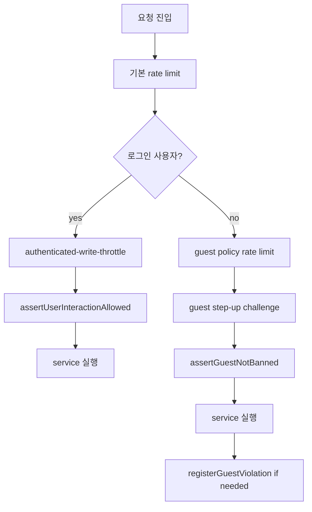

# 16. rate limit, guest safety, abuse defense

## 이번 글에서 풀 문제

커뮤니티 서비스는 기능보다 abuse 방어가 먼저 무너지기 쉽습니다.

TownPet에서 특히 위험한 흐름은 이렇습니다.

- 게시글 작성
- 댓글 작성
- 신고
- 비회원 작성
- 업로드
- 로그인/비밀번호 관련 인증 흐름

이 글은 TownPet의 abuse 방어를 **단일 rate limit 함수가 아니라, 여러 단계의 방어선이 겹쳐 있는 구조**로 정리합니다.

## 왜 이 글이 중요한가

스팸/도배는 한 줄짜리 `429`로 막히지 않습니다.

예를 들면:

- 로그인 사용자는 다계정으로 우회할 수 있고
- 비회원은 IP/fingerprint를 바꿔가며 시도할 수 있고
- 자동화 요청은 일반 브라우저와 시그널이 다르고
- 제재된 사용자는 다시 로그인해 write path를 시도할 수 있습니다

TownPet는 이 문제를 아래 계층으로 나눠 다룹니다.

- 기본 rate limit backend
- 로그인 사용자 write throttle
- 비회원 ban/violation 기록
- step-up challenge
- sanction 기반 interaction 차단

즉 "한 번 막고 끝"이 아니라, **행위 유형과 사용자 상태에 따라 방어선이 달라지는 구조**입니다.

## 먼저 볼 핵심 파일

- [`app/src/server/rate-limit.ts`](/Users/alex/project/townpet/app/src/server/rate-limit.ts)
- [`app/src/server/authenticated-write-throttle.ts`](/Users/alex/project/townpet/app/src/server/authenticated-write-throttle.ts)
- [`app/src/server/services/guest-safety.service.ts`](/Users/alex/project/townpet/app/src/server/services/guest-safety.service.ts)
- [`app/src/server/guest-step-up.ts`](/Users/alex/project/townpet/app/src/server/guest-step-up.ts)
- [`app/src/server/services/sanction.service.ts`](/Users/alex/project/townpet/app/src/server/services/sanction.service.ts)
- [`app/src/app/api/guest/step-up/route.ts`](/Users/alex/project/townpet/app/src/app/api/guest/step-up/route.ts)
- [`app/src/app/api/posts/route.ts`](/Users/alex/project/townpet/app/src/app/api/posts/route.ts)
- [`app/src/app/api/posts/[id]/comments/route.ts`](/Users/alex/project/townpet/app/src/app/api/posts/[id]/comments/route.ts)
- [`app/src/app/api/reports/route.ts`](/Users/alex/project/townpet/app/src/app/api/reports/route.ts)
- [`app/src/server/rate-limit.test.ts`](/Users/alex/project/townpet/app/src/server/rate-limit.test.ts)
- [`app/src/server/authenticated-write-throttle.test.ts`](/Users/alex/project/townpet/app/src/server/authenticated-write-throttle.test.ts)
- [`app/src/server/guest-step-up.test.ts`](/Users/alex/project/townpet/app/src/server/guest-step-up.test.ts)

## 먼저 알아둘 개념

### 1. rate limit backend와 abuse policy는 다르다

- `rate-limit.ts`는 요청 수 제한 엔진입니다.
- abuse policy는 "누구에게 어떤 한도를 적용할지"를 정합니다.

즉 storage/backend와 정책은 분리됩니다.

### 2. guest와 authenticated user는 위협 모델이 다르다

- 로그인 사용자: userId를 중심으로 본다
- 비회원: IP, fingerprint, step-up, ban 기록이 중요하다

그래서 TownPet는 두 경로를 완전히 같은 방식으로 처리하지 않습니다.

### 3. sanction은 rate limit과 다른 층이다

rate limit은 "너무 자주 했다"를 막고,
sanction은 "지금 이 사용자에게 기능을 열어주면 안 된다"를 막습니다.

둘은 함께 있어야 합니다.

## 1. 기본 rate limit backend는 어떻게 생겼는가

핵심 파일:

- [`rate-limit.ts`](/Users/alex/project/townpet/app/src/server/rate-limit.ts)

먼저 볼 함수:

- `enforceRateLimit`
- `enforceRateLimitAndReturnState`
- `clearRateLimitKeys`
- `checkRateLimitHealth`

핵심 구조:

- Upstash Redis가 있으면 distributed rate limit
- 없거나 실패하면 memory fallback
- `ServiceError(429)`로 normalize

즉 TownPet는 "Redis 없으면 기능 불가"가 아니라, **memory fallback으로 최소 보호를 유지하는 설계**입니다.

다만 이 fallback은 instance-local이므로, distributed correctness보다 가용성을 우선한 선택입니다.

## 2. 로그인 사용자 write 방어는 왜 별도 파일로 뺐는가

핵심 파일:

- [`authenticated-write-throttle.ts`](/Users/alex/project/townpet/app/src/server/authenticated-write-throttle.ts)

먼저 볼 함수:

- `resolveAuthenticatedWriteRiskProfile`
- `buildAuthenticatedWriteThrottleConfig`
- `enforceAuthenticatedWriteRateLimit`

이 파일의 역할은 단순 userId limit이 아닙니다.

TownPet는 로그인 사용자 write를 아래 축으로 묶어서 봅니다.

- user global
- shared IP global
- fingerprint global
- scope별 user
- scope별 user+ip
- scope별 shared ip
- scope별 fingerprint

즉 user 하나만 보는 것이 아니라, **동일 네트워크/동일 디바이스/행위 종류**를 함께 봅니다.

## 3. risk level은 어떻게 계산하는가

`resolveAuthenticatedWriteRiskProfile(...)`를 보면 risk level은 단순 random 값이 아닙니다.

대표 신호:

- 신규 계정(7일 이내)
- 최근 90일 sanction 이력
- 반복 sanction

결과:

- `BASE`
- `ELEVATED`
- `HIGH`

이렇게 risk를 나누고, 각 scope별 limit도 달라집니다.

즉 TownPet는 로그인 사용자에게도 **동일 한도**를 주지 않고, 상태 기반으로 다른 throttle profile을 씁니다.

## 4. write route에서는 이 guard가 어떻게 호출되는가

대표 예:

- [`POST /api/posts`](/Users/alex/project/townpet/app/src/app/api/posts/route.ts)
- [`POST /api/posts/[id]/comments`](/Users/alex/project/townpet/app/src/app/api/posts/[id]/comments/route.ts)
- [`POST /api/reports`](/Users/alex/project/townpet/app/src/app/api/reports/route.ts)

로그인 사용자의 게시글 작성 흐름:

1. `getCurrentUserId()`
2. `enforceAuthenticatedWriteRateLimit(...)`
3. `createPost(...)`

댓글 작성도 동일합니다.

즉 abuse 방어는 service 내부에 숨어 있는 것이 아니라, **route boundary에서 먼저 차단**됩니다.

## 5. 비회원은 왜 다른 방어선을 쓰는가

핵심 파일:

- [`guest-safety.service.ts`](/Users/alex/project/townpet/app/src/server/services/guest-safety.service.ts)

주요 함수:

- `hashGuestIdentity`
- `assertGuestNotBanned`
- `registerGuestViolation`
- `assertGuestSafetyControlPlaneReady`

TownPet는 비회원에 대해:

- IP hash
- fingerprint hash
- violation count
- temporary ban

을 별도로 관리합니다.

즉 guest는 로그인 사용자보다 더 identity가 약하기 때문에, **행동 이력 기반 방어**가 더 중요합니다.

## 6. 왜 guest identity를 hash로 저장하는가

`guest-safety.service.ts`를 보면 원본 IP/fingerprint를 그대로 키로 쓰지 않습니다.

핵심:

- `hashValue`
- `hashValueWithPepper`
- `hashGuestIdentityCandidates`

의미:

- 운영에 필요한 비교는 가능해야 함
- 원본 네트워크 정보를 그대로 오래 남기지는 않음

즉 프라이버시와 abuse 방어를 동시에 잡으려는 구조입니다.

## 7. step-up challenge는 무엇을 추가로 해결하는가

핵심 파일:

- [`guest-step-up.ts`](/Users/alex/project/townpet/app/src/server/guest-step-up.ts)
- [`/api/guest/step-up/route.ts`](/Users/alex/project/townpet/app/src/app/api/guest/step-up/route.ts)

이 layer는 단순 rate limit보다 한 단계 위입니다.

기능:

- user-agent / fingerprint / forwarded-for / accept-language를 보고 risk 평가
- 난이도 있는 proof-of-work challenge 발급
- 토큰 서명과 proof 검증
- 실패 시 violation 기록

즉 TownPet는 비회원에게 "그냥 CAPTCHA"를 주는 게 아니라, **risk-sensitive step-up challenge**를 줍니다.

## 8. step-up risk는 어떻게 올라가는가

`assessGuestStepUpRisk(...)`를 보면 대표 시그널은 이렇습니다.

- fingerprint 없음
- user-agent 없음
- 자동화 UA
- 프록시 체인 다중
- locale header 없음

이 조합에 따라:

- `NORMAL`
- `ELEVATED`
- `HIGH`

가 결정되고, challenge difficulty도 달라집니다.

즉 비회원 방어는 고정 난이도가 아니라 **입력 시그널 기반 적응형 방어**입니다.

## 9. 실제 guest write route는 어떤 순서로 방어되는가

대표 예:

- [`POST /api/posts`](/Users/alex/project/townpet/app/src/app/api/posts/route.ts)
- [`POST /api/posts/[id]/comments`](/Users/alex/project/townpet/app/src/app/api/posts/[id]/comments/route.ts)

비회원 게시글 작성 흐름:

1. guest policy 조회
2. 10분 / 1시간 / 24시간 rate limit
3. `assertGuestStepUp(...)`
4. `createPost(...)`
5. service 내부에서 `assertGuestNotBanned(...)`
6. 위반 발생 시 `registerGuestViolation(...)`

즉 route boundary와 service 내부에 **두 겹의 guest defense**가 있습니다.

댓글도 비슷합니다.

- 10분 rate limit
- step-up
- guest author/password 준비
- `createComment(...)`

## 10. sanction은 왜 abuse 방어 글에 같이 들어오는가

핵심 파일:

- [`sanction.service.ts`](/Users/alex/project/townpet/app/src/server/services/sanction.service.ts)

주요 함수:

- `issueNextUserSanction`
- `getActiveInteractionSanction`
- `assertUserInteractionAllowed`

TownPet에서 sanction은 moderator 기능이지만, 동시에 abuse defense의 마지막 방어선이기도 합니다.

이유:

- 이미 제재된 사용자는 write path에 들어가면 안 됨
- 로그인은 되어 있어도 interaction은 막아야 함

그래서 `assertUserInteractionAllowed(...)`는:

- auth helper
- post/comment service
- upload route

등 여러 write path의 공통 전제조건으로 들어갑니다.

## 11. 전체 방어선은 어떻게 겹치는가



중요한 점은 어느 한 줄이 모든 걸 책임지지 않는다는 것입니다.

## 12. health와 control plane은 어떻게 연결되는가

guest safety와 sanction은 단순 기능이 아니라 health snapshot에도 들어갑니다.

- `assertGuestSafetyControlPlaneReady()`
- `assertSanctionControlPlaneReady()`

즉 운영자는 `/api/health`나 `/admin/ops`에서 보호 시스템 자체가 살아 있는지도 확인할 수 있습니다.

이건 흔히 놓치기 쉬운 부분인데, TownPet는 abuse 방어를 **운영 가능한 subsystem**으로 봅니다.

## 13. 테스트는 어떻게 읽어야 하는가

핵심 테스트:

- [`rate-limit.test.ts`](/Users/alex/project/townpet/app/src/server/rate-limit.test.ts)
- [`authenticated-write-throttle.test.ts`](/Users/alex/project/townpet/app/src/server/authenticated-write-throttle.test.ts)
- [`guest-step-up.test.ts`](/Users/alex/project/townpet/app/src/server/guest-step-up.test.ts)
- [`sanction.service.test.ts`](/Users/alex/project/townpet/app/src/server/services/sanction.service.test.ts)

여기서 볼 포인트:

- Redis/memory fallback
- risk level별 throttle
- step-up proof validation
- sanction level별 interaction 차단

즉 기능 테스트보다 **방어 계약 테스트**에 가깝습니다.

## 14. 직접 실행해 보고 싶다면

```bash
cd /Users/alex/project/townpet/app
corepack pnpm test -- src/server/rate-limit.test.ts src/server/authenticated-write-throttle.test.ts src/server/guest-step-up.test.ts src/server/services/sanction.service.test.ts
```

수동 확인 경로:

- `/api/guest/step-up`
- `/api/posts`
- `/api/posts/[id]/comments`
- `/api/reports`

확인 질문:

- 로그인/비회원 경로가 서로 다른 guard를 타는가
- step-up failure가 violation으로 기록되는가
- sanction 상태 사용자가 write를 못 하는가

## 현재 구현의 한계

- memory fallback은 instance-local이라 대규모 multi-instance 환경에서는 Redis보다 약합니다.
- guest step-up은 강력하지만, 브라우저 UX 비용이 있는 방어입니다.
- 현재 role 모델과 abuse 방어는 잘 붙어 있지만, 더 세밀한 reputation score 시스템까지는 아닙니다.

## Python/Java 개발자용 요약

- `rate-limit.ts`는 backend 엔진입니다.
- `authenticated-write-throttle.ts`는 로그인 사용자용 policy layer입니다.
- `guest-safety.service.ts`는 비회원 위반 기록/ban 계층입니다.
- `guest-step-up.ts`는 adaptive challenge 계층입니다.
- `sanction.service.ts`는 제재 기반 interaction 차단 계층입니다.

## 면접에서 이렇게 설명할 수 있다

> TownPet는 abuse 방어를 한 함수로 처리하지 않았습니다. 기본 rate limit backend 위에, 로그인 사용자는 risk-based write throttle을 얹고, 비회원은 IP/fingerprint hash, violation ban, adaptive step-up challenge를 따로 두었습니다. 그리고 제재 상태는 auth/service 경계에서 다시 검사해서 이미 제한된 사용자가 write path에 들어오지 못하게 만들었습니다.
