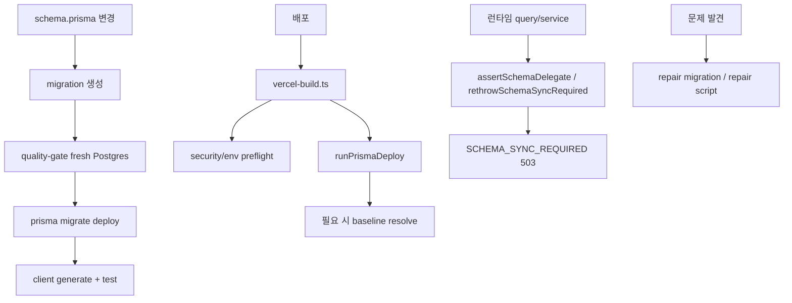

# 17. Prisma migration과 schema drift 대응

## 이번 글에서 풀 문제

TownPet는 개발이 길어지면서 migration chain, 환경 차이, schema drift를 여러 번 다뤘습니다.

여기서 중요한 질문은 세 가지입니다.

- migration을 어디서 적용하는가
- schema가 어긋났을 때 앱 코드는 어떻게 반응하는가
- 이미 drift가 생긴 DB를 어떻게 복구하는가

이 글은 TownPet의 Prisma 운용을 **ORM 사용법이 아니라, migration chain + runtime fallback + repair workflow** 관점으로 정리합니다.

## 왜 이 글이 중요한가

실서비스에서 schema 문제는 보통 이렇게 나타납니다.

- 로컬에서는 되는데 fresh DB에서 안 됨
- production은 테이블이 있는데 preview는 빠져 있음
- Prisma Client는 생성됐는데 DB migration이 덜 올라감
- 특정 컬럼만 빠져서 일부 기능만 깨짐

TownPet는 이런 문제를 다음 세 층으로 다룹니다.

- CI/배포에서 migration chain 검증
- 런타임에서 schema sync required 에러로 fail loudly
- 필요하면 repair migration과 repair script로 복구

즉 "migration 잘 올리세요"가 아니라, **문제가 생겼을 때 어디서 잡히고 어떻게 복구되는지까지 코드화**했습니다.

## 먼저 볼 핵심 파일

- [`app/prisma/schema.prisma`](../app/prisma/schema.prisma)
- [`app/prisma/migrations`](../app/prisma/migrations)
- [`app/src/server/schema-sync.ts`](../app/src/server/schema-sync.ts)
- [`app/scripts/vercel-build.ts`](../app/scripts/vercel-build.ts)
- [`/.github/workflows/quality-gate.yml`](../.github/workflows/quality-gate.yml)
- [`app/prisma/migrations/20260306133000_expand_auth_audit_for_login_events/migration.sql`](../app/prisma/migrations/20260306133000_expand_auth_audit_for_login_events/migration.sql)
- [`app/prisma/migrations/20260327164000_repair_auth_and_reaction_migrations/migration.sql`](../app/prisma/migrations/20260327164000_repair_auth_and_reaction_migrations/migration.sql)
- [`app/src/server/queries/notification.queries.ts`](../app/src/server/queries/notification.queries.ts)
- [`app/src/server/services/sanction.service.ts`](../app/src/server/services/sanction.service.ts)

## 먼저 알아둘 개념

### 1. schema.prisma와 DB schema는 다르다

`schema.prisma`는 원하는 최종 모델 정의이고,
실제 DB는 migration이 적용된 결과입니다.

즉 Prisma Client가 최신이어도 DB가 뒤처질 수 있습니다.

### 2. migration chain은 fresh DB에서 검증해야 한다

기존 production DB는 우연히 맞아도,
빈 DB에 첫 migration부터 올리면 깨질 수 있습니다.

그래서 fresh DB 기준 검증이 중요합니다.

### 3. runtime schema guard는 CI를 대체하지 않는다

런타임 guard는 마지막 안전장치입니다.

좋은 흐름은:

1. CI에서 migration chain 실패를 먼저 잡고
2. 배포 시 migrate deploy를 하고
3. 그래도 drift가 있으면 런타임에서 `SCHEMA_SYNC_REQUIRED`로 fail loudly

입니다.

## 1. TownPet는 migration을 어디서 적용하는가

핵심 파일:

- [`quality-gate.yml`](../.github/workflows/quality-gate.yml)
- [`vercel-build.ts`](../app/scripts/vercel-build.ts)

두 경로가 중요합니다.

### CI

`quality-gate.yml`는 fresh Postgres service를 띄우고:

- `pnpm prisma migrate deploy`
- `pnpm prisma generate`

를 실행합니다.

즉 CI가 단순 타입체크가 아니라, **fresh DB에서 migration chain을 실제로 검증**합니다.

### 배포

`vercel-build.ts`는 배포 중:

- security env preflight
- auth email readiness preflight
- `runPrismaDeploy()`

를 수행합니다.

즉 build와 migration이 분리되지 않고, **배포 파이프라인의 일부**로 묶입니다.

## 2. `vercel-build.ts`는 왜 baseline 로직까지 가지는가

먼저 볼 함수:

- `runPrismaDeploy`
- `baselineMigrations`
- `isBaselineRequired`

이 스크립트는 `P3005`를 만나면 baseline resolve를 시도합니다.

의미:

- 이미 기존 테이블이 있는 DB에 migration history만 없을 수 있음
- 이런 경우 migration을 바로 실패시키기보다 baseline으로 현재 상태를 맞출 수 있음

즉 TownPet는 배포 스크립트를 단순 `pnpm prisma migrate deploy` 래퍼가 아니라, **실서비스에서 자주 생기는 migration 상태 차이를 견디는 orchestration script**로 만들었습니다.

## 3. schema sync 에러는 런타임에서 어떻게 표준화되는가

핵심 파일:

- [`schema-sync.ts`](../app/src/server/schema-sync.ts)

주요 함수:

- `createSchemaSyncRequiredError`
- `assertSchemaDelegate`
- `rethrowSchemaSyncRequired`
- `isMissingSchemaError`

이 파일의 역할:

- Prisma delegate 자체가 없거나
- `P2021`, `P2022` 같은 missing table/column error가 나면
- `SCHEMA_SYNC_REQUIRED`라는 서비스 에러로 바꿔준다

이렇게 하면 앱 전반에서 schema mismatch를 **일관된 503 계약**으로 다룰 수 있습니다.

즉 "알 수 없는 Prisma 에러"를 그대로 올리지 않고,
운영자가 바로 이해할 수 있는 메시지로 표준화합니다.

## 4. 실제 도메인 코드에서는 이 helper를 어떻게 쓰는가

대표 예:

- [`notification.queries.ts`](../app/src/server/queries/notification.queries.ts)
- [`sanction.service.ts`](../app/src/server/services/sanction.service.ts)

예를 들어 `notification.queries.ts`는:

- `requireNotificationDelegate()`
- `throwNotificationSchemaSyncRequired(...)`

를 통해 `Notification`, `NotificationDelivery` 모델/컬럼 누락을 감지합니다.

`sanction.service.ts`도:

- `requireUserSanctionDelegate()`
- `throwSanctionSchemaSyncRequired(...)`

같은 패턴을 씁니다.

즉 schema drift 대응이 migration 문서에만 있는 것이 아니라, **도메인 코드의 defensive layer**로도 들어가 있습니다.

## 5. 왜 repair migration이 따로 필요한가

대표 사례:

- [`20260306133000_expand_auth_audit_for_login_events`](../app/prisma/migrations/20260306133000_expand_auth_audit_for_login_events/migration.sql)
- [`20260327164000_repair_auth_and_reaction_migrations`](../app/prisma/migrations/20260327164000_repair_auth_and_reaction_migrations/migration.sql)

TownPet는 migration history가 길어지면서, fresh DB와 오래된 DB 사이 차이를 실제로 겪었습니다.

그래서 repair migration은:

- `ALTER TABLE ... ADD COLUMN IF NOT EXISTS`
- `CREATE TABLE IF NOT EXISTS`
- `CREATE INDEX IF NOT EXISTS`
- `DO $$ BEGIN ... EXCEPTION WHEN duplicate_object THEN NULL; END $$`

같은 **idempotent SQL**을 많이 씁니다.

목표는 명확합니다.

- production에 이미 일부 객체가 있어도 안전
- fresh DB에는 누락된 baseline을 보강

즉 repair migration은 “예쁜 migration”보다 **실환경 복구 가능성**을 우선합니다.

## 6. 왜 auth/reaction repair migration이 중요했는가

`20260327164000_repair_auth_and_reaction_migrations`를 보면 아래를 한 번에 보강합니다.

- `User.emailVerified`
- `User.passwordHash`
- `PostReaction`
- `PasswordResetToken`

이건 흔한 예입니다.

앱 기능은:

- 인증
- 반응
- 비밀번호 재설정

을 이미 사용하고 있는데, migration chain 일부가 fresh DB 기준으로 완전하지 않으면 CI나 새 환경에서 터집니다.

TownPet는 이걸 repair migration으로 닫았습니다.

즉 "기능 구현 완료"와 "migration chain 안정화 완료"는 별개라는 점을 보여줍니다.

## 7. quality gate는 왜 `db push`가 아니라 `migrate deploy`를 쓰는가

핵심은 이 지점입니다.

`db push`는 현재 schema를 강제로 맞추는 데 가깝고,
`migrate deploy`는 **실제 migration history가 재생 가능한지**를 검증합니다.

TownPet가 quality gate를 `migrate deploy` 기준으로 둔 이유는:

- production deployment 방식과 CI를 맞추기 위해서입니다.

즉 CI와 production이 다른 방식으로 schema를 맞추면, 나중에 반드시 drift가 생깁니다.

## 8. 전체 흐름을 그림으로 보면



## 9. migration drift를 읽는 순서

TownPet를 기준으로는 이 순서가 좋습니다.

1. `schema.prisma`
2. `app/prisma/migrations`
3. `quality-gate.yml`
4. `vercel-build.ts`
5. `schema-sync.ts`
6. 대표 도메인 query/service의 schema guard

이 순서대로 보면:

- 원하는 모델
- DB 적용 이력
- CI 검증
- 배포 검증
- 런타임 fallback

이 한 줄로 이어집니다.

## 10. 테스트는 어떻게 읽어야 하는가

이 주제는 unit test보다도 **CI/배포 스크립트와 repair migration 자체**를 읽는 것이 중요합니다.

그래도 같이 보면 좋은 곳:

- [`notification.queries.test.ts`](../app/src/server/queries/notification.queries.test.ts)

이 테스트는 schema delegate가 없을 때 `SCHEMA_SYNC_REQUIRED`로 fail closed하는 계약을 확인합니다.

즉 런타임에서 drift가 나도 "엉뚱한 500"이 아니라, **의미 있는 sync-required 에러**가 나가도록 합니다.

## 11. 직접 실행해 보고 싶다면

```bash
cd /Users/alex/project/townpet/app
corepack pnpm exec prisma migrate deploy
corepack pnpm exec prisma generate
corepack pnpm exec prisma validate
```

fresh DB가 있으면:

```bash
corepack pnpm -C app exec prisma migrate deploy
```

를 처음 migration부터 올려보는 것이 가장 중요합니다.

## 현재 구현의 한계

- repair migration은 강하지만, history가 길어질수록 관리 비용이 커집니다.
- baseline/repair가 필요한 시점 자체를 줄이려면 앞으로도 fresh DB rehearsal을 계속 해야 합니다.
- 런타임 schema guard는 마지막 안전장치일 뿐, migration discipline을 대신할 수는 없습니다.

## Python/Java 개발자용 요약

- `schema.prisma`는 목표 모델입니다.
- `migrations/`는 실제 DB 적용 이력입니다.
- `quality-gate.yml`은 fresh DB replay 검증입니다.
- `vercel-build.ts`는 배포 시 migration orchestration입니다.
- `schema-sync.ts`는 런타임 drift를 표준 에러로 바꾸는 safety net입니다.
- repair migration은 drift를 현실적으로 복구하는 idempotent SQL 패치입니다.

## 면접에서 이렇게 설명할 수 있다

> TownPet에서는 Prisma를 단순 ORM으로만 쓰지 않았습니다. CI에서 fresh DB 기준으로 `migrate deploy`를 돌려 migration chain을 검증하고, 배포 스크립트에서도 migrate deploy와 baseline 복구를 orchestration했고, 그래도 drift가 생기면 `schema-sync.ts`가 `SCHEMA_SYNC_REQUIRED` 에러로 fail loudly 하도록 만들었습니다. 필요할 때는 idempotent repair migration으로 실제 환경을 복구했습니다.

## 면접 Q&A

### Q1. 왜 `db push` 대신 `migrate deploy`를 강조하나요?

실제 운영 환경은 migration chain으로 진화합니다. fresh DB에서 `migrate deploy`가 통과해야 history가 건강하다는 뜻입니다.

### Q2. repair migration은 왜 필요한가요?

현실 운영에서는 이미 일부 환경이 어긋난 상태일 수 있습니다. 그때는 idempotent repair migration이 가장 안전한 복구 수단입니다.

### Q3. 런타임 schema guard가 왜 필요한가요?

배포와 DB 적용이 어긋난 순간을 조기에 크게 실패시키기 위해서입니다. 조용히 이상 동작하는 것보다 낫습니다.
