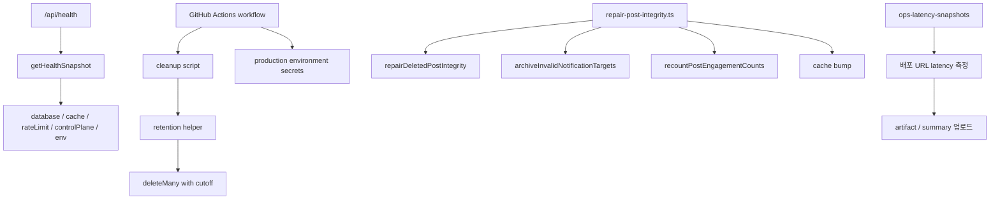

# 18. health check, retention cleanup, maintenance workflow

## 이번 글에서 풀 문제

TownPet는 단순히 `배포 후 잘 되길 바란다`는 식으로 운영하지 않습니다.

실제로는 아래가 같이 필요합니다.

- 지금 서비스가 정상인지 빠르게 보는 health check
- 오래된 로그/통계를 치우는 retention cleanup
- 데이터 drift를 잡는 repair workflow
- latency snapshot 같은 운영 관측 루틴

이 글은 운영 안정화를 **코드 밖의 운영 습관이 아니라, 저장소 안에 있는 실행 가능한 시스템**으로 정리합니다.

## 왜 이 글이 중요한가

운영 중인 서비스는 시간이 지나면 반드시 이런 문제가 생깁니다.

- search term 통계가 계속 누적됨
- archived notification이 계속 쌓임
- auth audit log가 계속 커짐
- soft delete된 post 주변 데이터가 예전 상태로 남음
- 오늘 배포가 느려졌는지 감으로만 판단함

TownPet는 이 문제를

- `/api/health`
- retention helper
- cleanup script
- GitHub Actions maintenance workflow
- latency snapshot workflow

로 나눠 다룹니다.

## 먼저 볼 핵심 파일

- [`app/src/server/health-overview.ts`](../app/src/server/health-overview.ts)
- [`app/src/app/api/health/route.ts`](../app/src/app/api/health/route.ts)
- [`app/src/server/notification-retention.ts`](../app/src/server/notification-retention.ts)
- [`app/src/server/auth-audit-retention.ts`](../app/src/server/auth-audit-retention.ts)
- [`app/src/server/search-term-stat-retention.ts`](../app/src/server/search-term-stat-retention.ts)
- [`app/src/server/search-term-daily-metric-retention.ts`](../app/src/server/search-term-daily-metric-retention.ts)
- [`app/scripts/cleanup-notifications.ts`](../app/scripts/cleanup-notifications.ts)
- [`app/scripts/cleanup-auth-audits.ts`](../app/scripts/cleanup-auth-audits.ts)
- [`app/scripts/cleanup-search-terms.ts`](../app/scripts/cleanup-search-terms.ts)
- [`app/scripts/cleanup-search-term-daily-metrics.ts`](../app/scripts/cleanup-search-term-daily-metrics.ts)
- [`app/scripts/repair-post-integrity.ts`](../app/scripts/repair-post-integrity.ts)
- [`/.github/workflows/notification-cleanup.yml`](../.github/workflows/notification-cleanup.yml)
- [`/.github/workflows/auth-audit-cleanup.yml`](../.github/workflows/auth-audit-cleanup.yml)
- [`/.github/workflows/search-term-cleanup.yml`](../.github/workflows/search-term-cleanup.yml)
- [`/.github/workflows/post-integrity-maintenance.yml`](../.github/workflows/post-integrity-maintenance.yml)
- [`/.github/workflows/ops-latency-snapshots.yml`](../.github/workflows/ops-latency-snapshots.yml)

## 먼저 알아둘 개념

### 1. health check와 maintenance는 다르다

- health check: **지금 살아 있는가**
- maintenance: **시간이 지나도 망가지지 않게 정리하는가**

TownPet는 이 둘을 섞지 않습니다.

### 2. retention helper는 pure function에 가깝다

예를 들어 [`notification-retention.ts`](../app/src/server/notification-retention.ts)는:

- retention days 해석
- cutoff 계산
- deleteMany 실행

정도만 맡습니다.

즉 비즈니스 로직보다 **운영 housekeeping 함수**에 가깝습니다.

### 3. workflow는 코드의 연장선이다

GitHub Actions YAML은 여기서 별도 DevOps 세계가 아니라,

- script
- prisma
- environment secret

을 조합해 **운영 명령을 정기 실행하는 thin wrapper** 역할을 합니다.

## 1. `/api/health`는 무엇을 점검하는가

핵심 파일:

- [`health-overview.ts`](../app/src/server/health-overview.ts)

핵심 함수:

- `getHealthSnapshot`

이 함수는 한 번에 아래를 봅니다.

- database `SELECT 1`
- `pg_trgm` extension
- rate limit backend
- moderation control plane
- query cache backend / bypass 상태
- runtime env validation

즉 TownPet의 health는 단순 `200 OK` endpoint가 아니라, **운영에 의미 있는 subsystem check 묶음**입니다.

## 2. 왜 health 로직을 route 밖으로 뺐는가

[`/api/health/route.ts`](../app/src/app/api/health/route.ts) 자체는 얇고,
실제 계산은 [`getHealthSnapshot`](../app/src/server/health-overview.ts)로 나갑니다.

이 구조의 장점:

- `/api/health`와 `/admin/ops`가 같은 truth를 씀
- public mode / internal detailed mode를 쉽게 나눔
- 테스트와 재사용이 쉬움

Spring으로 치환하면:

- `HealthController`
- `HealthOverviewService`

를 분리한 구조입니다.

## 3. retention helper는 모두 같은 모양을 가진다

대표 파일:

- [`notification-retention.ts`](../app/src/server/notification-retention.ts)
- [`auth-audit-retention.ts`](../app/src/server/auth-audit-retention.ts)
- [`search-term-stat-retention.ts`](../app/src/server/search-term-stat-retention.ts)
- [`search-term-daily-metric-retention.ts`](../app/src/server/search-term-daily-metric-retention.ts)

패턴은 거의 같습니다.

1. `resolveXRetentionDays()`
2. `buildXRetentionCutoff()`
3. `cleanupX(...)`

이 형태가 좋은 이유:

- env parsing을 한곳에 둠
- 시간 계산을 분리함
- script는 delegate 주입만 하면 됨

즉 retention 로직이 Prisma script 파일에 흩어지지 않고, **작고 재사용 가능한 운영 함수**가 됩니다.

## 4. 왜 search term daily metric만 KST day boundary를 따로 쓰는가

[`search-term-daily-metric-retention.ts`](../app/src/server/search-term-daily-metric-retention.ts)는 다른 retention helper와 조금 다릅니다.

여기에는:

- `KST_OFFSET_MS`
- `DAY_MS`

가 있고, cutoff도 단순 `now - N days`가 아니라 **KST day index** 기준으로 계산합니다.

이렇게 한 이유는 daily metric이 단순 timestamp row가 아니라, **일 단위 집계 테이블**이기 때문입니다.

즉:

- raw event log cleanup
- 일자 집계 cleanup

는 시간 계산 기준이 다릅니다.

이 차이를 코드에서 명시적으로 드러낸 점이 중요합니다.

## 5. cleanup script는 왜 거의 다 비슷하게 생겼는가

대표 스크립트:

- [`cleanup-notifications.ts`](../app/scripts/cleanup-notifications.ts)
- [`cleanup-auth-audits.ts`](../app/scripts/cleanup-auth-audits.ts)
- [`cleanup-search-terms.ts`](../app/scripts/cleanup-search-terms.ts)
- [`cleanup-search-term-daily-metrics.ts`](../app/scripts/cleanup-search-term-daily-metrics.ts)

패턴은 동일합니다.

1. `dotenv/config`
2. `new PrismaClient()`
3. retention days resolve
4. helper 호출
5. 결과 log
6. disconnect

이 구조는 단순하지만 운영에서는 오히려 좋습니다.

- 사람이 수동으로 돌리기 쉽고
- workflow에서 재사용하기 쉽고
- script 목적이 분명합니다

즉 "멋진 추상화"보다 **운영자가 이해하기 쉬운 스크립트**를 택한 것입니다.

## 6. post integrity maintenance는 왜 cleanup보다 무거운가

핵심 파일:

- [`repair-post-integrity.ts`](../app/scripts/repair-post-integrity.ts)
- [`post-integrity-maintenance.yml`](../.github/workflows/post-integrity-maintenance.yml)

이 작업은 cleanup보다 한 단계 무겁습니다.

왜냐하면 단순 delete가 아니라:

- deleted post 주변 데이터 repair
- invalid notification archive
- denormalized count recount
- cache bump

까지 하기 때문입니다.

즉 이건 housekeeping이 아니라 **data repair job**입니다.

그래서 workflow도:

- `dry-run`
- `apply`
- `fail_on_changes`
- artifact upload

를 지원합니다.

이 차이를 이해하면 maintenance 종류를 구분하기 쉽습니다.

## 7. workflow는 각각 어떤 책임으로 나뉘는가

### notification-cleanup

- archived notification 정리
- retention 90일
- production environment 사용

### auth-audit-cleanup

- auth audit log 정리
- retention 180일

### search-term-cleanup

- `SearchTermStat`
- `SearchTermDailyMetric`

둘 다 정리

### post-integrity-maintenance

- drift 탐지 / repair
- dry-run 시 drift 있으면 fail 가능
- artifact와 summary 남김

### ops-latency-snapshots

- 주기적으로 실제 배포 URL에 대해 latency snapshot 수집
- summary와 TSV artifact 업로드

즉 TownPet는 "운영 cron"을 하나로 뭉개지 않고, **도메인별 maintenance workflow**로 쪼갭니다.

## 8. 왜 모두 `environment: production`을 쓰는가

cleanup / repair workflow YAML을 보면 공통으로:

- `environment: production`

이 들어갑니다.

의미는 단순 secret 읽기 이상입니다.

- production secret 경계
- reviewer / approval gate
- write-capable workflow를 production 환경으로 묶기

즉 maintenance도 application deployment만큼 민감한 작업으로 보는 것입니다.

## 9. `package.json` script를 보면 운영 명령 지도가 보인다

[`app/package.json`](../app/package.json)에서 먼저 볼 script:

- `db:cleanup:notifications`
- `db:cleanup:auth-audits`
- `db:cleanup:search-terms`
- `db:cleanup:search-term-daily-metrics`
- `db:repair:post-integrity`
- `ops:perf:snapshot`

이 스크립트 이름만 봐도 TownPet 운영 철학이 드러납니다.

- cleanup
- repair
- snapshot

즉 운영 작업을 사람이 ad-hoc SQL로 하는 대신, 저장소 안의 **이름 있는 명령**으로 고정합니다.

## 10. 전체 운영 루프를 그림으로 보면



## 11. 운영자 관점에서 읽는 순서

운영 관점에서는 아래 순서로 읽는 것이 좋습니다.

1. `health-overview.ts`
2. `/api/health/route.ts`
3. retention helper 4개
4. cleanup script 4개
5. `post-integrity-maintenance.yml`
6. `ops-latency-snapshots.yml`

이 순서대로 보면:

- 지금 상태 확인
- 시간이 지나도 쌓이는 데이터 정리
- 틀어진 정합성 repair
- 성능 관측

으로 점점 운영 난이도가 올라가는 흐름이 보입니다.

## 12. 테스트는 어떻게 읽어야 하는가

이 파트는 대부분 script/helper 중심이라 테스트보다 **구조와 실행 경로**가 중요합니다.

그래도 같이 보면 좋은 파일:

- [`app/src/server/cache/query-cache.test.ts`](../app/src/server/cache/query-cache.test.ts)

왜냐하면 health snapshot이 보는 `cache` 상태는 결국 query cache health와 이어지기 때문입니다.

여기서 보면:

- Upstash 사용 시 runtime 동작
- build phase에서 external fetch를 피하는지
- Redis 실패 시 bypass로 fail-open 되는지

같은 운영 관점의 중요한 계약을 확인할 수 있습니다.

## 13. 직접 실행해 보고 싶다면

```bash
cd /Users/alex/project/townpet/app
corepack pnpm db:cleanup:notifications
corepack pnpm db:cleanup:auth-audits
corepack pnpm db:cleanup:search-terms
corepack pnpm db:cleanup:search-term-daily-metrics
corepack pnpm db:repair:post-integrity
corepack pnpm ops:perf:snapshot
```

주의:

- cleanup과 repair는 DB write가 일어납니다.
- production에서 실행할 때는 environment secret / reviewer gate가 걸린 workflow를 쓰는 편이 안전합니다.

## 현재 구현의 한계

- cleanup은 대부분 retention 기반 deleteMany라, 더 세밀한 tiered retention 정책은 아직 없습니다.
- latency snapshot은 artifact 중심이라 장기 시계열 대시보드까지는 아닙니다.
- repair workflow는 강력하지만, 근본적으로 drift가 왜 생겼는지까지 자동 설명해 주지는 않습니다.

## Python/Java 개발자용 요약

- `health-overview.ts`는 운영 상태를 모으는 service입니다.
- retention helper는 작은 housekeeping service입니다.
- cleanup script는 command-line runner입니다.
- GitHub Actions workflow는 scheduler + secret boundary입니다.
- `repair-post-integrity.ts`는 단순 cleanup이 아니라 data repair job입니다.

## 면접에서 이렇게 설명할 수 있다

> TownPet는 운영 작업을 수동 SQL이나 감에 의존하지 않게 하려고, health snapshot, retention helper, cleanup script, repair workflow, latency snapshot을 전부 저장소 안에 코드로 넣었습니다. 그래서 “지금 상태 확인”, “오래된 데이터 정리”, “정합성 복구”, “성능 관측”이 각각 독립된 실행 경로를 갖습니다.

## 면접 Q&A

### Q1. 왜 cleanup과 repair를 분리했나요?

cleanup은 오래된 데이터를 지우는 housekeeping이고, repair는 이미 어긋난 정합성을 복구하는 작업입니다. 위험도와 실행 기준이 다릅니다.

### Q2. 왜 maintenance workflow에 environment gate를 붙였나요?

production DB를 건드리는 작업은 코드보다 승인 절차가 더 중요할 때가 많습니다. 그래서 GitHub environment approval을 걸었습니다.

### Q3. `/api/health`만 있으면 운영이 충분하지 않나요?

아닙니다. health는 현재 상태 확인이고, retention/repair/latency snapshot은 시간이 흐르면서 생기는 운영 문제를 다루는 별도 축입니다.
