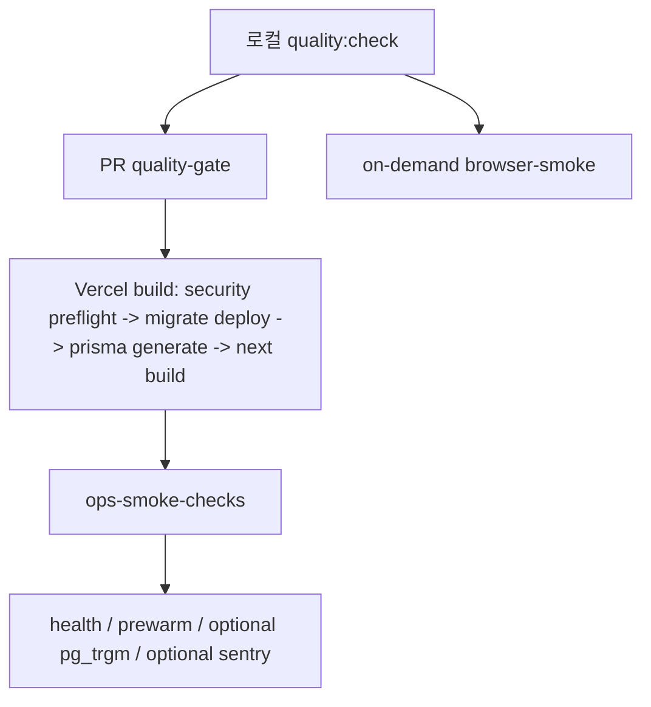

# 19. Vitest / Playwright / quality-gate 전략

## 이번 글에서 풀 문제

TownPet는 기능이 많은 커뮤니티 서비스입니다.

- 인증
- 댓글
- 검색
- 알림
- 모더레이션
- 관리자 화면
- migration
- 운영 스크립트

문제는 검증 항목이 많다고 해서, 그걸 **매 push와 매 deploy에 전부 묶는 것**이 항상 좋은 설계는 아니라는 점입니다.

이 글은 TownPet가 현재 품질 검증을 어떻게 나누는지, 즉 **로컬 빠른 검증 -> PR hot path -> on-demand browser smoke -> 배포 후 ops smoke** 구조를 정리합니다.

## 왜 이 글이 중요한가

혼자 오래 운영하는 프로젝트에서 가장 비싼 자원은 CPU가 아니라 **피드백 시간**입니다.

TownPet는 실제로 이런 위험을 동시에 가집니다.

- schema는 바뀌었는데 migration chain이 깨짐
- 검색은 고쳤는데 브라우저 진입 흐름이 깨짐
- 운영 cleanup 스크립트가 production에서 다른 결과를 냄
- health endpoint는 괜찮아도 실제 deploy 환경 설정이 틀림

그래서 TownPet는 검증을 한 곳에 다 몰아넣지 않고, 아래처럼 나눕니다.

- 코드 회귀 검증
- 브라우저 smoke 검증
- 배포 필수 preflight
- 배포 후 운영 smoke

핵심은 “검증을 줄인다”가 아니라, **검증을 hot path와 on-demand path로 분리한다**는 점입니다.

## 먼저 알아둘 개념

- `Vitest`
  - service, query, route, component의 빠른 회귀 테스트입니다.
- `Playwright`
  - 브라우저 사용자 흐름을 검증합니다.
- `quality-gate`
  - PR hot path에서 lint, typecheck, unit, migration sanity만 보는 작은 CI 게이트입니다.
- `browser-smoke`
  - Playwright smoke를 on-demand로 돌리는 별도 workflow입니다.
- `ops-smoke-checks`
  - 배포된 URL을 다시 확인하는 post-deploy smoke입니다.

## 먼저 볼 핵심 파일

- [`app/package.json`](../app/package.json)
- [`.github/workflows/quality-gate.yml`](../.github/workflows/quality-gate.yml)
- [`.github/workflows/browser-smoke.yml`](../.github/workflows/browser-smoke.yml)
- [`.github/workflows/docs-quality.yml`](../.github/workflows/docs-quality.yml)
- [`.github/workflows/ops-smoke-checks.yml`](../.github/workflows/ops-smoke-checks.yml)
- [`app/scripts/vercel-build.ts`](../app/scripts/vercel-build.ts)
- [`25-overengineering-ci-and-deploy-pipelines.md`](./25-overengineering-ci-and-deploy-pipelines.md)

## 품질 흐름을 먼저 그림으로 보면



TownPet는 이제 PR hot path를 작게 유지하고, 무거운 browser smoke는 필요할 때만 별도로 실행합니다.

## 1. 테스트 스택은 어떻게 나뉘는가

TownPet는 크게 두 도구를 씁니다.

### Vitest

- service
- query
- route
- component
- helper

즉 대부분의 로직 회귀는 Vitest로 빠르게 봅니다.

### Playwright

- 로그인 진입
- social onboarding
- 업로드
- 관리자 정책

같이 브라우저 상호작용이 중요한 흐름은 Playwright가 담당합니다.

즉 "서버 계산이 맞는가"와 "브라우저에서 실제로 되느냐"를 도구 단위로 나눕니다.

## 2. `package.json`을 보면 어떤 전략이 보이는가

핵심 파일:

- [`app/package.json`](../app/package.json)

여기서 먼저 봐야 하는 스크립트는 이 정도입니다.

- `lint`
- `typecheck`
- `test:unit`
- `test:coverage`
- `test:e2e:smoke`
- `quality:check`
- `quality:gate`

현재 기준에서:

- `quality:check`
  - `lint + typecheck + test:unit`
- `quality:gate`
  - `quality:check + test:e2e:smoke`

중요한 점은 `quality:gate`가 더 이상 매 PR hot path를 뜻하지 않는다는 것입니다.

이제 `quality:gate`는 **로컬이나 on-demand full gate**에 가깝고,
GitHub Actions의 PR hot path는 `quality:check` 중심으로 더 작게 유지합니다.

## 3. 왜 PR hot path를 작게 유지하는가

핵심 파일:

- [`.github/workflows/quality-gate.yml`](../.github/workflows/quality-gate.yml)

현재 PR hot path는 매우 단순합니다.

1. checkout / pnpm / node setup
2. install
3. `prisma migrate deploy`
4. `prisma generate`
5. `pnpm quality:check`

즉 PR gate는 아래 두 질문에만 집중합니다.

- fresh DB에서 migration chain이 실제로 적용되는가
- fresh runner에서 Prisma client가 schema와 맞게 다시 생성되는가
- lint / typecheck / unit이 모두 green인가

여기서 더 무거운 검증을 빼는 이유는 단순합니다.

- PR마다 coverage를 다시 계산하면 피드백이 느려짐
- Playwright browser 설치는 가장 비싼 단계 중 하나임
- docs freshness, env preflight, rehearsal까지 같이 넣으면 실패 원인이 흐려짐

즉 hot path는 **merge safety와 직접 연결된 것만** 남기는 쪽이 맞습니다.

## 4. docs freshness는 왜 별도 workflow로 분리하는가

핵심 파일:

- [`.github/workflows/docs-quality.yml`](../.github/workflows/docs-quality.yml)
- [`scripts/refresh-docs-index.mjs`](../scripts/refresh-docs-index.mjs)

TownPet는 docs sync report를 유지합니다.

그런데 이 검사는:

- docs 변경
- `app/package.json` 변경
- migration 추가
- API route 추가

같은 경우에만 필요합니다.

즉 앱 전체 CI에 항상 붙이는 것보다,
해당 경로에만 반응하는 **lightweight workflow**로 분리하는 편이 훨씬 낫습니다.

## 5. Playwright smoke는 왜 on-demand로 옮겼는가

핵심 파일:

- [`.github/workflows/browser-smoke.yml`](../.github/workflows/browser-smoke.yml)

브라우저 smoke는 여전히 중요합니다.

예:

- `feed-loading-skeleton`
- `kakao-login-entry`
- `naver-login-entry`
- `social-onboarding-flow`
- `post-editor-toolbar`

하지만 이 계층은:

- 브라우저 설치 비용이 크고
- CI 환경 의존성이 강하고
- flaky 원인이 코드 자체가 아닐 수도 있습니다

그래서 TownPet는 browser smoke를 없애지 않고,
**PR마다 강제하지 않는 on-demand workflow**로 옮겼습니다.

이게 solo 프로젝트에는 더 현실적입니다.

특히 contenteditable / SunEditor 같은 브라우저 의존 회귀는 unit test만으로는 끝나지 않습니다.

- selection restore
- toolbar submenu target
- styled typing boundary

같은 문제는 실제 브라우저에서만 확실히 드러나는 경우가 많습니다.

그래서 TownPet는 editor toolbar regression도 hot path가 아니라 `test:e2e:smoke`에 넣어,
필요할 때 실제 브라우저로 다시 확인하는 방식을 택했습니다.

## 6. `build:vercel`에는 무엇만 남겨야 하는가

핵심 파일:

- [`app/scripts/vercel-build.ts`](../app/scripts/vercel-build.ts)

현재 TownPet의 deploy build는 이 순서입니다.

1. `security env preflight`
2. `prisma migrate deploy`
3. `prisma generate`
4. `next build`

즉 배포 경로는 **deploy-essential only**로 줄였습니다.

반대로 deploy hot path에서 뺀 것:

- auth email readiness 전체 스캔
- neighborhood sync
- browser smoke
- coverage 계산
- guest legacy maintenance rehearsal

이 항목들은 중요할 수는 있지만, **모든 deploy가 실패해야 하는 이유**는 아닙니다.

## 7. auth email readiness는 왜 every deploy에서 뺐는가

핵심 파일:

- [`app/scripts/check-auth-email-readiness.ts`](../app/scripts/check-auth-email-readiness.ts)

이 검사는 여전히 유효합니다.

다만 모든 배포마다:

- 전체 user email
- verification identifier
- normalization drift

를 스캔하는 것은, 현재 TownPet 운영 모델에서는 과합니다.

이 검사는 이제 이런 시점에만 수동으로 돌리는 것이 맞습니다.

- `User.email` 정규화 규칙을 건드릴 때
- auth/email migration을 배포하기 직전
- 운영 데이터 정합성이 의심될 때

즉 중요한 검사를 없앤 것이 아니라, **항상 필요한 검사가 아닌 것을 항상 실행하던 위치에서 뺀 것**입니다.

## 8. 배포 후 smoke는 어디서 보는가

핵심 파일:

- [`.github/workflows/ops-smoke-checks.yml`](../.github/workflows/ops-smoke-checks.yml)

TownPet는 CI와 deploy build가 green이어도, 실제 URL을 다시 봅니다.

대표 단계:

- `ops:check:health`
- `ops:prewarm`
- optional `pg_trgm` 확인
- optional Sentry ingestion 확인

즉 “코드 검증”과 “실제 배포 확인”을 분리해서 다룹니다.

이 구조가 중요한 이유는:

- CI 성공 != deploy 성공
- build 성공 != runtime env 정상

이기 때문입니다.

## 9. 왜 이 구조가 solo 프로젝트에 맞는가

핵심은 세 가지입니다.

### 1) 피드백이 빠르다

PR gate가 작으면 수정 -> push -> 결과 확인 루프가 짧아집니다.

### 2) 실패 원인이 더 선명하다

PR gate는 code/migration, browser smoke는 브라우저, ops smoke는 배포 URL을 봅니다.

즉 실패했을 때 “어느 계층 문제인가”가 더 빨리 드러납니다.

### 3) 무거운 검증을 버리지 않는다

TownPet는 무거운 검증을 포기하지 않았습니다.

다만:

- hot path
- on-demand
- post-deploy

로 자리를 다시 나눴습니다.

## 10. 관련 회고 글

이 판단의 배경과 과설계 리스크는 아래 글에 별도로 정리했습니다.

- [`25-overengineering-ci-and-deploy-pipelines.md`](./25-overengineering-ci-and-deploy-pipelines.md)

핵심 주제:

- 배포 속도 지연
- unrelated failure coupling
- flaky gate 증가
- 우회 push 유도
- 팀이 CI를 신뢰하지 않게 되는 문제

## 11. 직접 실행해 보고 싶다면

가장 자주 쓰는 명령은 이 정도입니다.

```bash
corepack pnpm -C app quality:check
corepack pnpm -C app test:e2e:smoke
corepack pnpm -C app exec prisma migrate deploy
corepack pnpm -C app ops:check:security-env:strict
corepack pnpm -C app ops:check:health
```

GitHub Actions 기준으로는:

- PR hot path: `quality-gate.yml`
- browser smoke: `browser-smoke.yml`
- deploy 후 smoke: `ops-smoke-checks.yml`

이 세 개만 보면 현재 구조가 보입니다.

## 현재 구현의 한계

- browser smoke를 PR마다 강제하지 않기 때문에, UI 회귀는 release 직전 수동 확인 책임이 더 커집니다.
- coverage는 hot path에서 빠졌기 때문에 수치 관리는 별도 시점에 의식적으로 봐야 합니다.
- auth email readiness를 manual로 내렸기 때문에, 해당 영역을 건드릴 때는 사람이 체크 시점을 명시적으로 판단해야 합니다.

## Python/Java 개발자용 요약

- `quality-gate.yml`은 JUnit 전체 풀스캔이 아니라, **fast merge gate**로 이해하면 됩니다.
- `browser-smoke.yml`은 Selenium smoke를 필요할 때만 돌리는 on-demand job에 가깝습니다.
- `ops-smoke-checks.yml`은 배포 후 실제 URL에 붙는 post-deploy smoke입니다.
- 핵심은 검증을 줄인 것이 아니라, **어디서 무엇을 볼지 다시 나눈 것**입니다.

## 면접에서 이렇게 설명할 수 있다

> TownPet는 한때 migration, maintenance rehearsal, coverage, browser smoke를 hot path에 많이 얹었지만, solo 운영에서는 피드백 지연이 더 큰 비용이라는 판단을 했습니다. 그래서 PR gate는 lint/typecheck/unit과 fresh DB migration sanity만 남기고, browser smoke와 운영성 검증은 on-demand/manual/post-deploy로 분리했습니다. 핵심은 검증을 버린 것이 아니라 배치 위치를 다시 설계한 것입니다.
