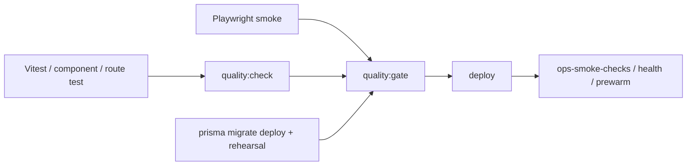
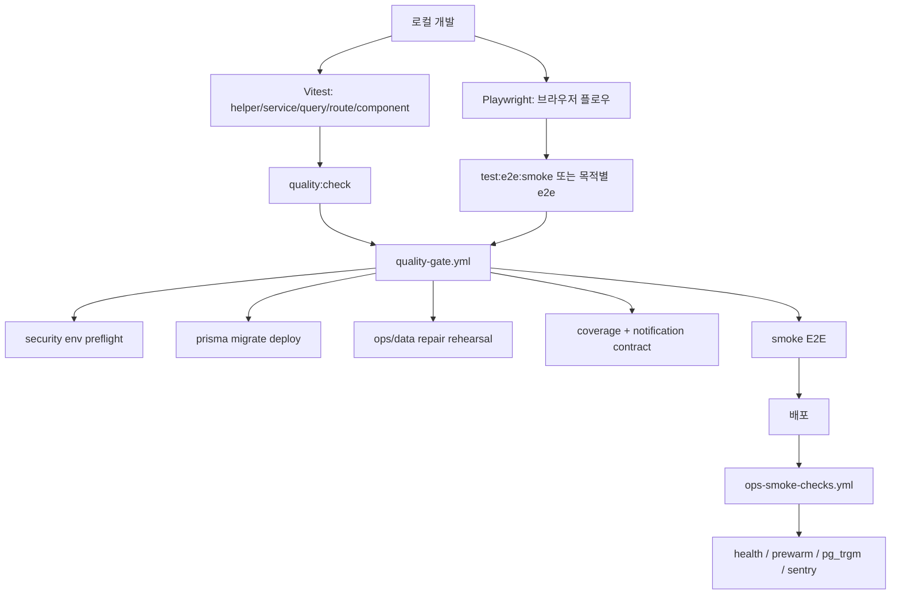

# 19. Vitest / Playwright / quality-gate 전략

## 이번 글에서 풀 문제

TownPet는 기능이 많은 커뮤니티 서비스입니다.

- 인증
- 댓글
- 검색
- 알림
- 모더레이션
- 관리자 화면
- migration
- 운영 스크립트

이런 서비스는 "테스트가 있다"만으로는 부족합니다.

이 글은 TownPet가 품질을 어떻게 나누어 검증하는지, 즉 **단위 테스트 -> E2E -> CI gate -> 배포 후 smoke** 순서를 정리합니다.

## 왜 이 글이 중요한가

프로젝트를 혼자 오래 끌고 가려면, 기능보다 "안전하게 바꿀 수 있는 구조"가 더 중요합니다.

TownPet는 실제로 이런 위험이 있습니다.

- schema는 바뀌었는데 migration chain이 깨짐
- 검색은 고쳤는데 E2E 로그인 진입이 깨짐
- 운영 cleanup 스크립트가 production에서 다른 결과를 냄
- health endpoint는 괜찮아도 admin/ops 데이터가 틀림

그래서 TownPet는 테스트를

- 코드 로직 검증
- 사용자 흐름 검증
- CI 품질 게이트
- 배포 후 운영 검증

으로 나눠 둡니다.

## 먼저 볼 핵심 파일

- [`app/package.json`](/Users/alex/project/townpet/app/package.json)
- [`.github/workflows/quality-gate.yml`](/Users/alex/project/townpet/.github/workflows/quality-gate.yml)
- [`.github/workflows/ops-smoke-checks.yml`](/Users/alex/project/townpet/.github/workflows/ops-smoke-checks.yml)
- [`app/e2e/profile-social-account-linking.spec.ts`](/Users/alex/project/townpet/app/e2e/profile-social-account-linking.spec.ts)
- [`app/src/server/queries/ops-overview.queries.test.ts`](/Users/alex/project/townpet/app/src/server/queries/ops-overview.queries.test.ts)
- [`app/src/app/api/health/route.test.ts`](/Users/alex/project/townpet/app/src/app/api/health/route.test.ts)

## 품질 게이트를 먼저 그림으로 보면



TownPet 품질 게이트는 테스트만이 아니라 migration, rehearsal, 배포 후 smoke까지 한 줄로 이어집니다.

## 1. 테스트 스택은 어떻게 나뉘는가

TownPet는 크게 두 도구를 씁니다.

### Vitest

- service
- query
- route
- component
- helper

즉 대부분의 로직 테스트는 Vitest로 갑니다.

### Playwright

- 로그인
- 검색
- 소셜 온보딩
- 업로드
- 관리자 정책

같이 브라우저 상호작용이 중요한 흐름은 Playwright가 담당합니다.

즉 "서버 계산이 맞는가"와 "브라우저에서 실제로 되느냐"를 도구 단위로 나눴습니다.

## 2. `package.json`을 보면 어떤 전략이 보이는가

핵심 파일:

- [`app/package.json`](/Users/alex/project/townpet/app/package.json)

여기서 먼저 봐야 하는 스크립트는 이 6개입니다.

- `lint`
- `typecheck`
- `test`
- `test:e2e`
- `quality:check`
- `quality:gate`

이 중 `quality:check`는:

- `pnpm lint`
- `pnpm typecheck`
- `pnpm test:unit`

을 묶습니다.

즉 코드 레벨에서 최소한 "문법, 타입, 단위 테스트"는 한 번에 통과하게 만듭니다.

그리고 `quality:gate`는:

- `quality:check`
- `test:e2e:smoke`

를 합칩니다.

즉 CI에서 중요한 건 "unit만 green"이 아니라 "핵심 smoke E2E까지 green"입니다.

## 3. 왜 `test:e2e:smoke`를 따로 두는가

모든 E2E를 매 push마다 돌리면 느리고 flaky할 수 있습니다.

그래서 TownPet는 smoke 세트를 따로 둡니다.

현재 smoke 예:

- `feed-loading-skeleton`
- `kakao-login-entry`
- `naver-login-entry`
- `social-onboarding-flow`

즉 "서비스 진입이 가능한가"를 빠르게 보는 최소 브라우저 경로입니다.

반면 더 무거운 흐름은 별도 명령으로 둡니다.

- `test:e2e:auth`
- `test:e2e:upload`
- `test:e2e:notification-filters`
- `test:e2e:admin-policies`

이 구조는 실무적으로 매우 중요합니다.

- smoke는 자주
- heavy suite는 목적별로

돌릴 수 있기 때문입니다.

## 4. `quality-gate.yml`은 어떤 순서로 실패를 막는가

핵심 파일:

- [`.github/workflows/quality-gate.yml`](/Users/alex/project/townpet/.github/workflows/quality-gate.yml)

이 워크플로우는 단순히 `pnpm test`만 하지 않습니다.

순서를 보면 TownPet가 무엇을 위험하다고 보는지 드러납니다.

1. checkout / pnpm / node setup
2. install
3. `Security env preflight`
4. `prisma migrate deploy`
5. `prisma generate`
6. guest author/backfill 관련 rehearsal
7. `quality:check`
8. coverage
9. notification contract suite
10. Playwright browser install
11. `test:e2e:smoke`

즉 이 CI는 "코드가 빌드되는가"보다 먼저

- security env가 production-like 한가
- migration chain이 처음부터 적용 가능한가
- 데이터 보정 스크립트가 위험하지 않은가

를 확인합니다.

TownPet가 커뮤니티 운영 서비스라서, 코드보다 migration/ops 스크립트가 더 큰 사고를 낼 수 있다는 판단이 반영된 구조입니다.

## 5. 왜 CI에서 `prisma db push`가 아니라 `migrate deploy`를 쓰는가

핵심은 이 지점입니다.

`db push`는 현재 schema를 맞추는 데는 편하지만, migration chain이 실제로 살아 있는지는 보장하지 못합니다.

TownPet는 이미 migration repair 경험이 있었기 때문에, CI에서도:

- `prisma migrate deploy`

를 표준 경로로 씁니다.

즉 "현재 schema가 맞다"보다 "처음부터 지금까지 migration history가 실행된다"를 더 중요한 품질 기준으로 둡니다.

Python/Django로 치환하면:

- `makemigrations` 결과만 보는 게 아니라
- clean DB에 `migrate`를 실제로 끝까지 실행하는 것

과 같은 철학입니다.

## 6. 운영 스크립트 rehearsal은 왜 CI에 들어가 있는가

`quality-gate.yml`에는 일반 앱 테스트 외에도 이런 단계가 있습니다.

- `db:backfill:guest-authors`
- `db:verify:guest-authors`
- `db:check:guest-legacy-cleanup`
- `db:rehearse:guest-legacy-cleanup`

즉 TownPet는 "앱 코드"만 검증하지 않고, **운영 데이터 보정 스크립트**도 품질 게이트에 포함시킵니다.

이게 중요한 이유:

- production 문제는 배포 코드보다 데이터 repair script에서 자주 납니다.
- 혼자 운영할수록 이런 스크립트 실수가 치명적입니다.

즉 TownPet의 quality gate는 CI라기보다 `engineering + ops gate`에 가깝습니다.

## 7. 배포 후 smoke는 어디서 보는가

핵심 파일:

- [`.github/workflows/ops-smoke-checks.yml`](/Users/alex/project/townpet/.github/workflows/ops-smoke-checks.yml)

이 워크플로우는 production/preview 배포 뒤 외부에서 다시 확인합니다.

대표 단계:

- `ops:check:health`
- `ops:prewarm`
- optional `pg_trgm` 확인
- optional Sentry ingestion 확인

즉 CI가 끝났다고 바로 끝내지 않고, 배포된 URL에서도

- health endpoint
- route prewarm
- search extension
- sentry ingestion

을 다시 봅니다.

이건 "로컬/CI 성공"과 "실제 배포 성공"을 분리해서 다루는 구조입니다.

## 8. 실제 테스트 파일은 어떻게 읽는가

### 로직 테스트 예

- [`app/src/server/services/auth-account-link.service.test.ts`](/Users/alex/project/townpet/app/src/server/services/auth-account-link.service.test.ts)
- [`app/src/server/queries/ops-overview.queries.test.ts`](/Users/alex/project/townpet/app/src/server/queries/ops-overview.queries.test.ts)

이 레벨은 service/query 규칙을 빠르게 고정합니다.

### route 테스트 예

- [`app/src/app/api/health/route.test.ts`](/Users/alex/project/townpet/app/src/app/api/health/route.test.ts)

이 레벨은 JSON contract와 권한/토큰 분기를 고정합니다.

### component 테스트 예

- [`app/src/components/admin/admin-section-nav.test.tsx`](/Users/alex/project/townpet/app/src/components/admin/admin-section-nav.test.tsx)

이 레벨은 권한별 UI 노출 계약을 고정합니다.

### E2E 예

- [`app/e2e/profile-social-account-linking.spec.ts`](/Users/alex/project/townpet/app/e2e/profile-social-account-linking.spec.ts)

이 레벨은 브라우저 사용자 흐름을 끝까지 검증합니다.

즉 TownPet는 "테스트 종류"를 기술 스택 기준으로 나눈 게 아니라, **깨질 수 있는 계층 기준**으로 나눕니다.

## 9. 전체 흐름을 그림으로 보면



## 10. 직접 실행해 보고 싶다면

가장 자주 쓰는 명령은 이 정도입니다.

```bash
corepack pnpm -C app lint
corepack pnpm -C app typecheck
corepack pnpm -C app test
corepack pnpm -C app test:e2e -- e2e/profile-social-account-linking.spec.ts --project=chromium
corepack pnpm -C app exec prisma migrate deploy
```

특정 파일만 보고 싶다면:

```bash
corepack pnpm -C app test -- src/server/queries/ops-overview.queries.test.ts
corepack pnpm -C app test -- src/app/api/health/route.test.ts
```

## 11. 현재 구현의 한계

- Playwright는 브라우저/CI 환경 의존성이 있어서 가끔 launch 문제를 별도로 다뤄야 합니다.
- smoke E2E는 빠르지만 모든 운영 edge case를 덮지는 못합니다.
- coverage가 높아도 migration/ops script 위험을 완전히 대체하지 못하므로, TownPet는 rehearsal step을 계속 유지해야 합니다.

## Python/Java 개발자용 요약

- `Vitest`는 JUnit + Mockito 성격의 빠른 로직 테스트 묶음으로 읽으면 됩니다.
- `Playwright`는 Selenium보다 더 modern한 브라우저 E2E 층입니다.
- `quality-gate.yml`은 단순 test workflow가 아니라 migration/ops safety까지 묶은 release gate입니다.
- `ops-smoke-checks.yml`은 배포 후 실제 URL을 다시 검증하는 post-deploy smoke입니다.

## 면접에서 이렇게 설명할 수 있다

> TownPet는 unit test만 많은 프로젝트가 아니라, migration chain과 운영 스크립트까지 CI에서 검증하는 구조로 만들었습니다. `quality-gate`는 security env preflight, `prisma migrate deploy`, data repair rehearsal, coverage, notification contract, Playwright smoke까지 포함하고, 배포 후에는 별도의 ops smoke workflow로 health와 search extension까지 다시 점검합니다.
