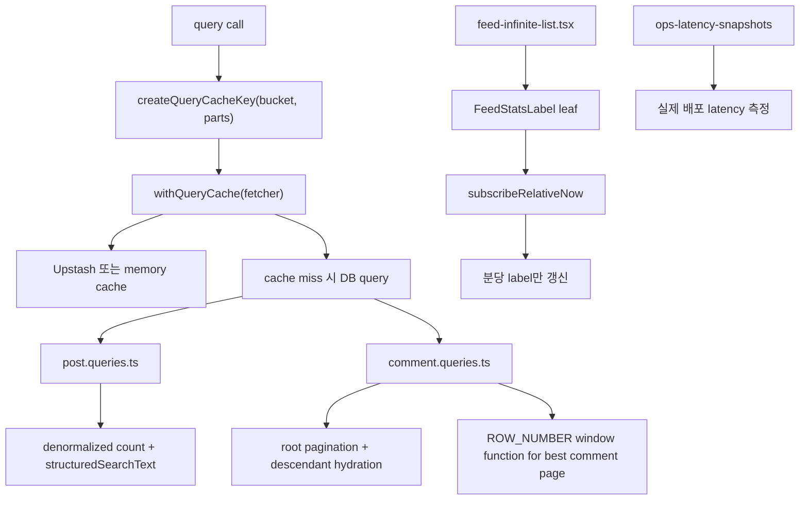

# 20. 성능 개선을 코드 구조와 함께 설명하기

## 이번 글에서 풀 문제

TownPet는 기능이 늘어나면서 성능 문제도 같이 다뤘습니다.

대표 축은 이렇습니다.

- 피드 목록 렌더링
- query cache와 invalidation
- 검색 후보 추출과 fallback
- 댓글 페이지네이션과 best comment 문맥 계산
- 운영 latency snapshot

이 글은 성능 개선을 "튜닝 팁"이 아니라 **데이터 구조와 계층 분리가 병목을 어떻게 바꾸는지** 관점으로 정리합니다.

## 왜 이 글이 중요한가

서비스 성능은 흔히 뒤늦게 손보게 됩니다.

하지만 TownPet에서는 성능을 기능 완료 후의 마지막 polish가 아니라,

- denormalized count
- cache bucket version
- server pagination
- shadow search column
- re-render 분리

같은 구조적 선택으로 먼저 다뤘습니다.

즉 "빠르게 만들고 나중에 튜닝"보다, **처음부터 어떤 비용이 큰지 알고 구조를 잡는 방식**에 가깝습니다.

## 먼저 볼 핵심 파일

- [`app/src/server/cache/query-cache.ts`](../app/src/server/cache/query-cache.ts)
- [`app/src/server/cache/query-cache.test.ts`](../app/src/server/cache/query-cache.test.ts)
- [`app/src/server/queries/post.queries.ts`](../app/src/server/queries/post.queries.ts)
- [`app/src/server/services/posts/feed-page-performance.service.ts`](../app/src/server/services/posts/feed-page-performance.service.ts)
- [`app/src/server/services/posts/feed-page-query.service.ts`](../app/src/server/services/posts/feed-page-query.service.ts)
- [`app/src/server/queries/comment.queries.ts`](../app/src/server/queries/comment.queries.ts)
- [`app/src/server/queries/comment.queries.test.ts`](../app/src/server/queries/comment.queries.test.ts)
- [`app/src/components/posts/feed-loading-skeleton.tsx`](../app/src/components/posts/feed-loading-skeleton.tsx)
- [`app/src/components/posts/feed-infinite-list.tsx`](../app/src/components/posts/feed-infinite-list.tsx)
- [`app/src/lib/feed-list-presenter.ts`](../app/src/lib/feed-list-presenter.ts)
- [`app/src/lib/post-structured-search.ts`](../app/src/lib/post-structured-search.ts)
- [`app/scripts/collect-latency-snapshot.ts`](../app/scripts/collect-latency-snapshot.ts)
- [`/.github/workflows/ops-latency-snapshots.yml`](../.github/workflows/ops-latency-snapshots.yml)

## 먼저 알아둘 개념

### 1. 캐시는 “있으면 좋다”가 아니라 invalidation이 핵심이다

TownPet는 `withQueryCache`만 있는 것이 아니라, bucket별 version bump를 같이 둡니다.

즉 성능 설계의 핵심은:

- 캐시 사용
- 어떤 이벤트에서 버전을 올릴지

두 축이 같이 맞는가입니다.

### 2. denormalized count는 조회 비용을 줄이는 대신 정합성 repair가 필요하다

`commentCount`, `likeCount`, `dislikeCount`, `viewCount`를 조회마다 세지 않는 대신, write path와 repair job이 중요해집니다.

### 3. 렌더 최적화는 state scope를 줄이는 문제다

피드 전체가 분당 다시 렌더되던 문제를, 상대시간 label만 갱신되게 바꾸는 식입니다.

즉 React 최적화의 핵심은 `memo`보다 **어떤 상태가 어디까지 퍼지느냐**입니다.

## 1. Query cache는 어떻게 설계돼 있는가

핵심 파일:

- [`query-cache.ts`](../app/src/server/cache/query-cache.ts)

먼저 볼 함수:

- `getQueryCacheHealth`
- `getCacheVersion`
- `bumpCacheVersion`
- `createQueryCacheKey`
- `withQueryCache`

구조는 단순하지만 중요한 선택이 있습니다.

- cache backend: disabled / memory / upstash
- key 방식: `cache:{bucket}:v{version}:{parts}`
- distributed cache 장애 시: process memory fallback이 아니라 bypass fail-open

이 마지막 선택이 중요합니다.

예전에는 Redis 장애 시 인스턴스별 메모리 fallback으로 갈 수 있었는데, 이러면 multi-instance stale 문제가 커집니다.

지금 TownPet는 Redis가 죽으면 **일시적으로 캐시를 포기하고 직접 fetch**합니다.

즉 성능보다 정합성을 우선한 설계입니다.

## 2. 왜 bucket version 방식이 중요한가

`query-cache.ts` 하단을 보면 bucket별 bump 함수가 있습니다.

- `bumpFeedCacheVersion`
- `bumpSearchCacheVersion`
- `bumpSuggestCacheVersion`
- `bumpPostDetailCacheVersion`
- `bumpPostCommentsCacheVersion`
- `bumpNotificationUnreadCacheVersion`
- `bumpNotificationListCacheVersion`

장점:

- 특정 도메인만 invalidation 가능
- 키 전체를 scan/delete 하지 않음
- 유저별 notification cache처럼 세밀하게 나눌 수 있음

Spring으로 치환하면:

- `@CacheEvict(allEntries=true)`보다 더 예측 가능한 **versioned namespace cache**입니다.

## 3. 피드는 왜 denormalized count를 적극적으로 쓰는가

TownPet 피드 카드가 빠르게 보여야 하는 대표 이유는, 목록에서 매 row마다 comment/reaction count를 다시 세지 않기 때문입니다.

관련 필드:

- `commentCount`
- `likeCount`
- `dislikeCount`
- `viewCount`

이렇게 해두면 피드/베스트/검색 목록에서 필요한 핵심 수치를 한 row에서 바로 읽을 수 있습니다.

대신 비용은 write path로 이동합니다.

- 반응 변경 시 count 갱신
- 댓글 삭제/복구 시 count 갱신
- drift가 생기면 `repair-post-integrity.ts` 같은 repair job 필요

즉 TownPet는 **read-heavy 커뮤니티 특성에 맞게 read cost를 줄이고, write/repair complexity를 받아들인 구조**입니다.

## 4. 피드 상대시간은 왜 분리 컴포넌트로 뺐는가

핵심 파일:

- [`feed-infinite-list.tsx`](../app/src/components/posts/feed-infinite-list.tsx)
- [`feed-list-presenter.ts`](../app/src/lib/feed-list-presenter.ts)

먼저 볼 함수:

- `subscribeRelativeNow`
- `FeedStatsLabel`
- `buildFeedStatsLabel`
- `getStableFeedDateLabel`

문제:

- 상대시간은 시간이 지나면 변합니다.
- 그런데 이 값을 루트 리스트에서 직접 계산하면, 분당 피드 전체가 다시 렌더됩니다.

TownPet의 해결:

1. `buildFeedStatsLabel`을 presenter 함수로 분리
2. `FeedStatsLabel`을 작은 leaf component로 분리
3. `useSyncExternalStore(subscribeRelativeNow, ...)`로 상대시간만 구독

결과:

- 분당 갱신은 계속 되지만
- 큰 리스트 전체가 아니라 **작은 label leaf만 다시 계산**됩니다.

이건 React에서 매우 중요한 패턴입니다.

## 4.5. 첫 페이지는 왜 count와 list를 겹쳐서 가져오는가

핵심 파일:

- [`feed/page.tsx`](../app/src/app/feed/page.tsx)
- [`feed-page-query.service.ts`](../app/src/server/services/posts/feed-page-query.service.ts)

피드 첫 진입에서 흔한 흐름은 `page=1`입니다.

이 경우 `countPosts`로 전체 개수를 구한 뒤 `listPosts`를 다시 기다리면, 첫 화면은 항상 직렬 비용을 그대로 받습니다.

TownPet는 이 비용을 줄이기 위해 helper 하나로 아래 규칙을 고정했습니다.

1. total count 조회와 requested page 조회를 먼저 병렬로 시작한다.
2. count 결과로 `totalPages`를 계산한다.
3. 요청한 page가 유효하면 첫 조회 결과를 그대로 쓴다.
4. page overflow일 때만 resolved page를 다시 조회한다.

즉 “항상 두 번 조회”가 아니라, **흔한 경로를 빠르게 하고 예외 경로만 보정하는 구조**입니다.

백엔드 관점에서는 이게 중요합니다.

- 정합성: page 범위는 여전히 안전하게 보정
- 성능: 첫 페이지의 직렬 대기 시간을 줄임
- 코드 관리: page overflow 보정 규칙을 page 컴포넌트 여기저기에 흩뿌리지 않음

Spring/Java 식으로 보면, 컨트롤러에 pagination edge case를 직접 적는 대신 **read-model orchestration helper**로 공통화한 셈입니다.

## 4.6. 로딩 문구보다 skeleton을 먼저 보여주는 이유

핵심 파일:

- [`feed-loading-skeleton.tsx`](../app/src/components/posts/feed-loading-skeleton.tsx)
- [`feed/loading.tsx`](../app/src/app/feed/loading.tsx)
- [`feed/guest/page.tsx`](../app/src/app/feed/guest/page.tsx)
- [`guest-feed-page-client.tsx`](../app/src/components/posts/guest-feed-page-client.tsx)

체감 성능은 서버 시간만의 문제가 아닙니다.

같은 500ms라도:

- “피드를 준비 중입니다” 같은 빈상태 문구를 먼저 보면 느리게 느껴지고
- 실제 카드 레이아웃 skeleton을 먼저 보면 곧 채워질 화면처럼 느껴집니다.

TownPet는 그래서 feed loading UI를 공통 skeleton으로 맞췄습니다.

이건 단순 디자인 수정이 아니라, 운영 중 느린 구간이 있더라도 사용자가 보는 첫 인상을 더 안정적으로 만드는 선택입니다.

## 4.7. 느린 구간은 왜 `/feed` 안에서 단계별로 로그를 남기는가

핵심 파일:

- [`feed/page.tsx`](../app/src/app/feed/page.tsx)
- [`feed-page-performance.service.ts`](../app/src/server/services/posts/feed-page-performance.service.ts)
- [`collect-latency-snapshot.ts`](../app/scripts/collect-latency-snapshot.ts)

페이지가 느릴 때 중요한 건 “느리다”가 아니라 **어디가 느린가**입니다.

TownPet는 `/feed` 서버 렌더에서 아래 단계를 분리해 기록합니다.

- `bootstrap.session_and_communities`
- `bootstrap.viewer_context`
- `page_query.all` 또는 `page_query.best`
- `personalization.context`

기본 동작은 단순합니다.

- 전체 시간이 threshold를 넘는 slow request만 `warn` 로그로 남긴다.
- 운영 중 특정 요청을 바로 보고 싶으면 `?perf=1`로 강제 `info` 로그를 남긴다.

즉 평소에는 로그를 과하게 늘리지 않고, 필요할 때만 `/feed?perf=1` 요청 하나로 배포 로그에서 병목 위치를 바로 볼 수 있습니다.

여기에 운영 snapshot도 같이 맞췄습니다.

- `ops:perf:snapshot`
- `ops-latency-snapshots.yml`
- `page_feed` label

이제 API만 재지 않고 **canonical `/feed` 페이지 자체도 주기적으로 측정**합니다.

## 4.8. guest `/feed`는 왜 API 응답에 timing을 직접 싣는가

핵심 파일:

- [`api/feed/guest/route.ts`](../app/src/app/api/feed/guest/route.ts)
- [`response.ts`](../app/src/server/response.ts)

운영에서 바로 확인하려면 “로그가 찍혔는가”보다 **응답 자체가 timing을 들고 있는가**가 더 편합니다.

TownPet는 그래서 guest `/feed`의 실제 데이터 경로인 `/api/feed/guest`에 `perf=1` 진단 모드를 넣었습니다.

예:

- `GET /api/feed/guest?perf=1`
- `GET /feed?perf=1`

이 모드에서는 응답이 두 가지를 같이 돌려줍니다.

1. `Server-Timing` 헤더
2. JSON `meta.timings`

즉 브라우저 Network 탭이나 `curl -i`만으로도 아래 단계를 바로 볼 수 있습니다.

- `bootstrap.policy_and_communities`
- `page_query.all`
- `page_query.best`

실제로 이 계측을 넣고 보니 중요한 사실이 하나 드러났습니다.

- `/api/feed/guest` 자체는 `totalMs` 수십 ms 수준으로 빨랐고
- 진짜 병목은 문서 응답 경로 쪽이었습니다.

즉 처음에는 “guest API가 느려서 첫 화면이 느리다”고 추정했지만, 계측 결과는 반대였습니다.

## 4.9. server-first가 항상 더 빠른 것은 아니었다

핵심 파일:

- [`feed/guest/page.tsx`](../app/src/app/feed/guest/page.tsx)
- [`guest-feed-page-client.tsx`](../app/src/components/posts/guest-feed-page-client.tsx)
- [`api/feed/guest/route.ts`](../app/src/app/api/feed/guest/route.ts)

한 번은 guest `/feed`의 첫 체감을 줄이려고, 서버가 먼저 `/api/feed/guest`를 호출해서 초기 payload를 `GuestFeedPageClient`에 넣는 구조로 바꿨습니다.

처음 가설은 그럴듯했습니다.

1. 문서 응답에 첫 페이지 데이터까지 같이 실으면
2. 브라우저가 추가 API를 기다리지 않아도 되고
3. 따라서 첫 화면이 더 빨라질 것

하지만 배포 응답을 다시 확인하니, 결과는 기대와 달랐습니다.

- `/feed` 문서 응답은 `private, no-cache, no-store`가 되었고
- guest rewrite 경로의 CDN 이점을 잃었고
- 서버는 같은 앱의 `/api/feed/guest`를 한 번 더 내부 fetch하게 됐습니다.

즉 API는 빨랐지만, **문서가 더 무거워진 것**입니다.

그래서 최종 구조는 다시 단순하게 정리했습니다.

- `/feed/guest/page.tsx`: static shell만 렌더
- `GuestFeedPageClient`: skeleton을 먼저 보여주고 client fetch 수행
- `/api/feed/guest`: cacheable public read endpoint + `perf=1` 계측

이 경험에서 얻은 교훈은 단순합니다.

- SSR이 있다고 항상 빠른 것이 아니다
- 같은 앱 내부 self-fetch는 쉽게 “조용한 병목”이 된다
- public read 표면은 HTML보다 API 캐시가 더 큰 승부처일 수 있다

즉 TownPet의 이번 피드 최적화는 “더 많은 서버 작업”이 아니라, **어디를 static으로 두고 어디를 cacheable API로 둘지 다시 경계 그리기**에 가까웠습니다.

## 4.10. strict nonce를 전역으로 걸면 public `/feed`도 같이 느려진다

핵심 파일:

- [`layout.tsx`](../app/src/app/layout.tsx)
- [`middleware.ts`](../app/middleware.ts)
- [`posts/[id]/page.tsx`](../app/src/app/posts/[id]/page.tsx)
- [`posts/[id]/guest/page.tsx`](../app/src/app/posts/[id]/guest/page.tsx)
- [`users/[id]/page.tsx`](../app/src/app/users/[id]/page.tsx)

한 번 더 허탕 친 지점은 CSP였습니다.

처음에는 `/feed`가 느린 이유를 계속 피드 쿼리나 guest API에서 찾았습니다.
그런데 응답 헤더를 다시 보니, public `/feed`도 계속 `private, no-store`였습니다.

원인을 따라가 보니 구조가 이랬습니다.

1. production에서 `CSP_ENFORCE_STRICT=1`
2. `RootLayout`이 전역 `connection()`을 호출
3. middleware가 매 요청마다 nonce를 발급
4. 결과적으로 public `/feed`도 strict nonce 기반 동적 경로를 같이 탐

즉 “보안 하드닝을 전역으로 단순하게 건 선택”이 public feed 캐시를 같이 죽이고 있었습니다.

이 문제는 쿼리 튜닝으로는 안 풀립니다.

- `page_query.all`을 30ms 줄여도
- 문서 자체가 dynamic/no-store면
- cold/warm 편차와 캐시 손해는 그대로 남습니다.

그래서 최종 수정은 범위를 줄이는 방식이었습니다.

- `RootLayout`: 전역 `connection()` 제거
- `posts/[id]`, `posts/[id]/guest`, `users/[id]`: nonce가 실제 필요한 페이지에서만 `connection()`
- guest `/feed` rewrite: static CSP 사용, nonce 헤더 미주입

이렇게 바꾸면 보안 경계를 없애는 것이 아니라, **nonce가 꼭 필요한 surface만 strict nonce 경로에 남기고 public feed는 static shell로 분리**할 수 있습니다.

이번 경험의 교훈:

- 성능 문제는 종종 피드 쿼리가 아니라 레이아웃/보안 계층에서 생긴다
- 전역 hardening은 이해하기 쉽지만, public caching과 충돌할 수 있다
- “더 안전하게”가 항상 “더 단순하게”와 같은 뜻은 아니다

즉 TownPet의 이번 최적화는 결국 feed 코드보다도, **보안 경계를 어디까지 전역으로 걸 것인가를 다시 설계한 작업**이었습니다.

## 4.11. rewrite보다 redirect가 더 빨랐던 이유

여기서 한 번 더 의외의 결과가 나왔습니다.

헤더와 실측을 같이 보니:

- `/feed/guest` 직접 요청은 `x-nextjs-prerender: 1`, `x-vercel-cache: HIT`
- `/feed/guest`는 `ttfb 0.14s~0.22s`로 안정적
- 반면 `/feed`는 guest rewrite 경로에서만 계속 느렸습니다

즉 guest 피드의 느린 부분은 “guest 페이지”가 아니라, **원래 URL `/feed`를 유지한 rewrite 방식**이었습니다.

그래서 최종 선택은 rewrite를 고집하지 않는 것이었습니다.

- guest `/feed` 요청은 `/feed/guest`로 redirect
- `GuestFeedPageClient` 내부 navigation/canonical도 `/feed/guest` 기준으로 유지

이렇게 하면 URL은 하나 더 생기지만, 실제 빠른 경로를 그대로 활용할 수 있습니다.

이 결정은 “URL이 더 예쁘냐”보다 “실제로 더 빠르냐”를 우선한 선택입니다.

정리하면 이번 feed 최적화의 흐름은 이렇습니다.

1. guest API가 느릴 것이라 추정했다
2. 계측해 보니 API는 빨랐다
3. server-first self-fetch를 붙였더니 문서가 더 무거워졌다
4. strict nonce 범위를 줄였지만 rewrite 경로는 여전히 느렸다
5. 직접 `/feed/guest`를 재보니 이미 충분히 빨랐다
6. 그래서 rewrite 대신 redirect로 바꿨다

즉 TownPet에서 이번 성능 개선은 “더 많은 캐시를 붙인다”보다, **실제로 빠른 경로를 인정하고 그 경로로 단순하게 보내는 작업**에 가까웠습니다.
- `page_query.cursor`

게다가 guest route도 `count -> list` 직렬 흐름을 공통 helper로 줄여, **측정과 최적화를 같은 경로에서 같이 진행**할 수 있게 했습니다.

## 4.9. 실제로는 어떤 허탕을 쳤는가

이번 최적화는 한 번에 정답으로 간 게 아닙니다.

오히려 아래 순서로 틀린 가설을 지웠습니다.

### 1. “guest route를 `/feed`로 합치면 빨라질 것”이라고 생각했다

처음에는 guest `/feed`를 canonical `/feed`로 더 단순하게 합치면 경로가 짧아지고 빨라질 거라고 봤습니다.

하지만 production에서는 이 시도가 self-redirect loop로 이어졌습니다.

로컬에서는 안 보이는데 배포에서만 `NEXT_REDIRECT`가 섞이는 전형적인 Next.js/App Router 함정이었습니다.

즉 이 단계에서 배운 건:

- 경로가 단순해진다고 항상 빨라지는 건 아니다
- App Router rewrite/redirect는 production 동작을 별도로 검증해야 한다

였습니다.

### 2. “DB query가 느려서 `/feed`가 느린 것”이라고 생각했다

그 다음 가설은 더 흔합니다.

- count query가 느리다
- list query가 느리다
- personalization query가 느리다

그래서 `/feed`와 `/api/feed/guest`에 단계별 계측을 넣었습니다.

실제 `GET /api/feed/guest?perf=1&nonce=...` 결과는 대략 이랬습니다.

- `totalMs ≈ 58`
- `bootstrap.policy_and_communities ≈ 11`
- `page_query.all ≈ 36`

여기서 중요한 건 `page_query.all`이 가장 크더라도 **절대 시간이 수십 ms 수준**이었다는 점입니다.

즉 guest 피드 API는 “가장 큰 비중”과 “실제 병목”이 다른 사례였습니다.

- 비중상 제일 큼: `page_query.all`
- 하지만 절대 시간은 여전히 작음

그래서 이 단계에서 배운 건:

- 가장 큰 구간이 있다고 해서 그게 진짜 병목은 아닐 수 있다
- 퍼센트보다 절대 시간으로 판단해야 한다

였습니다.

### 3. 그래서 방향을 “query 최적화”에서 “첫 화면 구조 변경”으로 바꿨다

API가 이미 충분히 빠르다면, 사용자가 느끼는 지연은 다른 곳에 있습니다.

- 문서 응답 자체
- App Router/RSC 경로
- 첫 HTML 이후 다시 API를 기다리는 구조
- cold start

그래서 최종 방향은 guest `/feed`의 첫 렌더를 **server-first**로 바꾸는 것이었습니다.

지금 구조는:

1. `/feed/guest/page.tsx`가 서버에서 초기 payload를 가져온다
2. 그 payload를 `GuestFeedPageClient`에 주입한다
3. 클라이언트는 첫 fetch를 건너뛴다
4. 이후 필터 변경/무한 스크롤만 client가 담당한다

이건 아주 중요한 교훈입니다.

성능 작업은 종종 “더 빠른 SQL”보다 **어디서 기다림을 없앨지**를 찾는 일에 더 가깝습니다.

## 5. 검색 성능은 왜 structured shadow column으로 옮겼는가

메인 검색은 예전처럼 relation table을 매번 크게 조인하면 비싸집니다.

그래서 TownPet는:

- `structuredSearchText`

같은 shadow column을 둬서, 구조화 필드를 미리 합쳐 놓고 검색 시 relation join을 줄였습니다.

이 선택의 장점:

- query가 단순해짐
- 검색/자동완성에서 같은 문서를 재사용하기 쉬움
- compact query, 초성 fallback 같은 후속 최적화를 얹기 쉬움

즉 성능 개선이 단순 인덱스 추가가 아니라 **search document 모델 재구성**과 연결됩니다.

## 6. 댓글 페이지네이션은 왜 “루트 기준”인가

핵심 파일:

- [`comment.queries.ts`](../app/src/server/queries/comment.queries.ts)

먼저 볼 함수:

- `listComments`
- `listCommentDescendants`
- `listBestComments`
- `attachBestCommentThreadContext`
- `listRootCommentPages`

TownPet의 댓글은 flat list가 아니라 thread입니다.

그래서 페이지네이션을 아무 댓글 기준으로 하면 문맥이 깨집니다.

TownPet는:

- root comment 기준 페이지네이션
- root에 매달린 descendants는 같이 조회

를 택합니다.

이 덕분에 사용자는 "댓글 페이지 2"가 실제 thread 문맥과 함께 보이게 됩니다.

## 7. best comment 문맥 계산은 어떻게 최적화했는가

예전에는 best comment가 root의 몇 번째 페이지인지 계산할 때 root마다 `count()`를 반복하기 쉬웠습니다.

지금 TownPet는:

- `listRootCommentPages`
- raw SQL `ROW_NUMBER() OVER (...)`

로 root들의 page를 한 번에 계산합니다.

즉

- 여러 root에 대해 count 반복

대신

- window function 1회

를 사용합니다.

이건 "JS 루프로 성능을 때우는 것"이 아니라, **DB가 잘하는 일을 DB로 보내는 전형적인 최적화**입니다.

## 8. 댓글 조회는 왜 full cache가 아니라 조건부 cache인가

`listComments` 하단을 보면 cache 사용 조건이 보수적입니다.

대략:

- viewer 없음
- hidden author viewer 없음
- blocked/muted author 없음

일 때만 캐시합니다.

이 이유는 명확합니다.

- viewer가 있는 댓글 목록은 사람마다 다름
- block/mute 상태가 끼면 payload가 달라짐

즉 TownPet는 캐시 hit를 무리하게 늘리기보다, **캐시 가능한 경우를 엄격히 제한해 correctness를 우선**합니다.

## 9. 운영에서 성능은 어떻게 관측하는가

핵심 파일:

- [`ops-latency-snapshots.yml`](../.github/workflows/ops-latency-snapshots.yml)

이 workflow는:

- 배포 URL 기준
- GET/POST endpoint에 대해 샘플 수집
- TSV + summary artifact 업로드

를 수행합니다.

즉 TownPet는 "느린 것 같다"가 아니라, **정기적인 latency snapshot**을 남깁니다.

아직 완전한 APM 대시보드는 아니지만, 운영자가 baseline 변화를 볼 수 있다는 점이 중요합니다.

## 10. 전체 흐름을 그림으로 보면



## 11. 테스트는 어떻게 읽어야 하는가

핵심 테스트:

- [`query-cache.test.ts`](../app/src/server/cache/query-cache.test.ts)
- [`comment.queries.test.ts`](../app/src/server/queries/comment.queries.test.ts)

`query-cache.test.ts`에서 볼 포인트:

- build phase에서 Upstash fetch를 하지 않는지
- runtime에서 Upstash를 쓰는지
- Redis 장애 시 bypass fail-open 되는지

`comment.queries.test.ts`에서 볼 포인트:

- best comment에 `threadRootId`, `threadPage`가 붙는지
- muted comment placeholder 처리
- blocked author filtering

즉 성능 테스트라고 해서 benchmark만 보는 것이 아니라, **최적화 이후에도 의미가 유지되는지**를 테스트합니다.

## 12. 직접 실행해 보고 싶다면

```bash
cd /Users/alex/project/townpet/app
corepack pnpm test -- src/server/cache/query-cache.test.ts src/server/queries/comment.queries.test.ts
```

운영 명령:

```bash
cd /Users/alex/project/townpet/app
corepack pnpm ops:perf:snapshot
```

실제 UI에서 보기 좋은 곳:

- `/feed`
- `/search`
- 게시글 상세 댓글
- `/admin/ops`

## 현재 구현의 한계

- query cache는 강력하지만, 완전한 tag-based invalidation 시스템은 아닙니다.
- latency snapshot은 artifact 중심이라 장기 time-series 시각화까지는 가지 않습니다.
- structured search shadow column이 있어도, 검색 품질과 성능을 더 높이려면 더 강한 unified search document로 갈 수 있습니다.

## Python/Java 개발자용 요약

- `query-cache.ts`는 versioned cache namespace 계층입니다.
- 피드 성능은 denormalized count와 리스트 렌더 분리로 잡았습니다.
- 검색 성능은 relation join 대신 shadow search column으로 줄였습니다.
- 댓글 성능은 root pagination과 window function으로 잡았습니다.
- 운영 관측은 workflow로 정기 latency snapshot을 남깁니다.

## 면접에서 이렇게 설명할 수 있다

> TownPet의 성능 개선은 “느린 쿼리 몇 개 튜닝”보다 구조를 바꾸는 쪽에 가까웠습니다. 읽기 많은 화면에는 denormalized count와 versioned query cache를 쓰고, 검색은 structured shadow column으로 join 비용을 줄였고, 댓글은 root pagination과 window function으로 문맥과 성능을 같이 맞췄습니다. 프론트에서는 상대시간 label만 다시 렌더되게 범위를 줄였습니다.

## 면접 Q&A

### Q1. 왜 query cache를 tag invalidation 대신 bucket version으로 풀었나요?

TownPet는 피드/검색/알림처럼 읽기 표면이 명확해서 bucket version이 구현과 운영 모두 단순했습니다. 필요한 표면만 선택적으로 무효화하기 좋았습니다.

### Q2. 왜 검색은 relation join 대신 shadow column으로 갔나요?

구조화 필드가 많아질수록 join 기반 검색은 비싸집니다. `structuredSearchText`로 검색 후보 추출 비용을 줄였습니다.

### Q3. 댓글 페이지네이션은 왜 전체 댓글이 아니라 루트 기준인가요?

댓글 thread 문맥을 유지하려면 루트 기준이 더 자연스럽고, 페이지네이션·best comment jump·reply 렌더도 이 기준이 더 안정적입니다.
