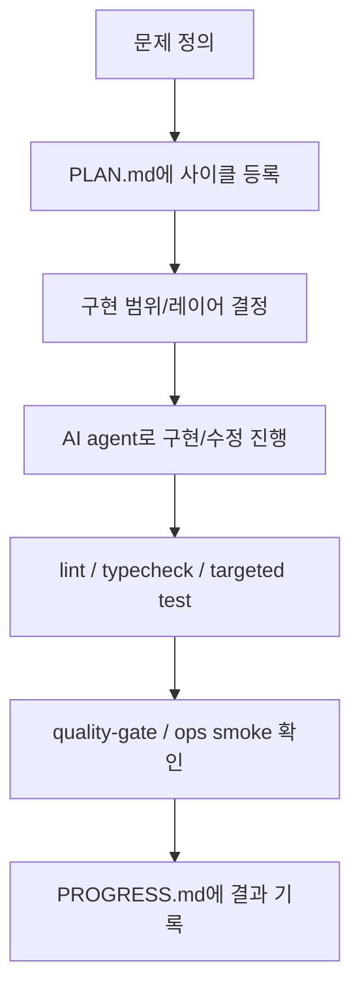

# 23. AI agent를 실제 개발 방식에 어떻게 녹였는가

## 이번 글에서 풀 문제

TownPet는 README에서 “AI agent 기반으로 설계, 구현, 검증, 운영까지 밀어붙인 프로젝트”라고 소개합니다.

그런데 이 말은 쉽게 오해될 수 있습니다.

- AI가 코드를 대신 써줬다는 뜻인가?
- 단순 자동완성과 뭐가 다른가?
- 실제로는 사람이 다 정리한 것 아닌가?

이 글은 TownPet에서 AI agent가 어떤 역할을 했는지, 그리고 무엇을 사람 판단으로 남겼는지를 구체적으로 정리합니다.

## 왜 이 글이 중요한가

이 시리즈의 독자는 코드 구조뿐 아니라 개발 방식도 같이 알고 싶어 합니다.

특히 TownPet 같은 프로젝트는 기능이 많습니다.

- 인증
- 검색
- 댓글/알림
- 모더레이션
- 운영 대시보드
- migration / cleanup / CI

이걸 혼자 오래 유지하려면 “AI를 썼다”보다 **AI를 어떻게 작업 시스템에 넣었는가**가 더 중요합니다.

TownPet의 핵심은 AI를 코드 생성기처럼 쓴 것이 아니라,  
계획 분해, 구현 순서, 검증, 기록, 운영 확인까지 연결하는 **개발 시스템**으로 사용했다는 점입니다.

## 먼저 볼 문서와 파일

- [README.md](/Users/alex/project/townpet/README.md)
- [PLAN.md](/Users/alex/project/townpet/PLAN.md)
- [PROGRESS.md](/Users/alex/project/townpet/PROGRESS.md)
- [docs/operations/에이전트_운영_가이드.md](/Users/alex/project/townpet/docs/operations/%EC%97%90%EC%9D%B4%EC%A0%84%ED%8A%B8_%EC%9A%B4%EC%98%81_%EA%B0%80%EC%9D%B4%EB%93%9C.md)
- [docs/operations/에이전트_프롬프트_템플릿.md](/Users/alex/project/townpet/docs/operations/%EC%97%90%EC%9D%B4%EC%A0%84%ED%8A%B8_%ED%94%84%EB%A1%AC%ED%94%84%ED%8A%B8_%ED%85%9C%ED%94%8C%EB%A6%BF.md)
- [docs/operations/에이전트_도구_거버넌스.md](/Users/alex/project/townpet/docs/operations/%EC%97%90%EC%9D%B4%EC%A0%84%ED%8A%B8_%EB%8F%84%EA%B5%AC_%EA%B1%B0%EB%B2%84%EB%84%8C%EC%8A%A4.md)
- [.github/workflows/quality-gate.yml](/Users/alex/project/townpet/.github/workflows/quality-gate.yml)
- [.github/workflows/ops-smoke-checks.yml](/Users/alex/project/townpet/.github/workflows/ops-smoke-checks.yml)

## 먼저 알아둘 개념

### 1. TownPet의 AI 사용 단위는 “기능”보다 “사이클”이다

TownPet는 보통 아래 단위로 일을 쪼갰습니다.

- 검색 품질
- moderation
- 데이터 정합성
- 업로드 보안
- 운영 대시보드
- 모바일 사용성

즉 `댓글 기능 하나`, `화면 하나`처럼 자르기보다,  
문제 축 단위로 사이클을 정의했습니다.

그리고 각 사이클은 항상:

1. 계획 수립
2. 구현
3. 검증
4. 기록

순서를 따릅니다.

### 2. AI의 출력보다 “검증 계약”이 먼저 있었다

TownPet는 AI에게 바로 구현을 맡기더라도, 다음 순서를 고정했습니다.

`Prisma -> Zod -> Service -> Action/Route -> UI -> Tests`

이 순서는 단순한 스타일 가이드가 아닙니다.

- 스키마가 먼저 바뀌는지
- 입력 검증이 빠지지 않았는지
- 정책이 서비스 레이어에 들어갔는지
- UI만 고쳐놓고 서버가 비어 있지 않은지
- 회귀 테스트가 있는지

를 강제로 점검하는 장치입니다.

## 1. 실제 작업은 어떻게 굴렸는가

TownPet에서 AI agent를 쓸 때의 기본 흐름은 아래와 같습니다.

핵심은 AI가 `D`에만 있는 것이 아니라,  
`B`, `C`, `G`에도 깊게 관여한다는 점입니다.

## 2. `PLAN.md`와 `PROGRESS.md`가 왜 중요한가

TownPet의 개발 방식에서 가장 중요한 산출물은 코드만이 아닙니다.

### [PLAN.md](/Users/alex/project/townpet/PLAN.md)

- 어떤 문제를 왜 고치는지
- 완료 기준이 무엇인지
- 어떤 파일과 문서가 영향을 받는지

를 먼저 고정합니다.

### [PROGRESS.md](/Users/alex/project/townpet/PROGRESS.md)

- 실제로 무엇을 바꿨는지
- 어떤 검증을 돌렸는지
- 어떤 리스크나 후속이 남았는지

를 남깁니다.

즉 TownPet는 AI가 생성한 코드보다,  
그 코드를 어떤 문맥에서 만들고 검증했는지를 기록으로 남기는 방식을 택했습니다.

이게 중요한 이유는:

- 나중에 변경 이유를 다시 이해하기 쉽고
- 기능 간 의존성을 추적하기 쉽고
- “AI가 만든 코드”가 아니라 “검증된 변경 이력”으로 남기기 쉽기 때문입니다.

## 3. 에이전트 역할은 어떻게 나눴는가

[docs/operations/에이전트_운영_가이드.md](/Users/alex/project/townpet/docs/operations/%EC%97%90%EC%9D%B4%EC%A0%84%ED%8A%B8_%EC%9A%B4%EC%98%81_%EA%B0%80%EC%9D%B4%EB%93%9C.md)를 보면 역할이 분리돼 있습니다.

- 구현
- 검증
- 성장
- 계획 기록
- 로컬 에러 수정

실제 운영에서 이 구조가 의미 있었던 이유는 다음과 같습니다.

### 구현과 검증을 분리했다

AI가 직접 구현한 뒤 바로 “완료”라고 선언하면 품질이 흔들리기 쉽습니다.

그래서 TownPet는:

- 구현 담당
- 검증 담당

을 나눠 생각했습니다.

### 성장/운영/계획을 코드와 분리했다

TownPet는 단순 기능 구현이 아니라:

- README/문서
- 운영 대시보드
- 배포 health
- growth execution

도 함께 다뤘기 때문에, 에이전트 역할도 자연스럽게 분화됐습니다.

## 4. 프롬프트도 자유형이 아니라 템플릿을 썼다

[docs/operations/에이전트_프롬프트_템플릿.md](/Users/alex/project/townpet/docs/operations/%EC%97%90%EC%9D%B4%EC%A0%84%ED%8A%B8_%ED%94%84%EB%A1%AC%ED%94%84%ED%8A%B8_%ED%85%9C%ED%94%8C%EB%A6%BF.md)를 보면 TownPet는 프롬프트까지 표준화했습니다.

중요한 항목:

- 목표
- 비목표
- 범위
- 정책 영향
- 데이터 영향
- 위험도
- 완료 기준

이렇게 한 이유는 단순합니다.

- AI가 범위를 넘기 쉽고
- 고위험 정책(auth/report/sanction/rate-limit)을 건드릴 수 있고
- 테스트나 운영 영향이 빠지기 쉽기 때문입니다.

즉 TownPet는 “프롬프트를 잘 쓰자”가 아니라,  
**프롬프트 자체도 운영 문서처럼 다뤘다**고 보는 것이 맞습니다.

## 5. 도구 선택도 AI에게 완전히 맡기지 않았다

[docs/operations/에이전트_도구_거버넌스.md](/Users/alex/project/townpet/docs/operations/%EC%97%90%EC%9D%B4%EC%A0%84%ED%8A%B8_%EB%8F%84%EA%B5%AC_%EA%B1%B0%EB%B2%84%EB%84%8C%EC%8A%A4.md)를 보면 더 분명합니다.

TownPet는 AI에게 “새로운 도구를 자유롭게 도입하라”고 하지 않았습니다.

오히려 아래를 고정했습니다.

- ORM/DB: Prisma + PostgreSQL
- Auth: NextAuth
- Validation: Zod + Service layer
- Cache: 현재 query-cache 전략 우선
- Test/CI: Vitest + Playwright + quality gate

이렇게 한 이유:

- AI는 종종 “이 도구로 바꾸자”를 쉽게 제안합니다.
- 하지만 실제 서비스에서는 도구 교체보다 정책 일관성이 더 중요합니다.

즉 TownPet에서 AI는 자유 실험 장치가 아니라,  
기존 스택 안에서 문제를 더 빠르고 넓게 해결하는 도구였습니다.

## 6. 실제로 어떤 영역에서 AI 효과가 컸는가

### 1) 문제 분해

검색, moderation, migration, 업로드 보안처럼 얽힌 문제를  
작은 사이클로 쪼개는 데 효과가 컸습니다.

### 2) 구현 속도

서비스/쿼리/route/component/test를 한 묶음으로 빠르게 움직일 수 있었습니다.

### 3) 문서 동기화

TownPet는 코드뿐 아니라:

- 운영 문서
- 보안 문서
- PLAN / PROGRESS
- 블로그 시리즈

까지 같이 움직였는데, 이 문서 동기화에 AI가 특히 유용했습니다.

### 4) 회귀 검증

테스트, quality gate, ops smoke까지 포함한 검증 루프를 반복적으로 닫는 데 도움이 컸습니다.

## 7. 반대로 무엇은 사람 판단으로 남겼는가

TownPet에서 중요한 결정은 여전히 사람이 했습니다.

예:

- 제품 방향
- Local/Global 경계
- 신고/제재 정책
- 권한 분리
- 공개/비공개 운영 원칙
- README와 포트폴리오 메시지

즉 AI는 구현과 탐색을 가속했지만,  
제품 원칙과 최종 책임은 계속 사람에게 남아 있었습니다.

## 8. TownPet가 보여주는 AI-native 개발 방식의 핵심

한 문장으로 요약하면:

> AI를 “코드 생성기”로 쓴 것이 아니라, 계획-구현-검증-운영 기록을 이어주는 개발 시스템으로 사용했다.

TownPet는 이 구조 덕분에:

- 기능을 많이 만들었고
- 운영/보안/검색/모더레이션까지 닫았고
- 변경 이유와 검증 결과를 다시 추적할 수 있게 됐습니다.

## 테스트는 어떻게 읽어야 하는가

이 글은 단일 test 파일보다 아래 묶음을 함께 보면 됩니다.

- [PLAN.md](/Users/alex/project/townpet/PLAN.md)
- [PROGRESS.md](/Users/alex/project/townpet/PROGRESS.md)
- [.github/workflows/quality-gate.yml](/Users/alex/project/townpet/.github/workflows/quality-gate.yml)
- [.github/workflows/ops-smoke-checks.yml](/Users/alex/project/townpet/.github/workflows/ops-smoke-checks.yml)
- [blog/19-testing-and-quality-gate.md](/Users/alex/project/townpet/blog/19-testing-and-quality-gate.md)

즉 TownPet의 AI 활용은 “어떤 모델을 썼나”보다,  
“어떻게 품질 게이트와 운영 루프 안에 넣었나”로 읽는 것이 더 정확합니다.

## 현재 구현의 한계

- 에이전트 운영 문서는 있지만, 완전한 자동 orchestration 시스템을 만든 것은 아닙니다.
- 일부 문서는 OpenCode 기준 기록이고, 실제 구현/운영은 이후 도구 환경 변화에 맞춰 사람이 계속 조정했습니다.
- AI-native 개발의 성과를 계량적으로 비교한 리포트는 아직 없습니다.

## Python/Java 개발자용 요약

- TownPet의 AI 활용 포인트는 “코드를 대신 짜게 했다”가 아닙니다.
- 구현 순서, 정책 체크, 테스트, 문서 기록, 운영 확인까지 한 사이클로 묶은 것이 핵심입니다.
- 그래서 이 프로젝트는 AI 보조 코딩 예제가 아니라, AI를 개발 운영 체계 안에 넣은 예제로 보는 것이 맞습니다.

## 면접에서 이렇게 설명할 수 있다

> TownPet에서는 AI를 단순 자동완성 도구가 아니라, 사이클 단위 개발 시스템으로 썼습니다. 문제를 PLAN에 먼저 등록하고, 구현은 Prisma→Zod→Service→Route/UI→Tests 순서로 진행하고, 결과는 PROGRESS와 quality-gate, ops smoke까지 연결했습니다. 그래서 기능 속도뿐 아니라 운영 추적성과 검증 가능성을 같이 가져갈 수 있었습니다.
