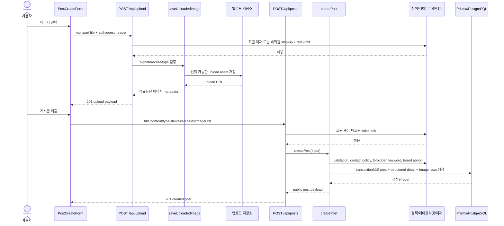
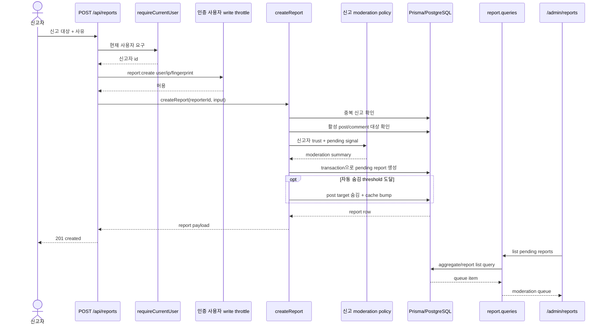
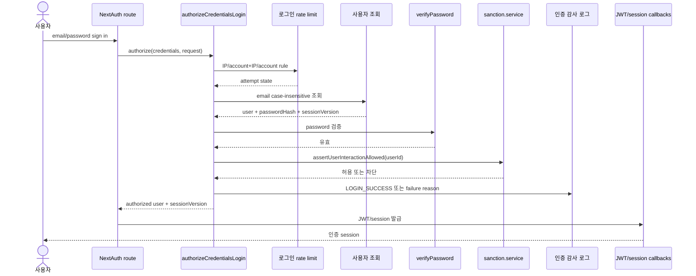
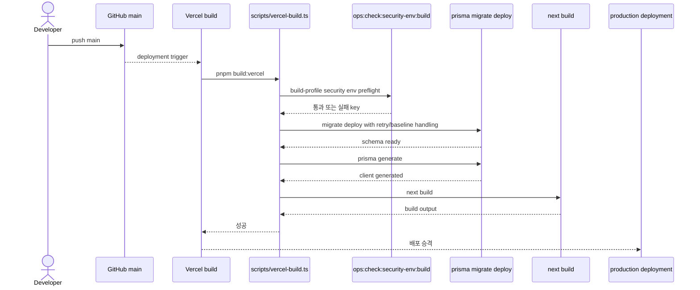

# 백엔드 시퀀스 다이어그램

목적: TownPet의 복잡한 백엔드 흐름을 면접/리뷰에서 코드 없이 설명할 수 있게 Mermaid 시퀀스 다이어그램으로 고정한다.

범위:
- 현재 구현은 MSA가 아니라 Next.js App Router 기반 모놀리식 앱이다.
- 따라서 API 서버 여러 개나 Kafka를 가정하지 않고, `UI -> Route/Action -> Service/Query -> Prisma/External` 책임 경계를 그대로 표현한다.
- 단순 CRUD가 아니라 정책, 권한, rate-limit, 외부 저장소, 운영 게이트가 함께 얽히는 흐름만 포함한다.

## 1. 게시글 작성 + 이미지 업로드

상황: 사용자가 글 작성 중 이미지를 업로드하고, 최종 게시글을 생성한다.

관여 컴포넌트:
- `app/src/components/posts/post-create-form.tsx`
- `app/src/app/api/upload/route.ts`
- `app/src/server/upload.ts`
- `app/src/app/api/posts/route.ts`
- `app/src/server/services/posts/post-create.service.ts`
- `app/src/server/services/posts/post-create-variants.ts`

설계 포인트:
- 업로드와 게시글 생성은 API가 분리되어 있지만, 게시글 생성 시 이미지 URL을 다시 정규화해 신뢰 가능한 업로드만 연결한다.
- 작성 정책은 UI가 아니라 route/service 계층에서 rate-limit, sanction, guest step-up, 구조화 validation으로 집행한다.

## 2. 신고 접수 + 모더레이션 큐

상황: 로그인 사용자가 게시글이나 댓글을 신고하고, 관리자 큐에서 처리 가능한 상태로 쌓인다.

관여 컴포넌트:
- `app/src/app/api/reports/route.ts`
- `app/src/server/services/moderation/report.service.ts`
- `app/src/server/services/moderation/sanction.service.ts`
- `app/src/server/moderation-action-log.ts`
- `app/src/server/queries/moderation/report.queries.ts`
- `app/src/app/admin/reports`

설계 포인트:
- 신고 접수는 단순 insert가 아니라 duplicate 방지, 대상 상태 확인, reporter trust, 조건부 auto-hide까지 포함한다.
- 관리자 화면은 service가 아니라 query 계층에서 read model을 가져오고, 처리 시점의 audit/action log와 제재는 별도 moderation service가 담당한다.

## 3. Credentials 로그인 + 세션/제재 차단

상황: 사용자가 이메일/비밀번호로 로그인할 때 계정 상태, rate-limit, 감사 로그, 제재 상태를 함께 확인한다.

관여 컴포넌트:
- `app/src/app/api/auth/[...nextauth]/route.ts`
- `app/src/server/auth-credentials.ts`
- `app/src/server/auth-login-rate-limit.ts`
- `app/src/server/auth-audit-log.ts`
- `app/src/server/services/moderation/sanction.service.ts`
- `app/src/server/auth.ts`

설계 포인트:
- 로그인 실패도 동일한 감사 경로에 남기고, 실패 횟수에 따라 지연/제한을 적용한다.
- `sessionVersion`을 세션 payload에 포함해 비밀번호 변경/세션 무효화 시 기존 JWT를 끊을 수 있게 한다.

## 4. Vercel 배포 + 보안 env preflight

상황: `main` push 후 Vercel이 production/staging 배포를 수행한다.

관여 컴포넌트:
- `app/package.json`
- `app/scripts/vercel-build.ts`
- `app/scripts/check-security-env.ts`
- `app/prisma/migrations`
- Vercel build runtime

설계 포인트:
- 배포 hot path는 `build` profile만 실행해 필수 env misconfig를 빠르게 막는다.
- 원격 `/api/health` control-plane drift는 운영자용 `ops:check:security-env:strict`로 분리해, unrelated 작업 뒤 반복 배포 실패가 생기지 않게 했다.

## 면접 설명 기준

- 이 문서는 "예쁜 UML"보다 런타임 메시지 흐름과 책임 경계를 설명하기 위한 문서다.
- 현재 구조를 MSA처럼 과장하지 않고, 모놀리식 앱 안에서도 route/service/query/DB/external boundary를 분리해 설명한다.
- 복잡도가 낮은 CRUD에는 다이어그램을 만들지 않고, 정책과 운영 리스크가 섞인 흐름에만 다이어그램을 사용한다.
