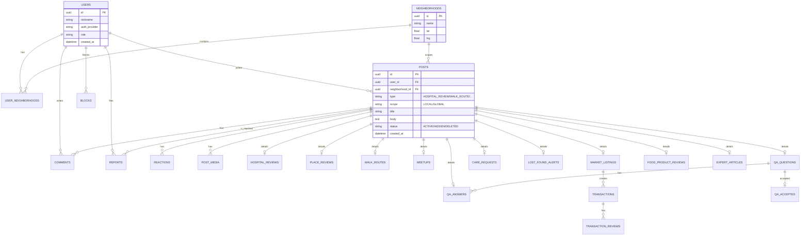

# 05. 데이터 모델(ERD) — posts 다형성 중심

## 1) 설계 원칙
- 게시물은 `posts`(공통) + 타입별 상세 테이블로 저장한다.
- Local/Global은 `scope`로 분리하거나, `type`을 Local/Global로 구분한다.
- 지도/위치는 정밀도를 낮춰(동 단위 + 좌표는 옵션) 개인정보 리스크를 줄인다.

## 2) Mermaid ERD (초안)

> 실제 스키마는 `05_backend/01_database_schema.md`에서 Flyway DDL로 구체화한다.

## 3) 상태 머신(요약)
- `POST.status`: ACTIVE → HIDDEN(신고/운영) → ACTIVE(복구) / DELETED(작성자)
- `MARKET_LISTINGS.status`: AVAILABLE → RESERVED → DONE / CANCELLED
- `MEETUPS.status`: OPEN → CLOSED → DONE / CANCELLED
- `CARE_REQUESTS.status`: OPEN → MATCHED → DONE / CANCELLED
- `LOST_FOUND_ALERTS.status`: ACTIVE → FOUND / CLOSED
